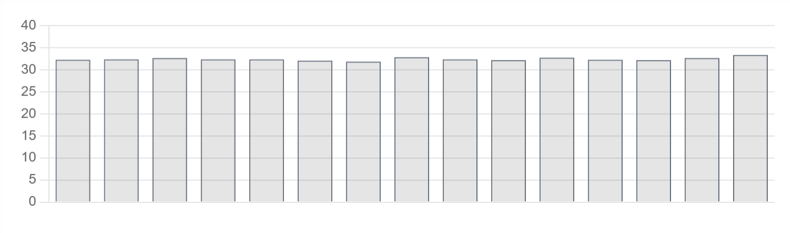

# Charts

Data visualisation component. Charts provide a graphical representation of data, showing patterns and changes over time.

Profinity supports multiple chart types. Line and bar charts are shown below:

**Line Chart** - Shows trends and changes over time:
<figure markdown>

<figcaption>Line chart component displaying data trends over time with connected data points</figcaption>
</figure>

**Bar Chart** - Compares discrete values or categories:
<figure markdown>

<figcaption>Bar chart component displaying data comparison using rectangular bars</figcaption>
</figure>

**Best for:** Data trends, historical analysis, performance monitoring, visual data representation, time-series data

**Parameters:**

| Parameter | Type | Description |
|-----------|------|-------------|
| `id` | optional (string) | Unique identifier for the chart |
| `class` | optional (string) | CSS class for styling |
| `type` | required (string) | Chart type: `bar`, `line`, `radar`, `doughnut`, `pie`, `polarArea`, `bubble` or `scatter`. See [Chart Types](#chart-types) for details |
| `value` | required (object/array) | Chart data (structured object with labels/datasets, or time series array) |
| `legend` | optional (boolean) | Whether to show the legend (default: `false`) |
| `refreshInterval` | optional (number) | Automatic refresh interval in milliseconds (minimum: 0) |
| `showControls` | optional (boolean) | Whether to show the time range and refresh controls |
| `min` | optional (number) | Minimum value of the chart scale (calculated automatically if not specified) |
| `max` | optional (number) | Maximum value of the chart scale (calculated automatically if not specified) |
| `label` | optional (string) | Chart label |
| `enabled` | optional (boolean) | Whether the chart is enabled |
| `visible` | optional (boolean) | Whether the chart is visible |
| `bind` | optional (array) | Data binding configuration |

## Chart Types

Profinity supports the following chart types:

- **`line`** - Line charts display data points connected by lines, which suits trends over time
- **`bar`** - Bar charts display data as rectangular bars, which suits comparing discrete values
- **`radar`** - Radar charts display multivariate data in a two-dimensional form
- **`doughnut`** - Doughnut charts display data as a circular chart with a hole in the centre
- **`pie`** - Pie charts display data as proportional slices of a circle
- **`polarArea`** - Polar area charts display data as sectors of a circle
- **`bubble`** - Bubble charts display three dimensions of data (x, y, and size)
- **`scatter`** - Scatter charts display data points across two axes

**Data Binding Example:**

``` yaml
dashboard:
  items:
    - row:
        items:
          - chart:
              type: bar
              legend: false
              bind:
                - target: value
                  source: Prohelion BMU.[Property].PackData.CellTempsSummaryGraph   
```

**Static Chart Example:**

``` yaml
dashboard:
  items:
    - row:
        items:
          - chart:
              type: line
              legend: true
              value:
                labels: ["Jan", "Feb", "Mar", "Apr"]
                datasets:
                  - label: "Sales"
                    data: [65, 59, 80, 81]
                  - label: "Revenue"
                    data: [28, 48, 40, 19]
```

**Time Series Example:**

``` yaml
dashboard:
  items:
    - row:
        items:
          - chart:
              type: line
              legend: false
              showControls: true
              refreshInterval: 1000
              bind:
                - target: value
                  source: "[TimeSeries].{COMPONENT_NAME}.BusMeasurement.BusCurrent"
```
