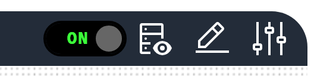

# Actions

Interactive buttons. Actions provide clickable buttons that can trigger system actions, navigation, or other interactive behaviours.

<figure markdown>

<figcaption>Actions component showing interactive buttons for system controls and navigation</figcaption>
</figure>

**Best for:** System controls, navigation buttons, data refresh actions, user interactions, command execution

**Parameters:**

| Parameter | Type | Description |
|-----------|------|-------------|
| `id` | optional (string) | Unique identifier for the action |
| `class` | optional (string) | CSS class for styling |
| `label` | conditional (string) | Button text, required when `mode` is `button` |
| `actionId` | required (string) | Action identifier |
| `mode` | required (string) | Display mode: `icon`, `button` or `auto` |
| `image` | optional (string) | Button icon filename from the `/Profile/Images` directory |
| `imageAlt` | optional (string) | Icon alt text |
| `value` | optional (object) | Action value |
| `systemAction` | optional (boolean) | System-level action |
| `trackProgress` | optional (boolean) | Whether to show a progress bar while the action runs |
| `hyperlink` | optional (string) | Hyperlink URL |
| `openHyperLinkInNewWindow` | optional (boolean) | Whether the hyperlink opens in a new window |
| `enabled` | optional (boolean) | Whether the action is enabled |
| `visible` | optional (boolean) | Whether the action is visible |
| `bind` | optional (array) | Data binding configuration |

**Example:**

``` yaml
dashboard:
  items:
    - row:
        items:
          - action:
              label: "Refresh Data"
              actionId: "refresh"
              mode: "button"
              class: "btn-primary"
              image: "refresh-icon.svg"
              imageAlt: "Refresh"
```

**Icon-Only Action Example:**

``` yaml
dashboard:
  items:
    - row:
        items:
          - action:
              actionId: "settings"
              mode: "icon"
              image: "settings-icon.svg"
              imageAlt: "Settings"
```
