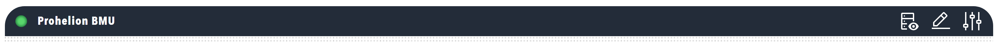

# Titlebar

Header section with a status lamp and a toolbar of menu items. The titlebar provides dashboard identification, status information, and component-specific actions.

<figure markdown>

<figcaption>Dashboard titlebar component showing status lamps and navigation menus</figcaption>
</figure>

**Best for:** Dashboard identification, status indicators, navigation links, component-specific actions and settings dialogs

**Parameters:**

| Parameter | Type | Required | Default | Description |
|-----------|------|----------|---------|-------------|
| `id` | string | No | None | Not used by the web interface |
| `class` | string | No | None | CSS class added to the titlebar element |
| `lamp` | object | No | None | Status lamp shown in the left group of the titlebar. See [Lamp](../Data/Lamp.md) |
| `menu` | object | No | None | Menu whose items are shown as icons in the toolbar at the right of the titlebar. See [Menu](Menu.md) |
| `showTitlebar` | boolean | No | `true` | When `false`, the titlebar background, the hamburger menu button and the lamp are hidden, and the toolbar remains visible on a transparent background |
| `showActions` | boolean | No | `true` | When `false`, the toolbar of menu items is hidden |

When both `showTitlebar` and `showActions` are `false`, the titlebar is not displayed and takes no space.

**Menu Content:**

The web interface displays each item of the titlebar `menu` as an icon, without the item caption, and supports the following item types:

| Item type | Behaviour in the titlebar |
|-----------|---------------------------|
| `menuitem` | Icon link that navigates to the `navigate` target when clicked. A `lamp` on the item is displayed beside the icon |
| `modal` | Icon that opens a dialog, such as a component settings dialog, when clicked |
| `action` | Icon button that runs the action when clicked |
| `toggle` | Switch that runs the action when clicked |
| `submenu` and `logo` | Accepted by the schema and displayed by the same menu code, although both are designed for the side menu rather than the titlebar |

**Example:**

``` yaml
dashboard:
  items:
    - titlebar:
        lamp:
          color: grey
          value: 1
          label: Prohelion BMU
          enabled: true
          bind:
            - target: color
              source: /Prohelion BMU/Properties/StatusColourText
              toType: string
        menu:
          items:
            - menuitem:
                image: nav_custom_active.svg
                imageAlt: Messages and Signals
                navigate: dbc?view=messages&componentIdFilter=Prohelion+BMU
            - modal:
                id: default
                image: dash_config.svg
                imageAlt: Change Settings
                settings:
                  create: false
                  update: true
                  delete: true
                  send: false
                  reload: true
                  showTabs: true
                  refreshOnClose: false
                  navigateOnClose: /
                  urlSettings: /api/v2/ActiveProfile/Component/Prohelion%20BMU/settings
                  urlDelete: /api/v2/ActiveProfile/Component/Prohelion%20BMU
```
