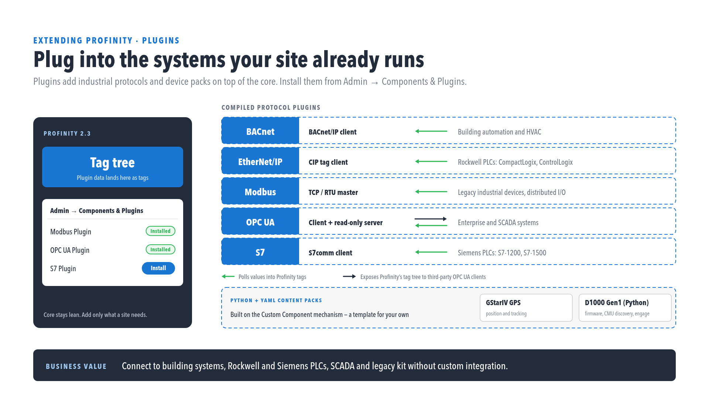

# Protocol plugins

Profinity ships a set of compiled protocol plugins that connect it to the industrial
systems a site already runs. Each is installed the same way as any other
[DLL plugin](./index.md), through **Components & Plugins** in the admin UI.

<figure markdown>

<figcaption>Plug into the systems your site already runs</figcaption>
</figure>

!!! info "Scope of this page"
    This page describes what each protocol plugin is for, at a glance. It is not a
    configuration or settings reference for any individual plugin — see
    [DLL plugins](./index.md) for how to install and enable a plugin once you have it,
    and contact Prohelion support for plugin-specific configuration guidance.

## Available protocol plugins

| Plugin | Role | Typical use |
|---|---|---|
| **BACnet** | BACnet/IP client — polls values into Profinity tags | Building automation and HVAC systems |
| **EtherNet/IP** | CIP tag client — polls values into Profinity tags | Rockwell PLCs (CompactLogix, ControlLogix) |
| **Modbus** | TCP/RTU master — polls values into Profinity tags | Legacy industrial devices, distributed I/O |
| **OPC UA** | Client (polls values in) and a read-only server (exposes Profinity's tag tree out) | Enterprise and SCADA system integration |
| **S7** | S7comm client — polls values into Profinity tags | Siemens PLCs (S7-1200, S7-1500) |

Each plugin brings data in as ordinary Profinity tags — once polled, a value from any
of these protocols behaves the same as a tag from a CAN device: it can be shown on a
dashboard, included in a collection, watched by a rule, or read by a script.

## Content-pack plugins

Alongside the compiled protocol plugins above, some device integrations ship as
**Python + YAML content packs** instead — built on the same [Custom Component
mechanism](../Custom_Components/index.md) available to anyone packaging their own
device. These are a template for building your own device pack rather than a
protocol client; see [Component types](../Components/Component_Types.md) for the
comparison between a compiled plugin and a Custom Component pack.

## Related documentation

- [DLL plugins](./index.md) — installing, enabling, and disabling any plugin
- [Component types](../Components/Component_Types.md) — compiled plugin vs Custom Component pack
- [Component Pack CLI](../Components/Component_Pack_CLI.md)
