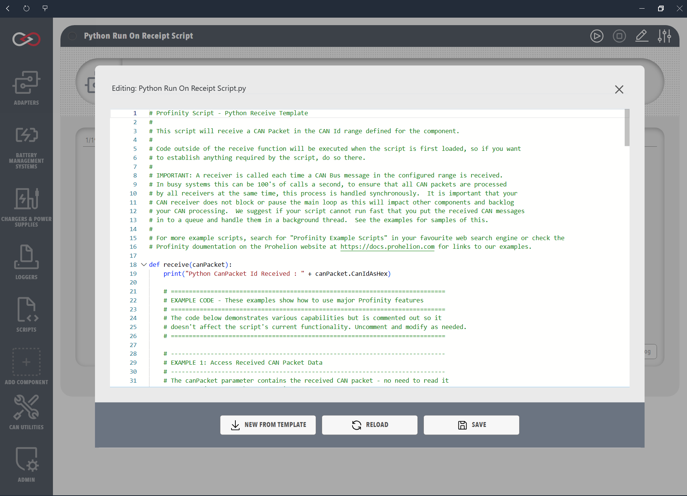

# Receive Scripts

Receive scripts handle incoming CAN (Controller Area Network) messages in real time. They execute automatically when a matching CAN packet is received, which suits CAN bus monitoring, protocol implementation, and real-time data processing, particularly where an immediate response to a CAN message is required.

## Characteristics
- Automatic execution when matching CAN packets are received
- Implement the `Receive` method (C#) or `receive` function (Python and Lua)
- Can be configured to match specific CAN IDs or a range of IDs
- Full access to the received CAN packet data

## Performance

Receive scripts run **synchronously** for **each** matching CAN packet. On a busy bus that can mean **many invocations per second**. Keep **`Receive`** / **`receive`** short: avoid blocking calls (for example **`time.sleep`** in Python, **`Thread.Sleep`** in C#, long calculations, locks, or slow I/O). A slow handler delays other work; Profinity may **drop incoming CAN packets** if the script cannot keep up. If you need heavier processing, pass a small amount of data to a **queue** and handle it on a **background thread**, or use another script type such as a **service script**.

<figure markdown>

<figcaption>Receive script editor and CAN packet trigger configuration</figcaption>
</figure>

## Examples

The following example shows how to implement a Receive script in each supported language, handling an incoming CAN packet and reading its CAN ID in hexadecimal format. It is the minimum implementation needed for a functional Receive script.

This example demonstrates a Receive script that:

- Implements the required Receive method
- Shows how to access the CAN ID in hexadecimal format
- Uses the Profinity console for output
- Handles incoming CAN packets

=== "C#"

    ```csharp
    using System;
    using Profinity.Scripting;
    using Profinity.Sdk.Models.CANBus;

    public class CSharpRunTest : ProfinityScript, IProfinityReceiverScript
    {
        public void Receive(CanBusPacket canPacket)
        {
            Profinity.Console.WriteLine("CSharp CanId Received : " + canPacket.CanIdAsHex);
        }
    }
    ```

=== "Python"

    ```python
    def receive(canPacket):
        print("Python CanPacket Id Received : " + canPacket.CanIdAsHex)
    ```

=== "Lua"

    ```lua
    function receive(canPacket)
        print('Lua CanPacket Id Received : ' .. canPacket.CanIdAsHex)
    end
    ```
