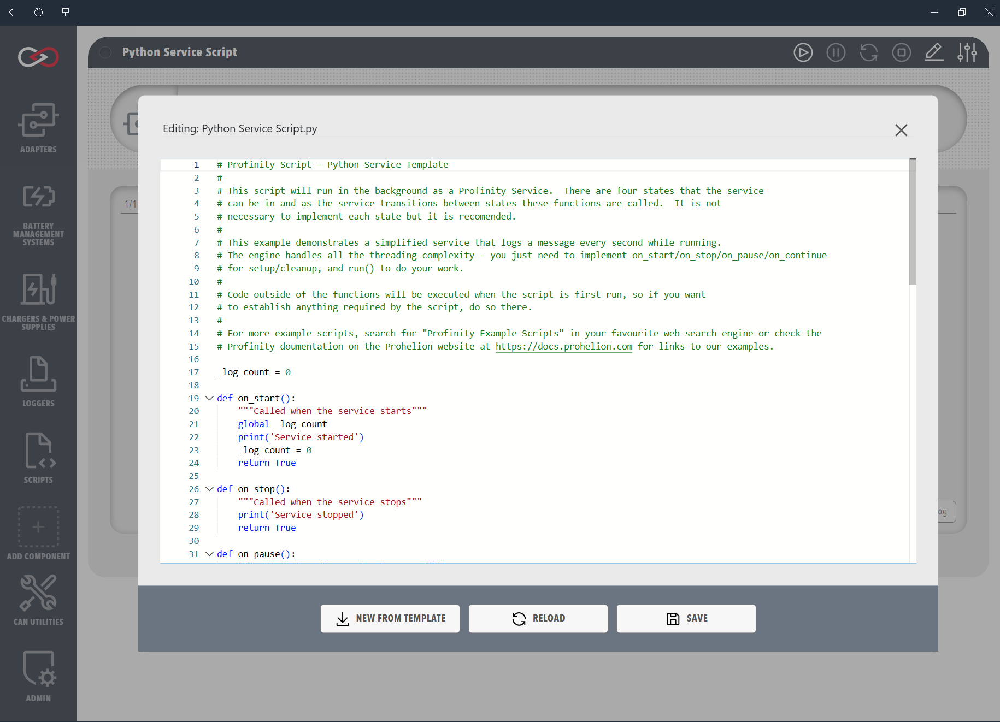

# Service Scripts

Service scripts are designed for continuous, long-running operations that need to maintain state and respond to system events. They operate similarly to Windows services, with full lifecycle management and multiple startup modes, which suits critical monitoring tasks, continuous data logging, and system-level operations that need to run reliably over extended periods.

## Characteristics
- Continuous execution with service-like behaviour
- Service state management methods
- Support for service lifecycle management

## Cooperative cancellation (`Profinity.ScriptCancelled`)

Long-running work in **`Run()`** / **`run()`** should observe **`Profinity.ScriptCancelled`**. This flag becomes **`true`** when the service is **stopped**, **paused**, or when Profinity is shutting down, so loops can exit and release resources promptly.

- If **`run()`** uses its **own** `while` loop, test **`not Profinity.ScriptCancelled`** (or `!Profinity.ScriptCancelled` in C#) in the loop condition and optionally break out before slow steps.
- When the service is **paused**, cancellation is signaled so an inner loop can finish; on **continue**, the engine may call **`run()`** again with a fresh cancellation scope (the **Example Scripts** folder in your Profinity installation includes **Python**, **C#** and **Lua** service templates with both single-step and loop-style **`run`** patterns).
- In **Python**, use **`import time`** if you call **`time.sleep`** in the service body. In **C#**, **`Thread.Sleep`** is typical (add **`using System.Threading;`**). In **Lua**, use the **`sleep(seconds)`** global; each call is clamped to a maximum of **30 seconds**, so a loop that needs to wait longer should call **`sleep()`** again on the next iteration rather than passing one large value.

## Python: module-level variables and `global`

Lifecycle hooks (`on_start`, `run`, and so on) are separate functions. If you keep counters or other mutable state in **module-level** names and assign to them inside those functions, Python treats those assignments as **local** unless you declare **`global _my_var`** in each function that assigns to them. Omitting **`global`** is a common mistake when resetting state in **`on_start`** and updating it in **`run()`**.

<figure markdown>

<figcaption>Service script editor and lifecycle configuration</figcaption>
</figure>

## Examples

The following examples demonstrate how to implement Service scripts in each supported language. Each example shows lifecycle methods (**start**, **stop**, **pause**, **continue**) and a **`Run()`** / **`run()`** implementation that loops until **`Profinity.ScriptCancelled`** is set. The `on_stop()` function (Python and Lua) or `OnStop()` method (C#) is called both when the service is manually stopped and when Profinity is shutting down.

This example demonstrates a Service script that:

- Implements all required lifecycle methods
- Uses **`Profinity.ScriptCancelled`** so stop and pause can complete promptly
- Uses **`time.sleep`** (Python), **`Thread.Sleep`** (C#), or **`sleep`** (Lua) between iterations; Python declares **`global`** for a shared run counter

=== "C#"

    ```csharp
    using System;
    using System.Threading;
    using Profinity.Scripting;

    public class CSharpServiceTest : ProfinityBaseService
    {
        private int _runCount = 0;

        public override bool OnStart()
        {
            Profinity.Console.WriteLine("Started CSharp Service");
            _runCount = 0;
            return true;
        }

        public override bool OnStop()
        {
            Profinity.Console.WriteLine("Stopped CSharp Service");
            return true;
        }

        public override bool OnPause()
        {
            Profinity.Console.WriteLine("Paused CSharp Service");
            return true;
        }

        public override bool OnContinue()
        {
            Profinity.Console.WriteLine("Continue CSharp Service");
            return true;
        }

        public override bool Run()
        {
            while (!Profinity.ScriptCancelled)
            {
                _runCount++;
                Profinity.Console.WriteLine("Run #" + _runCount);
                Thread.Sleep(100);
            }
            return true;
        }
    }
    ```

=== "Python"

    ```python
    import time

    _run_count = 0

    def on_start():
        global _run_count
        print("Python Service Started!")
        _run_count = 0
        return True

    def on_stop():
        print("Python Service Stopped!")
        return True

    def on_pause():
        print("Python Service Paused!")
        return True

    def on_continue():
        print("Python Service Continued!")
        return True

    def run():
        global _run_count
        while not Profinity.ScriptCancelled:
            _run_count += 1
            print(f"Run #{_run_count}")
            time.sleep(0.1)
        return True
    ```

=== "Lua"

    ```lua
    local run_count = 0

    function on_start()
        print('Started Lua Service')
        run_count = 0
        return true
    end

    function on_stop()
        print('Stopped Lua Service')
        return true
    end

    function on_pause()
        print('Paused Lua Service')
        return true
    end

    function on_continue()
        print('Continue Lua Service')
        return true
    end

    function run()
        while not Profinity.ScriptCancelled do
            run_count = run_count + 1
            print('Run #' .. run_count)
            -- sleep(seconds) is clamped to 30 seconds per call, so a longer wait
            -- is expressed as repeated calls rather than one large value
            sleep(0.1)
        end
        return true
    end
    ```