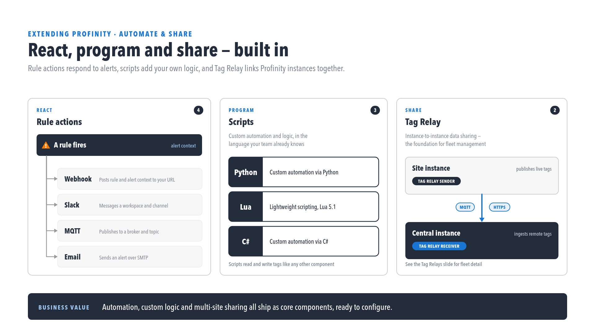
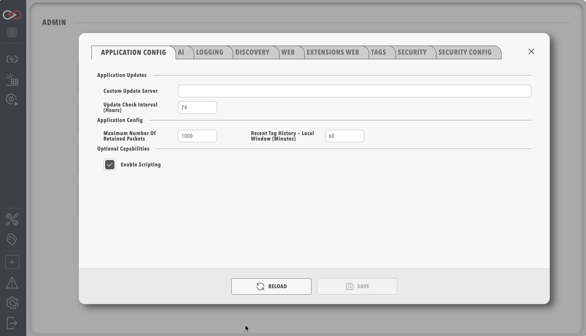

# Profinity Scripting

This section covers scripting in Profinity, including supported languages, script types, and available operations.

<figure markdown>

<figcaption>React, program and share — built in</figcaption>
</figure>

If you are new to Profinity scripting, read the security note below before writing your first script.

## Important Read This First

!!! warning "Profinity Scripts Execute With the Same Security Permissions as Profinity Itself"
    Because Profinity Scripting runs inside the Profinity engine, any script executes with the same operating system security permissions as Profinity itself, so you need to understand what each script on your system does before it is enabled.

To keep the Profinity environment secure, scripting is disabled until it is explicitly enabled. To enable Profinity Scripting, open [System Configuration](../../Administration/System_Config.md) and enable Scripting.

<figure markdown>

<figcaption>Profinity System configuration</figcaption>
</figure>

## Script Types

Profinity supports five types of script, each designed for specific use cases, which between them cover seven execution modes (Run On Demand, Run On Receipt of CAN Message, Run On Tag Change, Run On Alert, Run On Time Interval, Run On CRON Schedule and Run as Service):

- [Run Scripts](./Script_Types/RunScripts.md): For manual or scheduled operations (Run On Demand, Run On Time Interval and Run On CRON Schedule modes)
- [Receive Scripts](./Script_Types/ReceiveScripts.md): For handling incoming CAN messages
- [Service Scripts](./Script_Types/ServiceScripts.md): For continuous, long-running operations
- Tag Change Scripts (Run On Tag Change mode): For reacting when a watched tag's value changes
- [Rule Scripts](./Rule_Scripts.md) (Run On Alert mode): For custom handling when a rule fires

The [Script Types](./Script_Types/index.md) documentation describes each mode and when to use it.

## Supported Languages

Profinity scripting supports three programming languages, and a script can be written in any of them:

- C#: For complex, type-safe operations
- Python: For data processing and analysis
- Lua: For lightweight, low-overhead scripts

Each language has its own strengths, and each supports the same set of script types (Run, Receive, Service, Tag Change and Rule Script). See the [Supported Languages](./Supported_Languages/index.md) documentation for detailed comparisons.

## Operations

Profinity provides the following built-in operations to every script:

- [CANBus](./Script_Operations/CANBus.md): For CAN communication
- [DBC](./Script_Operations/DBC.md): For DBC Message and Signal handling
- [State](./Script_Operations/State.md): For data persistence
- [Console](./Script_Operations/Console.md): For output and logging

The [Operations](./Script_Operations/index.md) documentation describes each in more detail.

## Rule scripts (2.3)

A script set to **Run On Alert** mode can be named as a rule action and receives the firing context, including `TriggeredTags`. See [Rule scripts](./Rule_Scripts.md) and [Rule actions and scripts](../Rules/Rule_Actions_And_Scripts.md).

## Next Steps

1. Review the [Supported Languages](./Supported_Languages/index.md) guide to help select the right language for you
2. Learn about [Script Types](./Script_Types/index.md) to determine what script style might be most suitable
3. Explore the available [Operations](./Script_Operations/index.md) and things you can do with Scripts
4. Create your first script by following [Write Your First Script](../../How_To_Guides/Write_Your_First_Script.md) 
