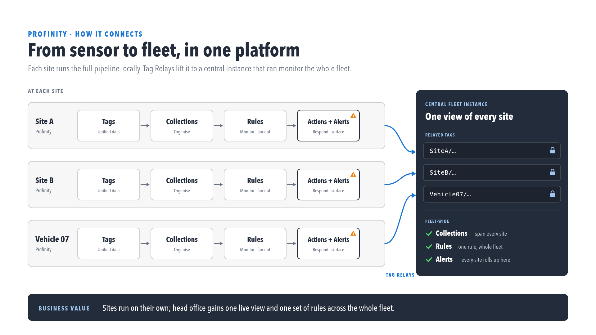

# Tag relay

Tag relay shares live tag data between two Profinity instances. One instance runs as a
**sender**, publishing a snapshot of its own tags; another runs as a **receiver**,
ingesting that snapshot as remote, read-only tags under a prefix that identifies where
they came from. It is the mechanism behind a fleet or head-office view spanning
multiple sites, vehicles, or installations.

<figure markdown>

<figcaption>Each site keeps running independently — relay only adds a shared view on top</figcaption>
</figure>

!!! info "Not the same feature as the MQTT Subscriber"
    **Tag relay** is Profinity-to-Profinity only, over its own snapshot format — it does
    not speak Sparkplug. If the other end is a third-party Sparkplug B source (an edge
    gateway, or a platform such as Ignition) rather than another Profinity instance, use
    the [MQTT Subscriber](../../Components/Publishers/MQTT_Subscriber.md) instead. See
    that page's own note for the reverse comparison.

## How it works

<figure markdown>

<figcaption>Sender and receiver roles, with per-site tag prefixes on the receiving instance</figcaption>
</figure>

- **Sender.** A Profinity instance configured as a Tag Relay Sender publishes a
  snapshot of its own tags, then streams incremental updates as they change.
- **Receiver.** A Profinity instance configured as a Tag Relay Receiver connects to one
  or more senders and mounts each sender's tags under a prefix identifying that site
  (for example `SiteA/…`), so a single receiving instance can ingest many senders at
  once without their tag trees colliding.
- **Transport.** A sender can be reached over HTTPS with a JWT, or over MQTT — both are
  supported in the same release, and the choice is per sender.
- **Read-only mirrors.** Relayed tags on the receiver are read-only — the receiving
  instance cannot write back to a site through relay. Local tags, collections, rules,
  and alerts on the receiver can still reference relayed tags the same way they
  reference any other tag.
- **Conflict handling.** If an incoming batch of relayed tags would collide with tags
  the receiver already owns, the whole batch is rejected — never partially applied —
  so a naming clash on one site cannot silently corrupt tags from another.

## Known limitations

- Relay currently exports a sender's full tag tree to its peers — there is no
  field-level filtering of what gets published to a given receiver yet.
- A tag path already occupied on the receiver by something relay does not own (a local
  device tag, a script register, a derived tag) is skipped for that one path; the rest
  of the batch is still applied.

## Licensing

Tag relay requires the **Data Relay** licensed feature on both the sending and
receiving instance. See [Licensing](../../Administration/Licensing.md) to check
whether it is licensed and available on a given instance.

## Related documentation

- [Tag layer](./index.md)
- [MQTT Subscriber](../../Components/Publishers/MQTT_Subscriber.md) — for ingesting an external, non-Profinity Sparkplug source instead
- [Licensing](../../Administration/Licensing.md)
- [RBAC and permissions](../../Administration/Security/RBAC_Permissions.md)
