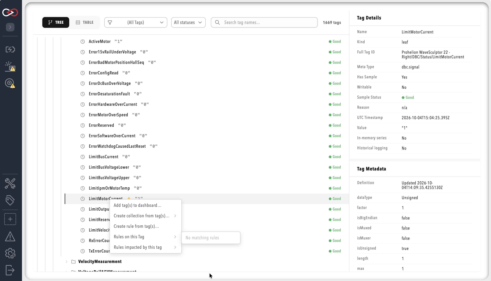

# Tag linking from Tag Explorer

Profinity 2.3 ships **Tag Explorer context menu** flows to create collections, rules, and dashboard bindings from selected tags, which reduces copying and pasting between Tag Explorer and the visual editors.

!!! note "Scope of the 2.3 release"
    **Available in 2.3:** the Tag Explorer context menu actions listed below. **Not available:** reciprocal editors (for example adding a rule from the collections editor via a context menu only), where-used panels, and collection-to-rule cross-links from every editor surface.

## Prerequisites

Tag Explorer itself requires **`TagView`**. Each context menu action then checks its own permission, and an action whose permission is missing is shown disabled, while the whole menu is hidden from a user who holds none of these permissions.

| Action | Permission required |
|--------|---------------------|
| **Add tag(s) to dashboard…** | `DashboardModify` |
| **Create collection from tag(s)…** | `TagCollectionsModify` |
| **Create rule from tag(s)…** | `TagRulesModify` |
| **Rules on this Tag**, **Rules impacted by this tag** | `TagRulesView` |

## Open the context menu

1. Open **TAG EXPLORER** (`/tags?view=tag_explorer`).
2. Right-click a **leaf tag** or branch as appropriate.

<figure markdown>

<figcaption>Tag Explorer context menu (screenshot placeholder — provide SS-41)</figcaption>
</figure>

## Shipped menu actions

| Action | Scope | Result |
|--------|-------|--------|
| **Add tag(s) to dashboard…** | Leaf tags only | Opens a dashboard picker and creates a binding draft; completing the bind still requires the dashboard editor |
| **Create collection from tag(s)…** | Branch, leaf, or root | Opens a submenu for the primary filter (**Branch**, **Meta type**, **Unit**, **Value** or **Quality**), then an insert-location picker, then the collections visual editor with a draft collection |
| **Create rule from tag(s)…** | Selected tags | Opens an insert-location picker, then the rules visual editor with a draft rule |
| **Rules on this Tag** | Selected tags | Lists the rules that reference the selection and opens the rules editor on the chosen rule source |
| **Rules impacted by this tag** | Selected tags | Lists the rules affected by the selection, and opens the rules editor with that rule selected |

After choosing an action, complete configuration in the visual editor and **save**.

The create-collection and create-rule flows generate the expressions automatically. A selection of leaf tags becomes a set of `tag.Is("…")` matches, a single selected branch becomes a scope prefix with the expression `tag.HasValue`, and several selected branches become `tag.MatchesPath("…")` matches joined with `||` and combined with `tag.HasValue`. For collections, a primary filter other than **Branch** replaces this with an expression built from the selected tags' metadata type, unit, value or quality. See [Tag expressions](../Rules/Tag_Expressions.md).

## What is not available in 2.3

The following are not available:

- Reciprocal "add to collection" from rules editor context menus only.
- Full where-used navigation across all tag consumers.

## Related documentation

- [Tag layer](../Tag_Layer/index.md)
- [Tag expressions](../Rules/Tag_Expressions.md)
- [Collections](../Rules/Collections.md)
- [Rule actions and scripts](../Rules/Rule_Actions_And_Scripts.md)
- [Dashboard visual editor](../Dashboards/Visual_Editor.md)
