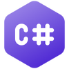

# Extending Profinity

Profinity can be extended and customised to meet specific needs, using [Scripting](./Scripting/index.md), [Tag layer](./Tag_Layer/index.md), [Rules](./Rules/Alerts.md), [APIs](./APIs/index.md), [Dashboards](./Dashboards/index.md), [Plugins](./Plugins/index.md), [Custom Components](./Custom_Components/index.md), the [Profinity SDK](./SDK.md), [MCP Support](./MCP_Server.md), and [Hosting](./Hosting/index.md), turning Profinity into an application server tailored to the deployment.

For mobile access, see [Profinity Mobile](../Mobile/index.md).

## Tag layer and rules (2.3)

The [tag layer](./Tag_Layer/index.md) provides Tag Explorer, collections, rules, and [ALL ALERTS](./Rules/Alerts.md). Use [tag linking](./Tags/Tag_Linking.md) from Tag Explorer to start collections and rules quickly.

## Profiles, configuration, and theming (2.3)

[Menu layout](./Profiles/Menu_Layout.md) covers customising per-profile and per-component menu placement. The [settings registry](./Configuration/Settings_Registry.md) covers the centralised Config.yaml settings model. [Theming](./Theming/index.md) covers branding and theme customisation through the engine Themes API.

## Scripting

Profinity's [scripting capabilities](./Scripting/index.md) allow you to automate tasks and create custom operations. 

With support for languages like C# and Python, you can choose the tool suited to the task. Scripting in Profinity handles operations ranging from manual tasks to continuous, long-running processes, so it suits teams automating repetitive tasks, integrating with other systems, or building workflows aligned to their own business processes.

| C# Scripting | Python |
|--------------|--------|
| |  |

## Dashboards

Profinity's [dashboard system](./Dashboards/index.md) allows you to create dynamic, data-driven user interfaces using YAML configuration files. Dashboards display real-time information from CAN bus systems and connect directly to Profinity's data sources.

Dashboards can be used in multiple contexts:
- **Custom Components**: Create component-specific interfaces with DBC files
- **Profile Dashboards**: Replace the standard home page with a custom dashboard

With Dashboards, you can create monitoring interfaces without writing code, using a declarative YAML approach. Teams monitoring complex systems, building operator interfaces, or developing custom data visualisation for system performance and status can use dashboards for this purpose without a separate development effort.

The Dashboard system supports various component types including data displays, charts, status indicators, and interactive elements, all connected to your live data through Profinity's data binding system. This enables you to create responsive dashboards that automatically update as your system state changes, providing real-time feedback and monitoring capabilities.

## Custom Components

Profinity's [Custom Components](./Custom_Components/index.md) allow you to integrate any CAN bus device into your profile by combining a DBC file (which defines the CAN messages and signals) with a Dashboard (which defines the user interface). Custom Components enable you to monitor, graph, and log data from any device that communicates via CAN bus.

### Component reference (2.3)

| Page | Description |
|------|--------------|
| [Component Types](./Components/Component_Types.md) | Compares Custom Components, Dashboard Components, and DLL plugins, and when to use each packaging model. |
| [Component Catalog](./Components/Component_Catalog.md) | Covers hiding component types from the add-component catalog using configuration. |
| [Component Pack CLI](./Components/Component_Pack_CLI.md) | Covers the `profinity-component-pack` tool for validating, packing, and installing Custom Component bundles. |
| [Tag Tree Path](./Components/Tag_Tree_Path.md) | Covers nesting a component's tags under a parent folder in the tag tree using the Tag tree path setting. |

## Profinity SDK

Building a DLL plugin, packing a Custom Component for distribution, or writing and testing a
script outside a profile all draw on the same [Profinity SDK](./SDK.md) — one developer kit
Prohelion distributes on request, rather than three separate downloads. Organisations building a
compiled integration, packaging Custom Components for field deployment, or developing scripts
offline before adding them to a profile use the kit for this work.

## APIs

Profinity is built around a modern API architecture, providing [RESTful interfaces](./APIs/index.md) that allow you to integrate and extend its functionality. The APIs are secure and support JSON, making it easy to build custom applications or extend existing ones. 

With Profinity's APIs, you can access both real-time and historical data. Organisations that integrate Profinity with other systems, build custom dashboards, or develop new applications on top of Profinity's data typically use the API layer for this integration work.

Profinity supports [Swagger](https://swagger.io/) to make it easy to understand what APIs are available in Profinity and how to use them.

<figure markdown>

<figcaption>Swagger from SmartBear</figcaption>
</figure>

## Scripting vs APIs

Profinity offers two different ways to extend its capabilities to meet the requirements of your applications: Scripting and APIs. The comparison below sets out the trade-offs between them.

| Scripting                                                                | APIs                                                                           |
| ------------------------------------------------------------------------ | ------------------------------------------------------------------------------ |
| Supports Python and C#                                                   | Support any Programming Language that can call REST APIs and JSON              |
| Are built in to Profinity and require no external frameworks or hosting  | Run outside of Profinity in your own environment, APP or cloud                 |
| Can be developed quickly and easily, to solve simple problems            | Can be as rich and complex as you want your app to be and still use Profinity  |
| Can run headless (no user interaction, scheduled or triggered by CAN)    | Requires you to write the logic for how your app uses the API                  |
| Script runs inside Profinity                                             | If scripted, your scripts run outside Profinity and can be distributed         |

Ultimately the decision on how to extend Profinity is up to you, but with two choices you have the flexibility to find the model that suits your needs best.

## MCP Support

Profinity includes support for the [Model Context Protocol (MCP)](./MCP_Server.md), which enables AI assistants and other MCP-aware tools to interact with Profinity to query system data and metadata.

The MCP server exposes ten read-only tools for tag discovery, tag values and history, and alert state, over Streamable HTTP at `/api/v2/Ai/Mcp`. See [MCP Support](./MCP_Server.md) for the full list of tools, authentication requirements, and usage examples.

Organisations integrating AI assistants with their CAN bus systems, automating data analysis, or building monitoring and reporting systems that query Profinity data programmatically can use the MCP server for this access.

## Hosting

Profinity includes an [integrated web server](./Hosting/index.md) that allows you to host custom applications. Whether the application uses modern web technologies like ReactJS or Angular, or traditional HTML and JavaScript, Profinity's hosting capabilities provide a flexible environment for the application. 

The web server supports SSL/TLS certificates, ensuring your applications are secure in production environments. This suits organisations developing and deploying custom web applications that integrate with Profinity as part of a single, unified user experience.

By combining these features, Profinity can be extended to serve as an application server tailored to an organisation's needs.