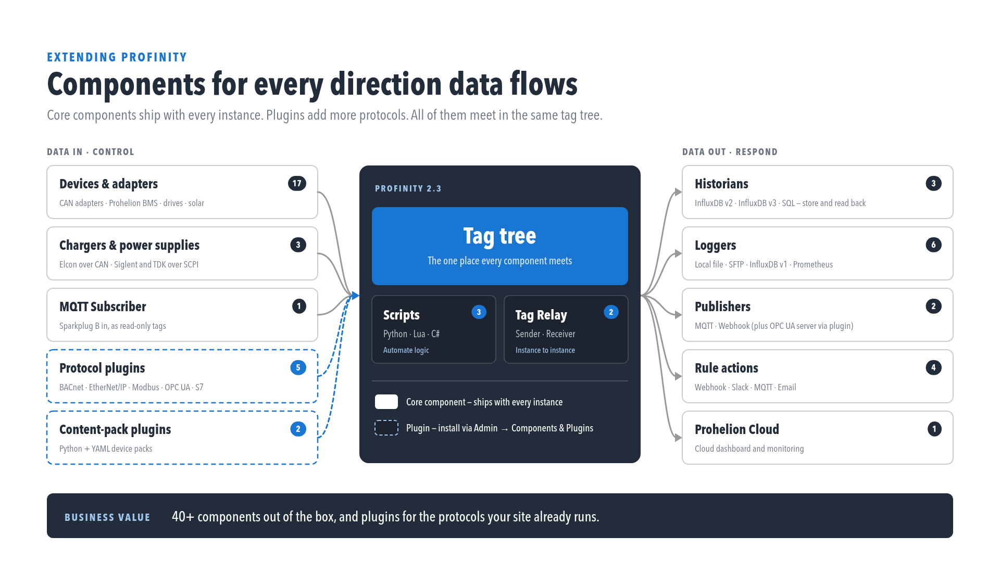

# Extending Profinity

Profinity can be extended and customised to meet specific needs, using [Scripting](./Scripting/index.md), [Tag layer](./Tag_Layer/index.md), [Rules and alerts](./Rules/Alerts.md), [Derived tags](./Rules/Derived_Tags.md), [APIs](./APIs/index.md), [Dashboards](./Dashboards/index.md), [Plugins](./Plugins/index.md), [Custom Components](./Custom_Components/index.md), the [Profinity SDK](./SDK.md), [MCP Server](./MCP_Server.md), and [Hosting](./Hosting/index.md), turning Profinity into an application server tailored to the deployment.

<figure markdown>

<figcaption>Make Profinity the hub of your solution</figcaption>
</figure>

<figure markdown>

<figcaption>Components for every direction data flows</figcaption>
</figure>

For mobile access, see [Profinity Mobile](../Mobile/index.md).

## Tag layer and rules (2.3)

The [tag layer](./Tag_Layer/index.md) provides Tag Explorer, collections, rules, [derived tags](./Rules/Derived_Tags.md), and [ALL ALERTS](./Rules/Alerts.md). [Tag linking](./Tags/Tag_Linking.md) from Tag Explorer starts collections and rules quickly.

## Profiles, configuration, and theming (2.3)

[Menu layout](./Profiles/Menu_Layout.md) covers customising per-profile and per-component menu placement. The [settings registry](./Configuration/Settings_Registry.md) covers the centralised config.yaml settings model. [Theming](./Theming/index.md) covers branding and theme customisation through the engine Themes API.

## Scripting

Profinity's [scripting capabilities](./Scripting/index.md) automate tasks and create custom operations in C#, Python, or Lua, so each script can be written in the language best suited to the task. Scripts range from manual one-off operations to continuous, long-running processes, which suits teams automating repetitive tasks, integrating with other systems, or building workflows aligned to their own business processes.

<!-- Logo sources (page note, not rendered).
     C#: https://github.com/dotnet/brand/tree/main/logo/language-icons (csharp-128.png)
     Python: https://www.python.org/community/logos/
     Lua: https://www.lua.org/images/ (lua-logo.gif), copyright 1998 Lua.org, graphic design by Alexandre Nakonechnyj -->

| C# Scripting | Python | Lua |
|--------------|--------|-----|
|  |  |  |

## Dashboards

Profinity's [dashboard system](./Dashboards/index.md) creates dynamic, data-driven user interfaces from YAML configuration files. Dashboards display real-time information from CAN bus systems and connect directly to Profinity's data sources.

Dashboards can be used in multiple contexts:
- **Custom Components**: Create component-specific interfaces, optionally with DBC files
- **Profile Dashboards**: Replace the standard home page with a custom dashboard

Dashboards create monitoring interfaces without writing code, using a declarative YAML approach, so teams monitoring complex systems, building operator interfaces, or developing custom data visualisation for system performance and status can do so without a separate development effort.

The Dashboard system supports component types including data displays, charts, status indicators, and interactive elements, all connected to live data through Profinity's data binding system, so dashboards update automatically as the system state changes.

## Custom Components

Profinity's [Custom Components](./Custom_Components/index.md) integrate any CAN bus device into a profile by combining a DBC file (which defines the CAN messages and signals) with a Dashboard (which defines the user interface), so data from any device that communicates via CAN bus can be monitored, graphed, and logged.

### Component reference (2.3)

| Page | Description |
|------|--------------|
| [Component Types](./Components/Component_Types.md) | Compares Custom Components, Dashboard Components, and DLL plugins, and when to use each packaging model. |
| [Component Catalog](./Components/Component_Catalog.md) | Covers hiding component types from the add-component catalog using configuration. |
| [Component Pack CLI](./Components/Component_Pack_CLI.md) | Covers the `profinity-component-pack` tool for validating, packing, and installing Custom Component bundles. |
| [Tag Tree Path](./Components/Tag_Tree_Path.md) | Covers nesting a component's tags under a parent folder in the tag tree using the Tag tree path setting. |

## Profinity SDK

Building a DLL plugin, packing a Custom Component for distribution, and writing and testing a
script outside a profile all draw on the same [Profinity SDK](./SDK.md), one developer kit
that Prohelion distributes on request rather than as three separate downloads. It suits
organisations building a compiled integration, packaging Custom Components for field deployment,
or developing scripts offline before adding them to a profile.

## APIs

Profinity is built around a modern API architecture, providing [RESTful interfaces](./APIs/index.md) to integrate with and extend its functionality. The APIs are secured with Bearer tokens and use JSON, so custom applications can be built on them, or existing applications extended with them.

The APIs expose both real-time and historical data, which suits organisations integrating Profinity with other systems, building custom dashboards, or developing new applications on top of Profinity's data.

Profinity supports [Swagger](https://swagger.io/), which documents the available APIs and how to call them.

<figure markdown>

<figcaption>Swagger from SmartBear</figcaption>
</figure>

## Scripting vs APIs

Profinity offers two ways to extend its capabilities to meet the requirements of an application: Scripting and APIs. The comparison below sets out the trade-offs between them.

| Scripting                                                                | APIs                                                                           |
| ------------------------------------------------------------------------ | ------------------------------------------------------------------------------ |
| Supports C#, Python, and Lua                                             | Support any programming language that can call REST APIs and JSON              |
| Is built in to Profinity and requires no external frameworks or hosting  | Run outside of Profinity, in a custom environment, app, or cloud               |
| Can be developed quickly and easily, to solve simple problems            | Can be as rich and complex as the application requires and still use Profinity |
| Can run headless (no user interaction, scheduled or triggered by CAN)    | Require the application to supply its own logic for how it uses the API        |
| Script runs inside Profinity                                             | If scripted, scripts run outside Profinity and can be distributed              |

The choice between the two depends on the requirements of the application.

## MCP Server

Profinity includes support for the [Model Context Protocol (MCP)](./MCP_Server.md), which enables AI assistants and other MCP-aware tools to interact with Profinity to query system data and metadata.

The MCP server exposes ten read-only tools for tag discovery, tag values and history, and alert state, over Streamable HTTP at `/api/v2/Ai/Mcp`. See [MCP Server](./MCP_Server.md) for the full list of tools, authentication requirements, and usage examples.

The MCP server suits organisations integrating AI assistants with their CAN bus systems, automating data analysis, or building monitoring and reporting systems that query Profinity data programmatically.

## Hosting

Profinity includes an [integrated web server](./Hosting/index.md) that hosts custom applications, whether they use modern web technologies such as ReactJS or Angular, or traditional HTML and JavaScript.

The web server supports SSL/TLS certificates so that hosted applications are secured in production environments, which suits organisations developing and deploying custom web applications that integrate with Profinity as part of a single, unified user experience.

By combining these features, Profinity can be extended to serve as an application server tailored to an organisation's needs.
