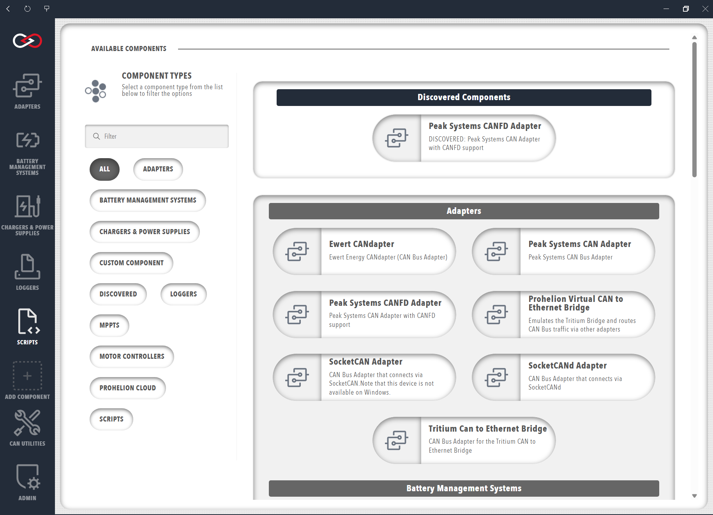
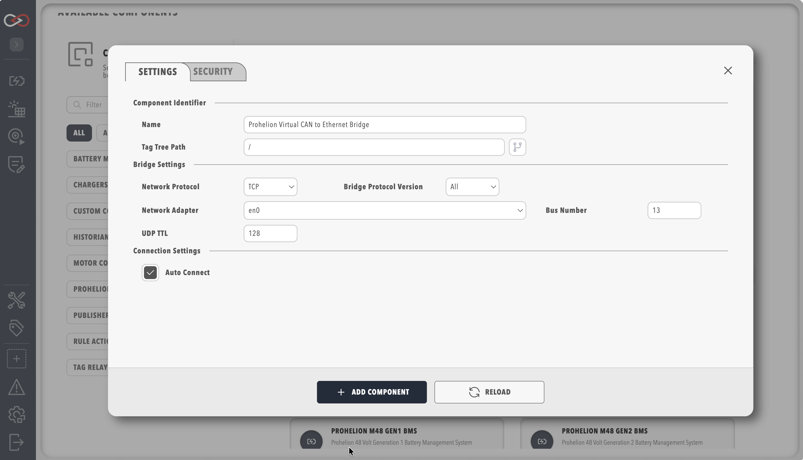

# Adding Components to Your Profile

Components can be added to your Profile by selecting the `+ ADD COMPONENT` button from the sidebar or homepage.

A page with all the currently supported components is presented, including hardware devices, data loggers and custom scripts, allowing you to select the component that you wish to add. The page also includes filter options to help locate the correct component.

Some CAN bus adapters in Profinity can be auto-discovered, and a discovered adapter that is available in your configuration is shown at the top of the screen.  You can filter the devices shown by selecting a filter on the left hand side of the screen.

!!! info "Add a CAN Adapter First"
    Adding a CAN Adapter allows Profinity to receive CAN traffic from the devices connected to your CAN bus network, and without CAN traffic Profinity is limited in what it is able to show and do. The supported adapters, including the Prohelion and Tritium CAN to Ethernet bridges, are described in [CAN bus Adapters](../Components/Adapters/CAN_Bus_Adapters.md), and a step-by-step procedure is given in [How to Connect to CAN Bus](../How_To_Guides/Connect_to_CAN_Bus.md).

<figure markdown>

<figcaption>Add a new component to the Profile</figcaption>
</figure>

Each component in the Profile has a set of properties that define the configuration of the component. Upon selecting a component, you will be prompted to fill in the necessary configuration properties for the component. The information required will vary greatly by component and can be modified later by opening the `Change Settings` menu from the component's dashboard. More information about specific component properties and how to correctly configure each component can be found in the dedicated component sections.

<figure markdown>

<figcaption>Example of defining component properties</figcaption>
</figure>

!!! info "Duplicate component names"
    You can add multiple components of the same type to your profile, but each must have a unique name, and the base address of the component is also generally unique. If the profile already has a component with the same name as the one you are proposing, a digit is added to the new component name to keep the component names in the profile unique.

Once you have added the component to your profile, an icon will appear in the sidebar to represent the new component. Hovering your mouse over a component icon in the sidebar will present a list of all devices associated with the current profile that match that component type. 

Each component also has a coloured indicator that displays the operational status of the device. The possible device statuses are summarised below.

| Colour   | Meaning                                                                          |
|----------|----------------------------------------------------------------------------------|
| `Green`  | The device is available, sending valid data and is in a valid state              |
| `Yellow` | The device is available, but is either not sending data or is in a warning state |
| `Red`    | The device is in an error state                                                  |
| `Grey`   | The device is not available, not connected or not visible on the network         |

## Removing Components from Your Profile

If you no longer require a component you can remove it by opening the component settings (the three bar icon at the top right of the component dashboard shown below) and selecting delete.

<figure markdown>

<figcaption>A dashboard showing the three bar setting icon (top right)</figcaption>
</figure>