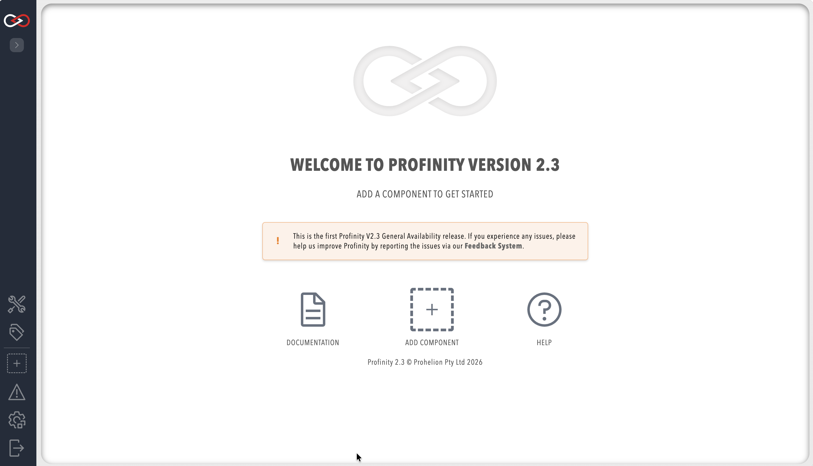

# Profinity Profiles

A Profile is the core mechanism that Profinity uses to maintain the configuration of your system. Any component that you add to your system becomes associated with the active Profile, and the configuration for each device is retained after Profinity is shut down.

Profinity keeps track of your Profiles and loads the most recently used one each time you start the tool.

## Managing Profiles

You can manage your Profiles through the **ADMIN** section of Profinity. Select **ADMIN** in the side menu, then the **Profile** pill, to:

- **Switch between profiles**: You can have multiple profiles configured in Profinity. Click **ACTIVATE** on a profile in the list to make it the active profile, which is useful when you are working with different system configurations or testing different setups.

- **Create new profiles**: You can create new profiles to organize different system configurations. Each profile maintains its own set of components, dashboards, and settings.

- **Manage existing profiles**: View, edit, or delete profiles as needed.

You can see the components that are in your active Profile in the menu on the left of the screen, and you can add to the Profile by clicking on the [+ ADD COMPONENT](./Adding_New_Components.md) button in the left-most menu of Profinity or on the home page.

<figure markdown>

<figcaption>Profinity homepage (showing the `+ ADD COMPONENT` button in both locations)</figcaption>
</figure>

## More Information

Additional information on how to create and manage Profiles can be found in the [Admin / Profiles](../Administration/Profiles.md) section of this documentation.