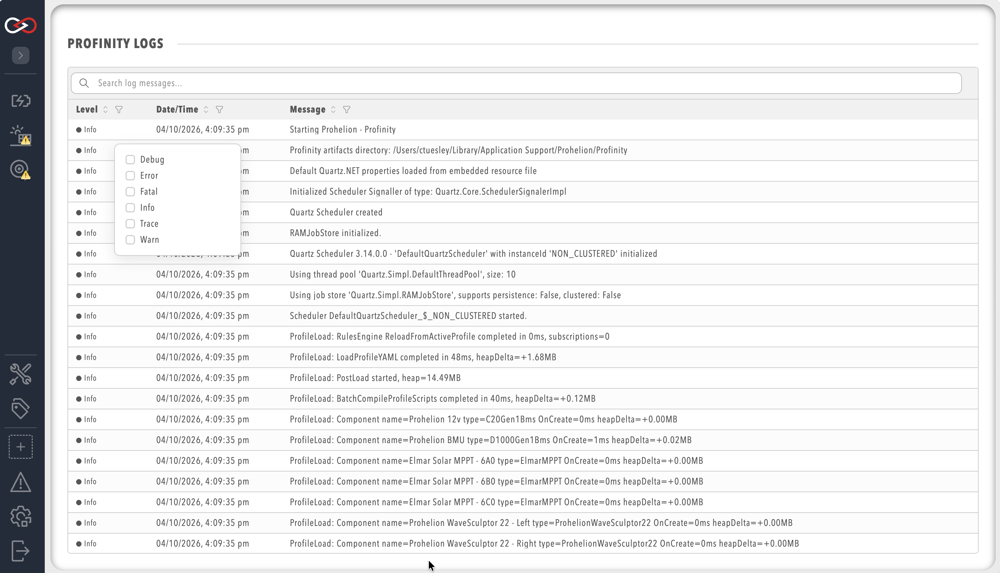

# Profinity System Logs

Profinity has a built-in logging mechanism that captures information about the operation of the system and is designed to assist in diagnosing system issues. To access the system logs, navigate to the `ADMIN` tab, then select `Logs`.

!!! info "Expanding Log Lines"
    If a log line goes off the right hand side of the page because it is too big, you can click on the line to expand that log message.

<figure markdown>

<figcaption>Profinity System Logs</figcaption>
</figure>

Each log entry contains a timestamp, a message level (for example `Info`, `Warn` or `Error`), and a message description. To help diagnose particular issues, the scope of the system logs can be changed to only include particular message levels. More information about varying the displayed log levels can be found in [Logs](../Administration/Logs_Config.md#system-logs-configuration) in the Administration section.