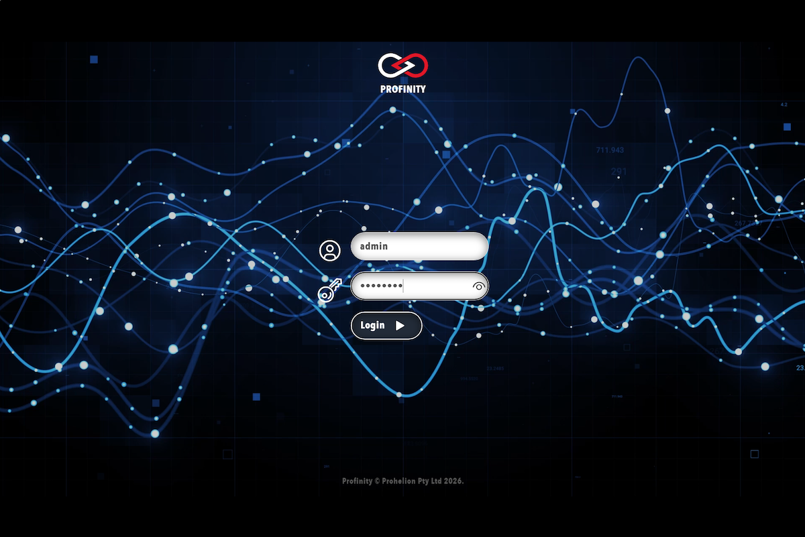

# Installing Profinity On Windows

!!! info "Available Profinity Releases"
    Profinity is currently available on [Windows machines](./Windows_Installation.md) as a standard desktop application, for selected [Unix Platforms (including macOS and Linux)](./Zip_Installation.md) and as a [Docker container](./Docker_Installation.md) for Docker enabled environments and Cloud setups.

## Installation on Windows

The Profinity Setup Wizard installs Profinity on a Windows machine.

!!! info "Profinity 2.3 Download Information"
    Profinity 2.3 is currently available for Early Adopters only.  Contact Prohelion at the [Prohelion Website](https://www.prohelion.com) to register for the program and to receive the installation files.

1. Open the downloaded file `Profinity.Install.msi` from your downloads directory.
2. Follow the prompts in the Profinity Setup Wizard.

Launching the Profinity desktop client opens the Profinity homepage directly.

<figure markdown>

<figcaption>Profinity homepage</figcaption>
</figure>

!!! warning "Available Ports for Windows"
    Even when Profinity is just being run as a Desktop application, it still listens on all available network interfaces on the running machine, on TCP port 18080 by default.  To prevent remote access to the Profinity instance, change the default IP address that Profinity runs on to localhost (127.0.0.1) in the [System Configuration](../Administration/System_Configuration/Profinity_Web.md).

### Starting and Stopping Profinity

As a Windows desktop application, Profinity is started by running the application from the Start Menu.

To stop Profinity, shut down the application.

### Accessing a Desktop Application Instance via a Web Browser

With Profinity Desktop running, you can also access the user interface as a web application if the Profinity instance is running on an address other than 127.0.0.1.  

To do so, open the URL defined in the Profinity Web panel of [System Configuration](../Administration/System_Configuration/Profinity_Web.md) (reached from **ADMIN** in the side menu) to access the Profinity web client. For installations that followed the default setup procedure, the default URL is `http://localhost:18080` on the local machine, or `http://[Your IP Address]:18080` if accessed remotely.

Connecting to the Profinity web client directs the browser to the Profinity login page. For security, a fresh install of Profinity Desktop on Windows has no account that can be used to log in, so create a [user account](../Getting_Started/Create_User.md) in the desktop application first and then log in as normal.

<figure markdown>

<figcaption>Profinity login page</figcaption>
</figure>
