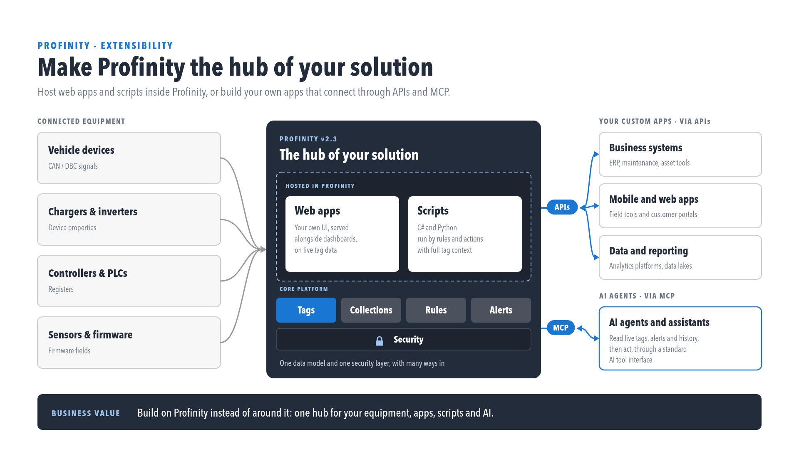

# Integrating to Profinity

Profinity is built to be the hub of a solution. Connected equipment feeds into Profinity, which hosts web apps and scripts on top of its core platform (Tags, Collections, Rules, Alerts) behind Security, then exposes that through [APIs](./APIs/index.md) to your own business systems and apps, and through [MCP](./MCP_Server.md) to AI agents.

<figure markdown>

<figcaption>Make Profinity the hub of your solution</figcaption>
</figure>

## APIs

Profinity provides [RESTful interfaces](./APIs/index.md) to integrate with and extend its functionality. The APIs are secured with Bearer tokens and use JSON, so custom applications can be built on them, or existing applications extended with them.

The APIs expose both real-time and historical data, which suits organisations integrating Profinity with other systems, building custom dashboards, or developing new applications on top of Profinity's data.

Profinity supports [Swagger](https://swagger.io/), which documents the available APIs and how to call them.

<figure markdown>

<figcaption>Swagger from SmartBear</figcaption>
</figure>

## MCP Server

Profinity includes support for the [Model Context Protocol (MCP)](./MCP_Server.md), which enables AI assistants and other MCP-aware tools to interact with Profinity to query system data and metadata.

The MCP server exposes ten read-only tools for tag discovery, tag values and history, and alert state, over Streamable HTTP at `/api/v2/Ai/Mcp`. See [MCP Server](./MCP_Server.md) for the full list of tools, authentication requirements, and usage examples.

The MCP server suits organisations integrating AI assistants with their CAN bus systems, automating data analysis, or building monitoring and reporting systems that query Profinity data programmatically.

## Scripting vs APIs

Profinity offers two ways to extend its capabilities to meet the requirements of an application: [Scripting](../Developing_with_Profinity/Scripting/index.md) and APIs. The comparison below sets out the trade-offs between them.

| Scripting                                                                | APIs                                                                           |
| ------------------------------------------------------------------------ | ------------------------------------------------------------------------------ |
| Supports C#, Python, and Lua                                             | Support any programming language that can call REST APIs and JSON              |
| Is built in to Profinity and requires no external frameworks or hosting  | Run outside of Profinity, in a custom environment, app, or cloud               |
| Can be developed quickly and easily, to solve simple problems            | Can be as rich and complex as the application requires and still use Profinity |
| Can run headless (no user interaction, scheduled or triggered by CAN)    | Require the application to supply its own logic for how it uses the API        |
| Script runs inside Profinity                                             | If scripted, scripts run outside Profinity and can be distributed              |

The choice between the two depends on the requirements of the application.

## Where next

- Compiled integrations and packaged components: [Developing with Profinity](../Developing_with_Profinity/index.md).
- Sharing live tags between Profinity instances: [Tag relay](../Tags/Tag_Relay.md).
