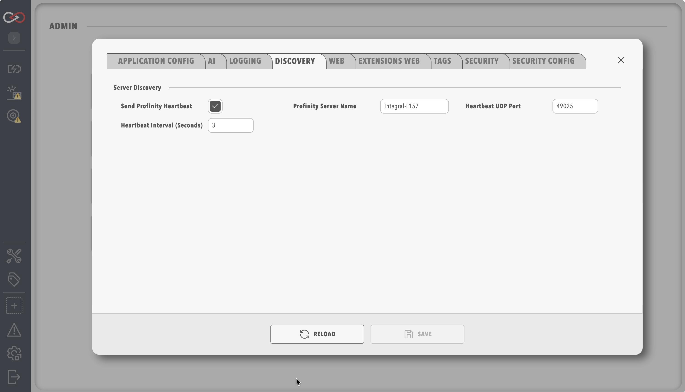

# Profinity Mobile

**Profinity Mobile** is a companion app for iOS and Android that connects to a Profinity engine over HTTPS and displays the web UI in a mobile shell. Profinity 2.3 adds **UDP heartbeat discovery**, so that devices on the same local area network (LAN) can find servers without typing URLs.

## Install the app

!!! info "Profinity v2.3 Download Information"
    Profinity v2.3 mobile app is currently available for Early Adopters only.  Contact Prohelion at the [Prohelion Website](https://www.prohelion.com) to register for the program and to receive the installation files.

## Enable server discovery on the engine

1. On the Profinity server, select **ADMIN** in the side menu, then **System Configuration**.
2. Locate **Server Discovery** (application configuration section).
3. Configure:
    - **Profinity Server Name** — friendly name shown in the mobile list, which defaults to the host name of the machine (for example `Workshop-Profinity`).
    - **Send Profinity Heartbeat** — enabled by default.
    - **Heartbeat UDP port** — default **49025**.
    - **Heartbeat interval (seconds)** — heartbeat broadcast interval, from 1 to 60 seconds, with a default of 3.

<figure markdown>

<figcaption>Server Discovery heartbeat settings</figcaption>
</figure>

Saving config.yaml restarts the engine.

## Discovery protocol

Profinity Mobile listens for UDP broadcasts on port **49025** (default) but this can be adjusted as required.  The mobile app uses the discovery protocol to find local instances of Profinity on the network so user can easily identify and connect to them from their mobile device.

## Connect from the app

1. Connect the phone to the **same Wi-Fi** network as the Profinity server.
2. Open Profinity Mobile, where the **discovery list** shows servers broadcasting heartbeat.
3. Select your server and connect (HTTPS is preferred when configured).

## Login modes

| Mode | Description |
|------|-------------|
| **Password** | Standard Profinity login (respects site Local/SSO policy in the WebView) |
| **Kiosk** | Auto-login with a configured kiosk user (see [Kiosk Mode](../Administration/Kiosk_Mode.md)) |

Back navigation returns to server selection without clearing any server TLS trust prompts that have been accepted.

## Troubleshooting

| Issue | Remedy |
|-------|--------|
| No servers in list | Confirm heartbeat is enabled, the phone and server are on the same subnet, and the firewall allows UDP 49025 |
| Android emulator list is empty | Emulators **cannot** receive LAN broadcasts, so use a **physical phone** |
| Certificate warnings | Install a trusted HTTPS certificate on the server, or accept the prompt once per server |
| SSO in mobile WebView | The site must use the **Sso** sign-in method, and the identity provider (IdP) flow is completed in the embedded browser |

## Related documentation

- [OEM white-label](OEM_White_Label.md)
- [Kiosk Mode](../Administration/Kiosk_Mode.md)
- [SSO and sign-in method](../Administration/Security/SSO_and_Sign_In.md)
- [Release notes 2.3.10](../Release_Notes/2.3.10.md)
