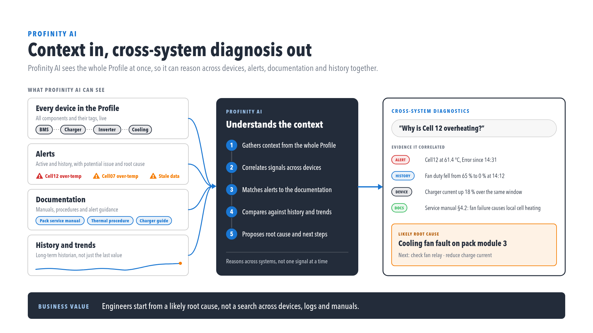

# Profinity AI

Profinity AI is a chat assistant built into Profinity, available from the side menu once an administrator has configured it (see [Profinity AI settings](../Administration/Security/AI_Assistant.md)). It can answer questions about the live state of this Profinity instance, look up how-to and reference material from docs.prohelion.com, and, if the administrator has enabled it, search the web.

<figure markdown>

<figcaption>Context in, cross-system diagnosis out</figcaption>
</figure>

!!! info "Your Messages May Leave This Instance"
    Profinity AI is answered by an external AI provider unless your administrator has configured a local, self-hosted model. Ask your administrator which provider is configured before discussing sensitive data with the assistant.

## Open Profinity AI

Users with the **AI Assistant** permission see a **Profinity AI** entry in the side menu, above **Admin**. Selecting it opens the chat window.

<figure markdown>

<figcaption>Profinity AI in the side menu (screenshot placeholder — provide SS-49)</figcaption>
</figure>

## Ask a question

The chat window opens with a short greeting and three example prompts to get started, covering a system-health question, a documentation search, and a how-to question. Type a question of your own and press **Enter** to send it, or **Shift+Enter** to add a new line without sending.

<figure markdown>

<figcaption>Profinity AI chat window with suggested prompts (screenshot placeholder — provide SS-50)</figcaption>
</figure>

While Profinity AI is answering, the status indicator at the top of the window reads **Thinking…**; once a question has been answered it reads **Connected to this environment**. The response streams in as it is generated, rather than appearing all at once.

<figure markdown>

<figcaption>A conversation in progress (screenshot placeholder — provide SS-51)</figcaption>
</figure>

Profinity AI answers questions about this instance by querying live data through the same permissions you have — it cannot see tags, alerts, or configuration you could not otherwise see through Profinity yourself.

You can send another question while Profinity AI is still answering the previous one; it is queued and answered in turn. Use **Stop** to cancel a response in progress, and **New chat** to clear the conversation and start again.

## Limitations for 2.3

- Conversation history is kept only for the current browser tab and is cleared when the tab is closed. Profinity AI does not keep a record of past conversations across sessions or devices.
- Profinity AI uses one configuration for the whole instance; there is no per-user choice of provider or model.
- The example prompts shown in the empty state are suggestions only — Profinity AI is not limited to those topics.

## Related documentation

- [Profinity AI settings](../Administration/Security/AI_Assistant.md) — administrator configuration, permissions, and data-handling notes.
- [MCP Server](../Extending_Profinity/MCP_Server.md) — the live-data connection Profinity AI uses.
- [AI Skills](./AI_Skills.md) — a separate toolkit for building Profinity dashboards and other config with an AI coding assistant, outside Profinity itself.
