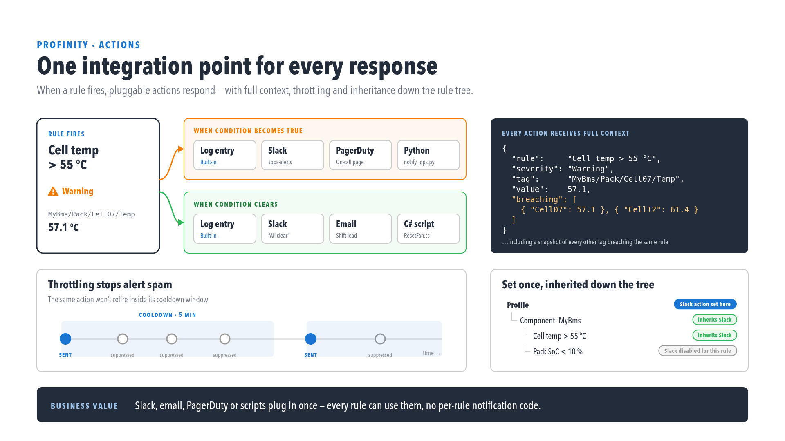
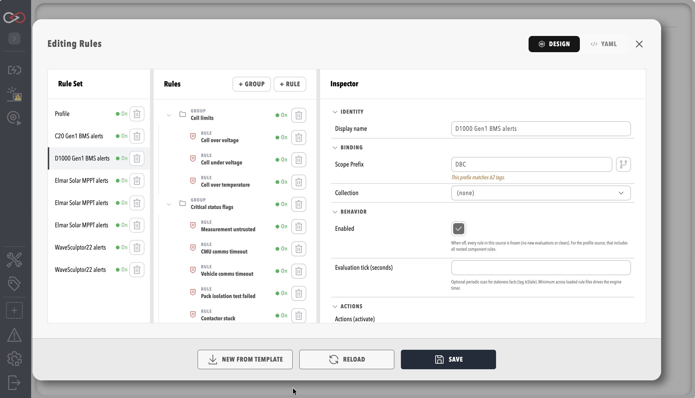

# Rule Actions and Scripts

A tag rule watches the tags in its scope and, when its condition changes, records an alert and runs the actions attached to it. Profinity 2.3 offers two built-in actions, the Email, Slack, Webhook and Message Queuing Telemetry Transport (MQTT) actions, and any [script](../Developing_with_Profinity/Scripting/Script_Types/Rule_Scripts.md) set to **Run On Alert** mode. Every action receives the list of tags that caused the rule to fire, which is named `TriggeredTags` in a script and `triggeringTags` in the Webhook and MQTT JSON message.

!!! info "Licence Required"
    Rules, the [Alerts Log](Alerts.md) and the built-in actions **Profinity Log** and **None** work on every edition. The Email, Slack, Webhook and MQTT actions need the **Tag Rule Actions** licensed feature, included in the **Server** and **Enterprise** editions, and a script set to **Run On Alert** needs both **Tag Rule Actions** and **Scripting** (included in the **Desktop**, **Server** and **Enterprise** editions). Without **Tag Rule Actions** the rule still evaluates and the alert is still recorded, and only the licensed actions are skipped. See [Licensing](../Administration/Licensing.md) for what each edition includes.

<figure markdown>

<figcaption>A rule firing and the actions it runs</figcaption>
</figure>

## Rules Visual Editor

Select **RULES & ACTIONS** under **TAG UTILITIES** in the side menu, which needs the **View tag rules** permission, or choose **Edit Rules** on a component that ships default rules, such as the Elmar MPPT and the C48 Gen2. The editor lists the profile's rules first and then each component's rules, and shows every rule with its level, scope, thresholds and actions.

<figure markdown>

<figcaption>Rules visual editor with an expanded rule</figcaption>
</figure>

The editor writes the same `rules.yaml` document that can be edited directly, and it exposes the settings that control how a rule is evaluated: **Rule level** and **Rule type** for each rule, **Dwell seconds**, **Throttle minutes** and the **More information links**, and the **Evaluation tick (seconds)** on the rules source. Each rule also has a `description` that the Alerts Log shows to the operator, and a condition written in the [tag expression](./Tag_Expressions.md) language, for example `tag.Value > 4.2` to trip with `tag.Value < 4.0` to clear, or `tag.IsStale` for a sensor that has stopped reporting.

The **Evaluation tick (seconds)** setting, `evaluationTickSeconds` in YAML, takes a whole number from 1 to 3600. Rules evaluate whenever a tag in their scope changes, and the tick adds a periodic extra pass, which is the only way a `tag.IsStale` rule can fire for a tag that has stopped changing. When several rules files set a tick, the smallest value applies to the whole profile, so a low value in one file changes the evaluation cadence of every file. A rule that tests for stale or missing data needs the tick to be set in at least one loaded rules file.

Setting **Publish state tag path** on a rule, in its **Rule State** group, mirrors the rule's current state to a read-only tag, as described in [Rule State Publishing](./Derived_Tags.md#rule-state-publishing).

## A Complete rules.yaml Example

The following file has one rules source with a file-level scope, actions inherited by every rule beneath it, a group with its own action, a threshold rule and a boolean rule that uses a collection. It assumes a collection with the id `CellVoltages`, as in the example under [Collections](./Collections.md#a-worked-collections-example), and two actions named `OpsSlack` and `OpsEmail` that were added as described under [Making an Action Available](#making-an-action-available).

```yaml
version: "2.3"
rules:
  displayName: Vehicle alerts
  enabled: true
  evaluationTickSeconds: 30
  scope:
    prefix: Vehicles/Car1
  actions:
    - action: ProfinityLog
      triggerLevel: Info
    - action: OpsSlack
      triggerLevel: Error
  clearActions:
    - action: ProfinityLog
      triggerLevel: Info
  groups:
    - group:
        id: battery
        displayName: Battery
        scope:
          prefix: Battery
        actions:
          - action: OpsEmail
            triggerLevel: Fatal
        rules:
          - rule:
              id: pack_temperature
              displayName: Pack temperature
              type: threshold
              description: >
                Pack temperature is above its normal range. Check the coolant
                pump and fan before the next drive.
              moreInformation:
                - description: Battery cooling guide
                  url: https://docs.example.com/battery-cooling
              relatedTags:
                - Vehicles/Car1/Battery/CoolantTemperature
              scope:
                prefix: PackTemperature
              expression: tag.HasValue
              dwellSeconds: 10
              throttleMinutes: 15
              thresholds:
                - condition: { operator: ">", value: 45 }
                  clearValue: 42
                  level: Warning
                  message: Pack temperature above 45 C
                  clearMessage: Pack temperature back below 42 C
                - condition: { operator: ">", value: 55 }
                  clearValue: 52
                  level: Fatal
                  message: Pack temperature above 55 C
  rules:
    - rule:
        id: cell_over_voltage
        displayName: Cell over voltage
        level: Error
        description: A cell voltage is above 4.2 V.
        scope:
          collection: CellVoltages
        expression: tag.Value > 4.2
        clearExpression: tag.Value < 4.1
        throttleMinutes: 5
        disableActions:
          - profile/ProfinityLog
        actions:
          - action: OpsEmail
            message: "Cell {TagId} is at {Value} V"
        clearActions:
          - action: OpsEmail
            message: "Cell {TagId} is back to {Value} V"
```

The file begins with `version: "2.3"` and a single `rules` object. Its `scope.prefix` of `Vehicles/Car1` is the default for every rule, and a `prefix` written without a leading `/` in a group or rule joins beneath its parent, so `pack_temperature` watches `Vehicles/Car1/Battery/PackTemperature`, while a prefix with a leading `/` replaces the inherited one and `/` alone covers the whole tag tree. Every rule must end up with a `prefix`, a `collection` or both, and when both are present a tag has to satisfy both. A rules file that belongs to a component is written relative to that component, so its prefixes start from the component's own place in the tag tree.

The `pack_temperature` rule is a threshold rule, which holds an ordered list of steps in `thresholds`, each with a `level` and a `message` and either a structured `condition` (the operators are `==`, `!=`, `>`, `>=`, `<`, `<=` and `between`) or an `expression`. The `clearValue` on a step is its deadband, so the Warning step stays active until the value falls below 42, and `clearExpression` does the same job for a step that uses an `expression`. A threshold rule still needs a rule-level `expression`, and `tag.HasValue` is the usual choice, but it takes its level from each step, so it must not set a rule-level `level`, `actions` or `clearActions`. The `dwellSeconds` value (or `dwellMinutes`, never both) makes the condition hold continuously before the first step activates, and the `throttleMinutes` value stops the actions of one rule on one tag from running again within that number of minutes, on both the trip and the clear. The `cell_over_voltage` rule is a boolean rule, which has a single `level`, a `clearExpression` that clears the alert even while the main `expression` is still true, and its own `actions` and `clearActions`.

The `description` is the text the operator reads in the detail dialog of the [Alerts Log](Alerts.md) and supports Markdown, `moreInformation` adds links, each with a `description` label and an `https://` `url`, which the dialog lists under **DOCUMENTATION**, and `relatedTags` stores tag paths that help diagnose the alert with the rule. Beyond the example, a rule, group or file takes `enabled: false` to switch everything beneath it off, and a rule may have `displayName` and `type: boolean` written explicitly.

## Actions Inherited Down the Rule Tree

Actions written on the file or on a group are parent actions, and each one needs a `triggerLevel`. A parent action runs for every rule beneath it whose alert level is at or above the `triggerLevel`, taking the level from the rule or, for a threshold rule, from the step that fired. In the example above, a Warning on `pack_temperature` runs only **Profinity Log**, an Error runs **Profinity Log** and `OpsSlack`, and the Fatal step also runs `OpsEmail` from the group. Actions written on a rule or on a threshold step are local, take no `triggerLevel` and always run when that rule or step fires. The `clearActions` lists work the same way when the alert clears, and each side can be switched off for one rule with `disableActions` and `disableClearActions`, which list an inherited action as the id of its parent, a slash and its name, as in `profile/ProfinityLog`. For a rules file that belongs to a component, the parent id is the component name instead of `profile`, and for a group it is the group `id`. Each parent can list a given action name only once, and a rule with `thresholds` cannot also have rule-level `actions` or `clearActions`, so its actions go on the steps.

An action entry may be a bare name or an object with `action` and optionally `message` and `level`, where `message` replaces the text sent for this rule and `level` sets the level that **Profinity Log** writes at. The `tagId` and `value` fields substitute a different tag path and value for those reported to the action. An action that is not found, or is not an action component, is reported as `references unknown component` when the rules file loads, and the rule file is not loaded until the name is corrected.

## Action Picker

When editing a rule in the visual editor, actions are chosen from the action picker, which lists:

- **Profinity Log**, which writes a message to the Profinity log at the action's `level` and otherwise the rule's level, and **None**, which records the alert in the Alerts Log only and rejects `message`, `level` and `tagId`. In YAML the two are written `ProfinityLog` and `None`.
- Every Email, Slack, Webhook and MQTT action that has been added to the profile, listed by the name of its component.
- Every **CSharp Script**, **Python Script** or **Lua Script** component whose mode is **Run On Alert**, as described in [Rule scripts](../Developing_with_Profinity/Scripting/Script_Types/Rule_Scripts.md).

### Making an Action Available

An Email, Slack, Webhook or MQTT action does not appear in the picker until it exists as a component. Add the component from the **Rule Actions** group when [adding a new component](../Getting_Started/Adding_New_Components.md), choosing **Email Rule Action**, **Slack Rule Action**, **Webhook Rule Action** or **MQTT Rule Action**, give it a name and fill in its settings. The component's name becomes the action id in the picker and in `rules.yaml`, so a component named `OpsSlack` is written `action: OpsSlack`, and renaming the component means updating the rules that use it. A rule can then select the action from the picker, and several components of the same type, for example one Slack action per channel, can exist side by side.

## TriggeredTags

Every rule action receives the same firing context, which includes `TriggeredTags`, the list of tags in the rule's scope that are currently evaluating true. A script uses it to log, branch or pass values on, and the Webhook and MQTT actions send the same list as the `triggeringTags` array of their JSON message, described under [Webhook and MQTT Actions](#webhook-and-mqtt-actions). The script version of the context is described in [Rule scripts](../Developing_with_Profinity/Scripting/Script_Types/Rule_Scripts.md).

## Alert Level

Set `level` on a rule, or on each threshold step, to classify alert severity, and the Alerts Log and the alert indicators combine the active rule state with that level.

The valid levels, from least to most severe, are `Trace`, `Debug`, `Info`, `Warning`, `Error` and `Fatal`. Level names are not case-sensitive, `Information` is accepted as `Info` and `Warn` as `Warning`, and a rule with no level is treated as `Info`. An unrecognised level on a rule, threshold step or `triggerLevel` stops the rules file loading and names the rule that holds it, so correct the spelling and save again. The same names are used as the `triggerLevel` of an action configured on a parent rule file or group.

A script receives the level as the string `RuleLevel`, and the Webhook and MQTT JSON message does not include the level.

## Message Placeholders

The message of an action and the template settings of the Email and Slack actions can include the following placeholders, which Profinity replaces when the action fires: `{RuleId}`, `{TagId}`, `{Transition}`, `{Value}`, `{TagValue}`, `{Quality}`, `{MetaType}`, `{RuleLevel}`, `{TriggeredTagCount}`, `{TriggeredTagIds}`, `{ThresholdLevel}` and `{ThresholdMessage}`. The `{Value}` and `{TagValue}` placeholders both give the value reported to the action, normally that of the tag that caused the transition, `{TriggeredTagIds}` is a comma-separated list, and `{ThresholdLevel}` and `{ThresholdMessage}` are filled only for threshold rules. Control characters in substituted values are removed so that a device value cannot split a notification across lines.

## Email Action Settings

The **Email Rule Action** sends a message over Simple Mail Transfer Protocol (SMTP) each time a rule transitions.

| Setting | Purpose |
|---|---|
| **SMTP host** | The mail server host name. Required, and defaults to `localhost`. |
| **SMTP port** | The mail server port, from 1 to 65535. Defaults to 587. |
| **Use SSL** | Enables TLS for the SMTP connection. Enabled by default. |
| **Username** / **Password** | Optional SMTP credentials. The password is stored encrypted. |
| **From address** | The sender address. Required, and defaults to `alerts@localhost`. |
| **To addresses** | One or more recipient addresses separated by commas or semicolons. Required. |
| **Subject template** | Optional subject line, which may use the [placeholders](#message-placeholders). A default subject is used when empty. |
| **Message prefix** | Optional text placed before the alert message in the body, which may use the placeholders. |

## Slack Action Settings

The **Slack Rule Action** posts a message to a Slack channel through an incoming webhook, and each Slack action can target a different workspace.

| Setting | Purpose |
|---|---|
| **Webhook URL** | The Slack incoming webhook URL. Required, must be an absolute URL, and is stored encrypted. |
| **Slack channel** | The channel name. Required, and defaults to `#alerts`. |
| **Title template** | Optional message title, which may use the [placeholders](#message-placeholders). A default title is used when empty. |
| **Message prefix** | Optional text placed before the alert message, which may use the placeholders. |

## Webhook and MQTT Actions

A rule can fire a **Webhook** action or an **MQTT** action when it transitions, sending a notification to a generic HTTP destination or an MQTT broker. Both send the same message, so a subscriber sees an identical structure whichever one a rule uses. The JSON property names are camelCase, `transition` is one of `EnteredTrue`, `EnteredFalse`, `EnteredStep` or `ExitedStep`, and `triggeringTags` is the same list that a script receives as `TriggeredTags`:

```json
{
  "ruleId": "high-battery-temp",
  "ruleName": "High battery temperature",
  "transition": "EnteredTrue",
  "triggerTagId": "Vehicles/Car1/BatteryTemp",
  "message": "Battery temperature exceeded 60C",
  "triggeringTags": [
    { "tagId": "Vehicles/Car1/BatteryTemp", "value": 63.2, "quality": "Good" }
  ]
}
```

| Use the **Webhook** action when... | Use the **MQTT** action when... |
|---|---|
| The receiver is an ordinary HTTP service, such as an internal API, an integration platform, or a chat or incident tool with a generic webhook intake. | MQTT broker infrastructure is already in place, for example alongside an [MQTT Publisher](../Components/Publishers_and_Subscribers/MQTT_Publisher.md). |
| There is no MQTT broker to publish to. | Several systems need to subscribe to the same rule notifications through one broker topic. |

Each firing opens a connection, sends the message and closes the connection. An action that has not finished within 10 seconds is cancelled and an error naming the action, the rule and the tag is written to the Profinity log, and the other rules and actions keep running. When a Webhook destination or MQTT broker cannot be reached, the alert still appears in the Alerts Log and the failure appears only in the Profinity log.

### Webhook Action Settings

| Setting | Purpose |
|---|---|
| **Destination URL** | The HTTP or HTTPS endpoint the action posts to when the rule transitions. It may embed a token, for example `https://host/hooks/<secret>`, and is stored encrypted. |
| **Auth mode** | **None**, **Bearer token**, **API key header** or **Basic auth**, the same four modes as the [Webhook Publisher](../Components/Publishers_and_Subscribers/Webhook_Publisher.md). |
| **Bearer token** | Shown when **Auth mode** is **Bearer token**, and sent as `Authorization: Bearer <token>`. Saving without it reports "You must provide a bearer token when auth mode is Bearer token.", and the other modes report a matching message for their missing fields. |
| **API key header name** / **API key header value** | Shown when **Auth mode** is **API key header**. The header name and value sent on every request, for example `X-Api-Key`. |
| **Basic auth username** / **Basic auth password** | Shown when **Auth mode** is **Basic auth**. |

### MQTT Action Settings

| Setting | Purpose |
|---|---|
| **Broker URL** | The broker's connection URL, with a scheme of `mqtt`, `mqtts`, `http` or `https`. Use `mqtts://` to enable Transport Layer Security (TLS). |
| **Trust all server certificates** | Disables TLS server certificate validation for this action. Enable only when connecting to a trusted broker that uses a self-signed certificate. |
| **Username** / **Password** | Credentials for broker authentication. The password is required but may be empty, and is stored encrypted. |
| **Client ID** | Optional. Leave blank, and Profinity generates a new client identifier for every firing. |
| **Destination topic** | The topic the message is published to when the action fires. Required. |
| **Quality of service** | **At most once**, **At least once** (default) or **Exactly once**, the Quality of Service (QoS) level used for the publish. |

## Permissions

| Task | Permission |
|------|------------|
| View rules | **View tag rules** |
| Edit rules | **Modify tag rules** |
| View alerts | **View alerts** |

## Related Documentation

- [Tag expressions](./Tag_Expressions.md)
- [Alerts Log](./Alerts.md)
- [Collections](./Collections.md)
- [Tag layer](index.md)
- [Derived tags](./Derived_Tags.md)
