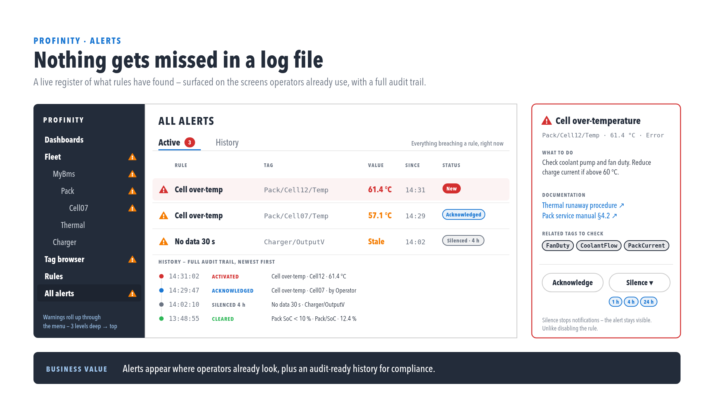
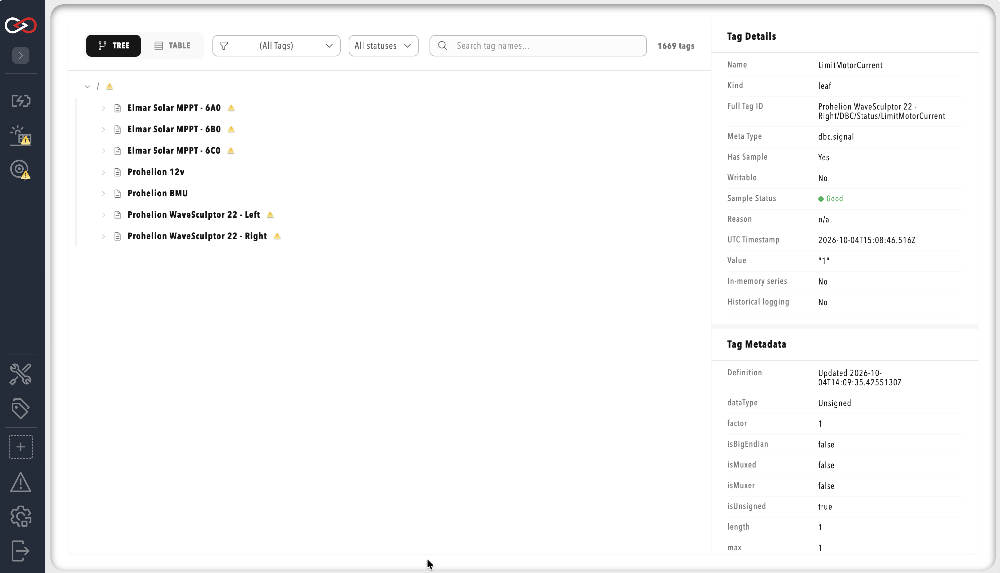
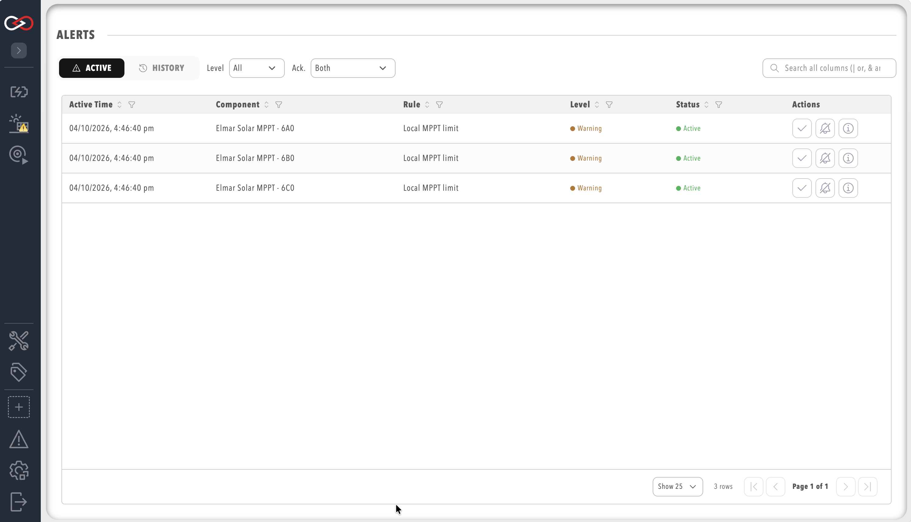
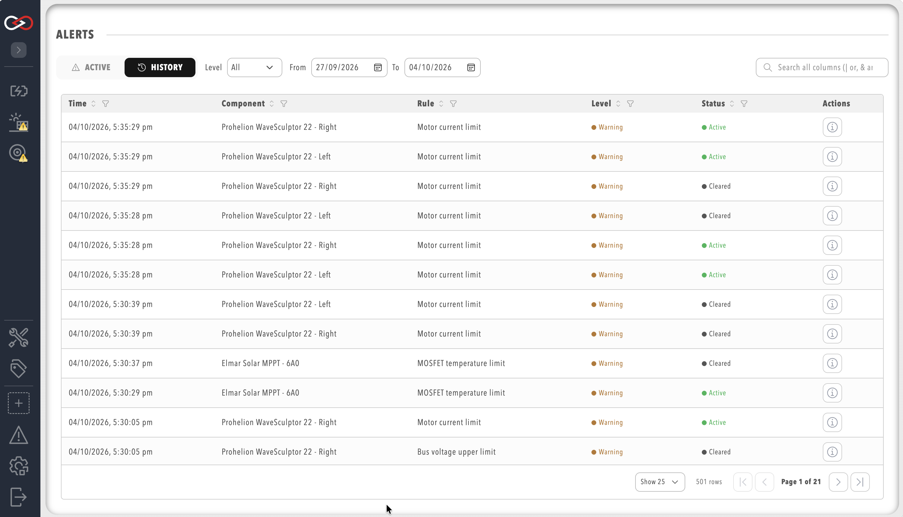
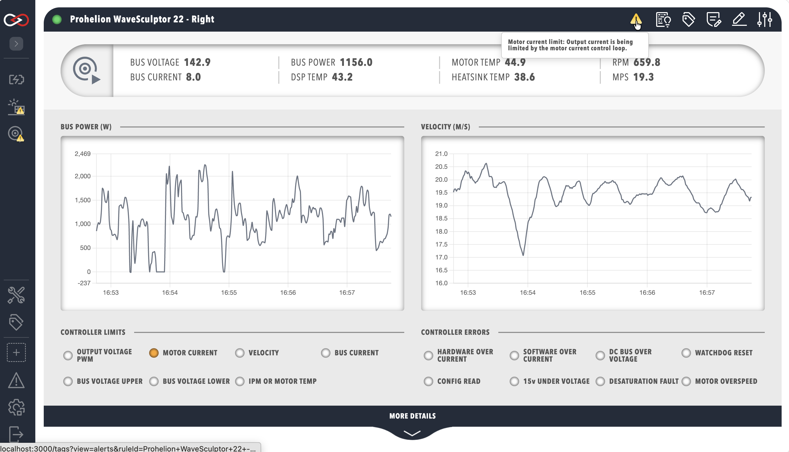
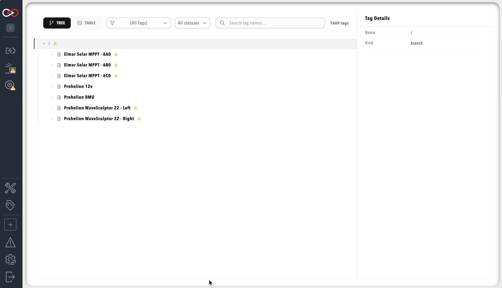
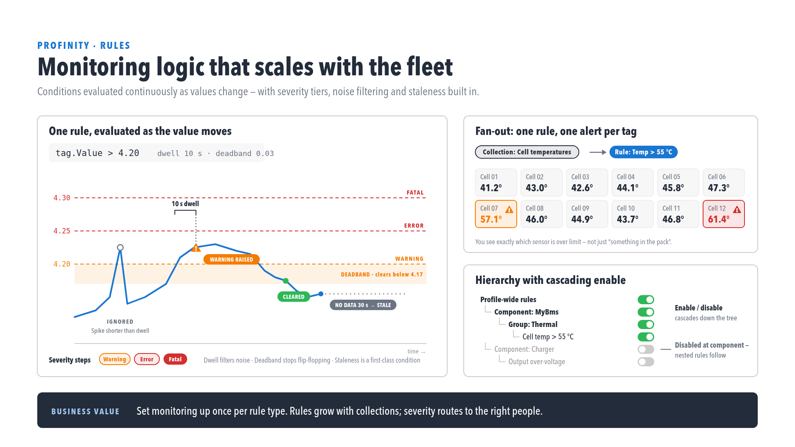

# Alerts Log

Profinity 2.3 surfaces rule-generated alerts in the **Alerts Log**, in live indicators across the UI, and through the `/api/v2/Alerts` API. Operators with the **View alerts** permission can view and acknowledge alerts and silence their actions, and an alert's text, level and links come from the [rule](./Actions.md) that raised it.

<figure markdown>

<figcaption>Alerts Log with Active and History tabs and the alert detail panel</figcaption>
</figure>

## Open Alerts Log

Select **ALL ALERTS** in the side menu to open the Alerts Log, which shows the page heading **ALERTS**.

<figure markdown>

<figcaption>ALL ALERTS in the side menu</figcaption>
</figure>

## Active and History Tabs

| Tab | Content |
|-----|---------|
| **Active** | Rule alerts currently firing |
| **History** | Paginated history, newest first |

Both tabs show the time (labelled **Active Time** on the **Active** tab, which is when the current episode began), the component, the rule, the level, the status and an actions column. Each row has a **More info** button that opens a detail dialog with the alert's message, tag, time and status, followed by any `relatedTags` of the rule under **RELATED TAGS**, then the rule's `description`, which supports Markdown, and any `moreInformation` links under **DOCUMENTATION**. Both tabs can be filtered by level, the **Active** tab can also be filtered by acknowledgement status, and the **History** tab has a date range. Tables show 25, 50, 75 or 100 rows per page, and 25 by default.

<figure markdown>

<figcaption>Active alerts table</figcaption>
</figure>

<figure markdown>

<figcaption>Alert history</figcaption>
</figure>

## Alert Levels

Every rule and threshold step carries a `level`, and the six permitted values in ascending severity are `Trace`, `Debug`, `Info`, `Warning`, `Error` and `Fatal`. The valid names, their aliases and the defaults are described under [Alert Level](./Actions.md#alert-level), and the level filter on the Active and History queries is not case-sensitive.

## Live Indicators

The web client polls active alerts every four seconds and shows a yellow alert triangle at the bottom right of any [dashboard](../Customising_Profinity/Dashboards/index.md) widget bound to an alerting tag, an alert icon on tags in Tag Explorer that have an active alert, and a highlighted **ALL ALERTS** entry in the side menu while any alert is active. Hovering over an indicator shows a summary of the alert, and selecting it opens the Alerts Log when the user holds the **View alerts** permission.

<figure markdown>

<figcaption>Dashboard alert indicator on a bound widget</figcaption>
</figure>

<figure markdown>

<figcaption>Rule alert on a tag in Tag Explorer</figcaption>
</figure>

!!! info "Alert vs Stale Data Quality"
    Rule alerts use a yellow triangle. Stale data quality in Tag Explorer has its own icon, distinct from the alert triangle, so when both appear they indicate different conditions.

## Acknowledge and Silence

Acknowledging and silencing both need the **View alerts** permission, and both act on an alert that is currently active.

| Action | Effect |
|--------|--------|
| **Acknowledge** | Marks the alert as seen and handled, and does not clear it. |
| **Silence** | Suppresses the actions of the rule for that alert, so no Email, Slack, Webhook, MQTT, script or log action runs, while the alert stays active and visible with a silence badge. |

The **Acknowledge alert** button and the **Silence alert for 1 hour** button sit in the actions column of the **Active** tab, and an acknowledged alert shows an **Unacknowledge alert** button in place of Acknowledge. Through the API a silence can last from 1 to 1440 minutes (24 hours), and a request outside that range is refused with "durationMinutes must be between 1 and 1440." The `/api/v2/Alerts/Unack` route is the same revert that the **Unacknowledge alert** button uses.

### REST API

| Method | Route | Body |
|--------|-------|------|
| GET | `/api/v2/Alerts/Active` | None. Optional query values `componentId`, `tagPrefix`, `unacknowledgedOnly` and `level`. |
| GET | `/api/v2/Alerts/History` | None. |
| POST | `/api/v2/Alerts/Ack` | `{ "ruleId": "...", "tagId": "..." }` |
| POST | `/api/v2/Alerts/Unack` | `{ "ruleId": "...", "tagId": "..." }` |
| POST | `/api/v2/Alerts/Silence` | `{ "ruleId": "...", "tagId": "...", "durationMinutes": 60 }` |

## Rule Evaluation: Dwell and Deadband

<figure markdown>

<figcaption>Dwell, deadband and severity levels on a rule</figcaption>
</figure>

Rules support **dwell**, where the condition must hold for a duration set with `dwellSeconds` or `dwellMinutes`, and **deadband**, where the alert clears at a different point from where it tripped, set on a threshold step with `clearValue` or `clearExpression` and on a boolean rule with `clearExpression`. Both are configured in the rules visual editor or in `rules.yaml`, and a complete example of each is shown under [A Complete rules.yaml Example](./Actions.md#a-complete-rulesyaml-example).

Rules evaluate whenever a tag in their scope changes. The `evaluationTickSeconds` setting adds a periodic extra pass, takes a whole number from 1 to 3600, and is required for a rule that detects stale data with `tag.IsStale`, because a stale tag does not change. When several rules files set it, the smallest value applies to the whole profile.

Conditions use the same `tag` expression language as collections, so a numeric trip and clear pair is written as follows:

```text
tag.Value > 4.2
tag.Value < 4.0
```

A no-data or stale sensor condition is written as follows:

```text
tag.IsStale
```

The expression language is described in [Tag expressions](./Tag_Expressions.md), and the actions a rule runs are described in [Rule actions and scripts](./Actions.md).

## Related Documentation

- [Tag expressions](./Tag_Expressions.md)
- [Rule actions and scripts](./Actions.md)
- [Tag layer](index.md)
- [Collections](./Collections.md)
- [Roles and permissions](../Administration/Users_and_Access/Roles_and_Permissions.md)
