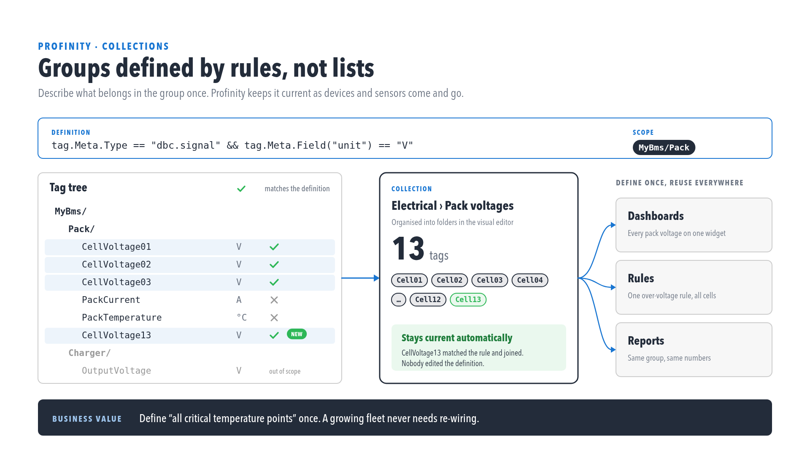
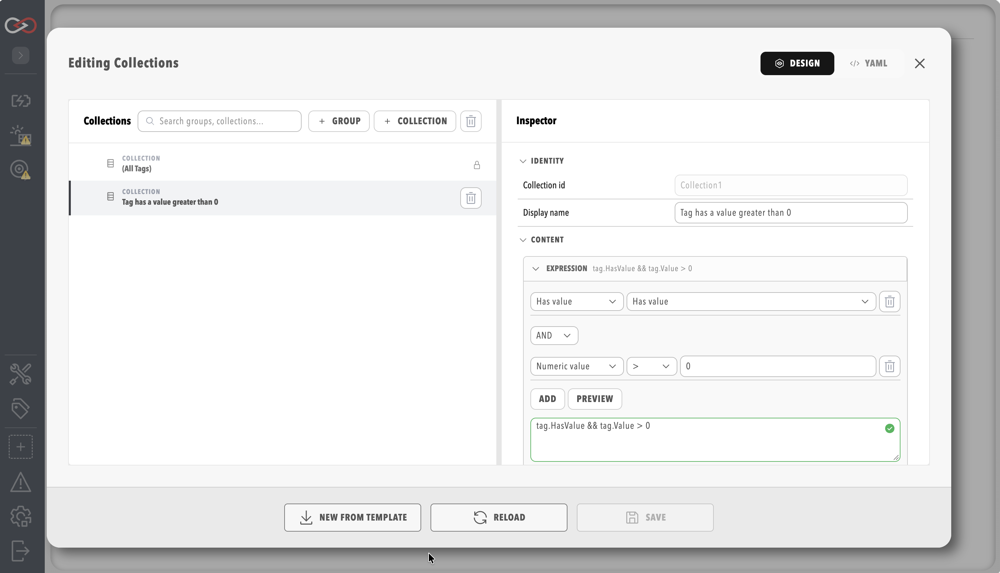

# Tag Collections

**Collections** group tags for filtering, [dashboards](../Customising_Profinity/Dashboards/index.md), and [rules](./Actions.md). Profinity 2.3 writes collections YAML with `version: "2.3"`, and each collection has an `id` that rules use to refer to it and that cannot be changed once it is created.

<figure markdown>

<figcaption>A collection matching tags in the tree by membership expression and scope</figcaption>
</figure>

## Open the Collections Editor

Select **COLLECTIONS** under **TAG UTILITIES** in the side menu, which opens the collections editor as a window over the current page. The entry appears for users who hold the **View tags** and **View tag collections** permissions while a profile is loaded, and saving needs the **Modify tag collections** permission.

<figure markdown>

<figcaption>Collections visual editor</figcaption>
</figure>

## Groups, Scope and the Editor Layout

The editor shows the collections as a tree on one side and an inspector for the selected node on the other, and a `collections.yaml` document can also be edited as YAML with a schema. The `collections` list holds two kinds of node.

| Node | Fields | Purpose |
|------|--------|---------|
| Group | `group.id`, `displayName`, `scope`, `items` | Organises collections into a hierarchy, and passes its `scope` down to every collection beneath it |
| Collection | `collection.id`, `displayName`, `scope`, `expression`, `security` | Selects tags with a membership expression |

### Identity and Scope

The `id` of a collection is the value that rules use in their `scope.collection` references, so it stays fixed while the display name can change. A `scope` is either a path prefix string or an object with a `prefix`, and the inspector shows it as **Scope prefix** under **Binding** for a collection. A relative scope on a collection joins beneath the scope of its group, whereas an absolute scope, which starts with `/`, replaces the inherited one.

### Saving and Security

The inspector requires a display name and a non-empty expression before a collection can be saved. A user who holds the **Security administration** permission can also set the `security` policy of a collection, with a `mode` of `All` or `Restricted` and a list of `allowedRoles`. The built-in **(All Tags)** collection, with the id `All`, is read-only and does not appear in `collections.yaml`.

## A Worked Collections Example

The following file defines one group that scopes everything beneath it to `Vehicles/Car1`, with a single collection of cell voltage signals inside it that only the `Engineers` role can see.

```yaml
version: "2.3"
collections:
  - group:
      id: car1
      displayName: Car 1
      scope: Vehicles/Car1
      items:
        - collection:
            id: CellVoltages
            displayName: Cell voltages
            scope: Battery
            expression: tag.Meta.Type == "dbc.signal" && tag.MatchesName("*Voltage") && tag.HasValue
            security:
              mode: Restricted
              allowedRoles:
                - Engineers
```

The scope of `CellVoltages` joins under its group to give `Vehicles/Car1/Battery`. A rule refers to the collection by id with `scope.collection: CellVoltages`, as in the `cell_over_voltage` rule in [A Complete rules.yaml Example](./Actions.md#a-complete-rulesyaml-example).

## Create Collections from Tag Explorer

A collection can be started from the Tag Explorer context menu with **Create collection from tag(s)…**, as described in [Tag linking](./Tag_Linking.md), and a rule can be started by right-clicking a collection in the editor and choosing **Create rule from collection…**.

## Membership Expression

Each collection filters candidate tags with a boolean expression over `tag`. The guided builder emits the published spellings, and free text uses the same language.

Examples:

```text
tag.MatchesPath("Elmar Solar MPPT") && tag.MatchesName("OutputCurrent")
tag.Meta.Type == "dbc.signal" && tag.HasValue
tag.Value > 0
```

The full expression vocabulary, covering path matching, values, metadata and wildcards, is described in [Tag expressions](./Tag_Expressions.md).

## API

Collections are managed through the [REST API](../Integrating_to_Profinity/APIs/index.md) at `/api/v2/Tags/Collections`, which accepts GET to read the document and PUT to save it, with JSON request and response bodies. Reading needs the **View tag collections** permission and saving needs **Modify tag collections**.

## Related Documentation

- [Tag expressions](./Tag_Expressions.md)
- [Tag layer](index.md)
- [Tag linking](./Tag_Linking.md)
- [Alerts Log](./Alerts.md)
- [Derived tags](./Derived_Tags.md)
