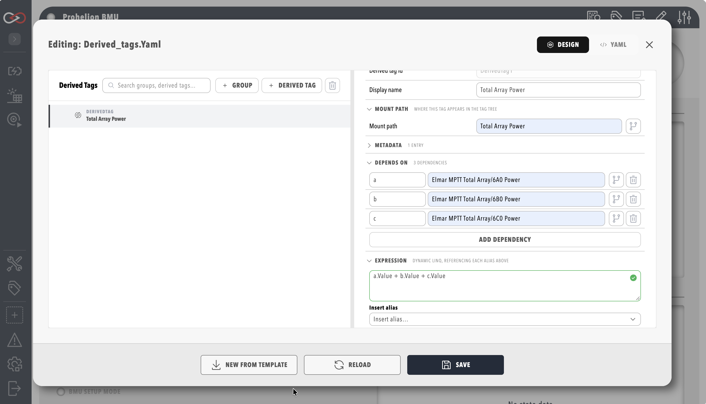

# Derived Tags

A **derived tag**, also called a virtual tag, is a value that Profinity computes automatically and that then behaves exactly like a real tag to every consumer. [Dashboards](../Customising_Profinity/Dashboards/index.md), the [historian](../Components/Historians/index.md), [rules](./Actions.md) and the API all see the same quality and timestamp envelope and can subscribe to it the same way, so the computation is configured once and Profinity keeps it current. Profinity 2.3 computes a derived tag's value either from an expression, which recomputes whenever a source tag changes and needs no scripting, or from a script, which suits a computation that needs more than a single expression, and the table under [Expression vs Script](#expression-vs-script) shows which one fits a given case.

## Open the Derived Tags Editor

Select **DERIVED TAGS** under **TAG UTILITIES** in the side menu, which opens the editor as a window over the current page and needs the **View tag collections** permission and a loaded profile. The file the editor works on is named by the **Derived tags YAML file (Optional)** setting in the **Tags** category of the profile settings. Derived tags are organised into groups in a tree on the left of the editor, and selecting a group or derived tag opens its settings in an inspector on the right.

<figure markdown>

<figcaption>Derived Tags editor</figcaption>
</figure>

## Expression-Based Derived Tags

An expression-based derived tag names one or more **dependencies**, which are short aliases mapped to source tag paths, and a formula that combines them, and it recomputes the moment any dependency changes. Groups exist only for organisation, and a group can set a **mount path**: a derived tag with a relative mount path mounts underneath its group's mount path, a derived tag that gives its own absolute path mounts there instead, and a nested group's mount path narrows further under its parent's.

### Worked Example

A derived tag that converts a vehicle's speed from mph to km/h, grouped under that vehicle:

```yaml
version: "2.3"
derivedTags:
  - group:
      id: vehicle-conversions
      displayName: Vehicle unit conversions
      mountPath: Vehicles/Car1
      items:
        - derivedTag:
            id: car1-speed-kmh
            mountPath: SpeedKmh                      # relative -> Vehicles/Car1/SpeedKmh
            dependsOn: { a: Vehicles/Car1/SpeedMph }
            expression: "a.Value * 1.60934"
```

Each alias exposes only the reading members (`Value`, `Text`, `Bool`, `HasValue`, `Quality` and `IsStale`), and path methods such as `MatchesPath` belong in collections and rules, as described in [Tag expressions](./Tag_Expressions.md). An expression can be up to 4096 characters long.

`Vehicles/Car1/SpeedKmh` is now a real tag that shows up in Tag Explorer and in the rules engine, and history is available for it without further configuration.

<figure markdown>

<figcaption>Derived tag inspector with live preview</figcaption>
</figure>

### Deleting a Derived Tag That Others Depend On

If another derived tag's expression or a rule expression depends on the tag being deleted, the editor names the dependents before the delete goes through.

## Script-Driven Derived Tags

A computation that does not fit one expression, such as multiple steps, state carried between runs, or publishing several tags from one computation, is written as a script instead. Add a **CSharp Script**, **Python Script** or **Lua Script** component, or use an existing one, set its mode to **Run On Tag Change** with the source tags selected in its **Collections** setting (see [Script Types](../Developing_with_Profinity/Scripting/Script_Types/index.md)), and publish the computed result from the script with `Profinity.Tags.SetValue(...)`.

Tag paths passed to `Profinity.Tags` are relative to the script's own host component, so a script is naturally suited to computing a derived value from, and publishing back to, tags on the same component. A path with a leading `/` starts at the root of the tag tree instead, which reaches tags on other components (see [Tags in scripts](../Developing_with_Profinity/Scripting/Script_Operations/Tags.md#tag-paths)).

=== "C#"

    ```csharp
    using Profinity.Sdk.Abstractions.Scripting;
    using Profinity.Sdk.Models.Tags;

    public class CSharpDerivedTagExample : ProfinityScript, IProfinityTagChangeScript
    {
        private const string SourceTagPath = "SpeedMph";
        private const string PublishedTagPath = "SpeedKmh";

        public void OnTagChange(string tagId, DataTagSample sample)
        {
            if (!tagId.EndsWith(SourceTagPath, StringComparison.OrdinalIgnoreCase))
            {
                return;
            }

            double speedMph = Convert.ToDouble(sample.Value);
            double speedKmh = speedMph * 1.60934;

            Profinity.Tags.SetValue(PublishedTagPath, speedKmh);
        }
    }
    ```

=== "Python"

    ```python
    SOURCE_TAG_PATH = "SpeedMph"
    PUBLISHED_TAG_PATH = "SpeedKmh"

    def on_tag_change(tagId, sample):
        if not str(tagId).lower().endswith(SOURCE_TAG_PATH.lower()):
            return

        speed_mph = float(sample.Value)
        speed_kmh = speed_mph * 1.60934

        Profinity.Tags.SetValue(PUBLISHED_TAG_PATH, speed_kmh)
    ```

=== "Lua"

    ```lua
    local SOURCE_TAG_PATH = 'SpeedMph'
    local PUBLISHED_TAG_PATH = 'SpeedKmh'

    function on_tag_change(tagId, sample)
        if not tostring(tagId):lower():find(SOURCE_TAG_PATH:lower() .. '$') then
            return
        end

        local speedMph = tonumber(sample.Value)
        local speedKmh = speedMph * 1.60934

        Profinity.Tags:SetValue(PUBLISHED_TAG_PATH, speedKmh)
    end
    ```

The full files `CSharpDerivedTagTemplate.cs`, `PythonDerivedTagTemplate.py` and `LuaDerivedTagTemplate.lua` ship as templates in the `example_scripts` folder of the Profinity directory (in its `CSharp`, `Python` and `Lua` subfolders), alongside Profinity's other example scripts.

!!! warning "A Read Never Re-Runs the Script"
    Reading the published tag returns the last value the script published. If nothing has triggered the script yet, the tag has no value rather than a freshly computed one.

Other trigger modes are available too, namely **Run On Time Interval**, **Run On CRON Schedule** and **Run as Service**, for a computation that is not purely reactive to a tag change. See [Script Types](../Developing_with_Profinity/Scripting/Script_Types/index.md).

## Expression vs Script

| Use an **expression** when... | Use a **script** when... |
|---|---|
| The computation is simple real-time maths, a unit conversion, or combining a handful of tags | The logic needs multiple steps, branching, or state carried between runs |
| You want automatic history with no extra setup | You need a timed or on-demand trigger rather than pure tag-change reactivity |
| | You want to populate several tags from one computation |

## Rule State Publishing

A rule can publish its own current state to a tag. Set **Publish state tag path** in the **Rule State** group of a rule in the Rules editor, and Profinity mirrors the rule's state to that tag path whenever it changes: a boolean rule publishes `true` or `false`, and a threshold rule publishes the index of its active step. The tag is read-only, so only the rule can write to it. See [Rule actions and scripts](./Actions.md).

## Permissions and API

The derived tags editor and API use the same permission pair as collections: reading needs **View tag collections** and saving needs **Modify tag collections**. See [Roles and permissions](../Administration/Users_and_Access/Roles_and_Permissions.md). Integrators can read and save the derived tags document at `/api/v2/Tags/DerivedTags`.

## Related Documentation

- [Tag expressions](./Tag_Expressions.md)
- [Tag layer](index.md)
- [Collections](./Collections.md)
- [Rule actions and scripts](./Actions.md)
- [Script Types](../Developing_with_Profinity/Scripting/Script_Types/index.md)
