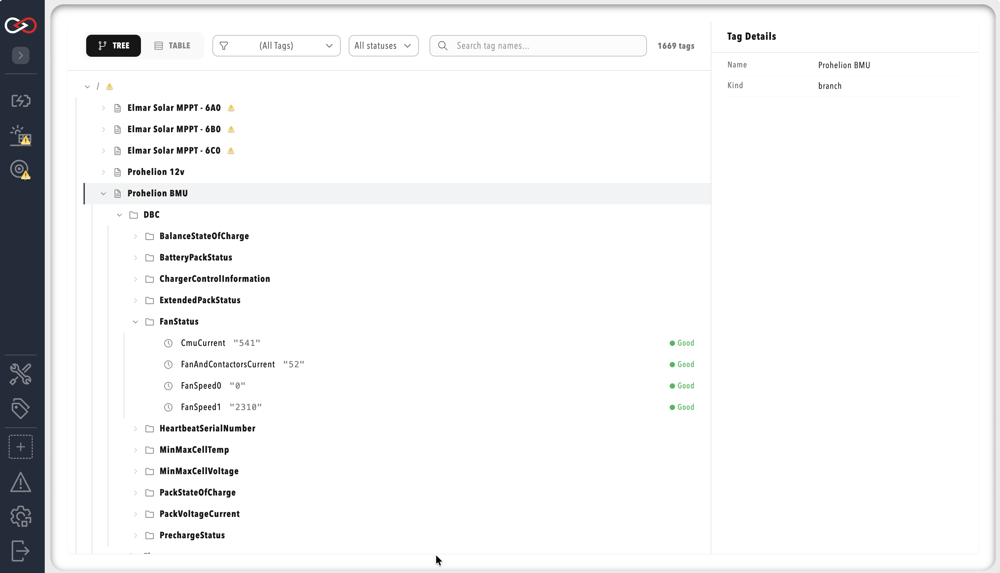

# Tag Tree Path

As of Profinity 2.3, a component can be placed inside a folder of the tag tree rather than at its root. By default each component mounts at the root under its own name, and the **Tag tree path** setting gives it a parent folder so that its tags nest under that location instead. The setting is stored as `tagTreeParentPath` in the component's YAML.

The following sketch shows the effect of giving two components a **Tag tree path** of `Vehicles/Car1`:

```text
Without a Tag tree path          With a Tag tree path of Vehicles/Car1
Charger/                         Vehicles/
Inverter/                          Car1/
                                     Charger/
                                     Inverter/
```

The Tag Explorer shows the same structure for a full profile. In the example below, each component appears as a branch under the root of the tree, and the tags within it are grouped into folders such as `DBC`, so a component with a **Tag tree path** set would appear in the same way inside its parent folders instead of at the root.

<figure markdown>

<figcaption>Full Tag Explorer example with components mounted at the root, the default</figcaption>
</figure>

## Why Nest a Component

Nesting suits profiles that model physical or logical groupings, such as several subsystems of one vehicle, or several instances of one component type representing the bays, strings or vehicles in a fleet. The shared folder appears in the tag tree and in the Tag Explorer, so an integrator or operator can navigate the tree the way the physical system is organised.

## Setting the Tag Tree Path

The **Tag tree path** field sits in the **Component Identifier** section of a component's settings dialog, directly below **Name**. Enter the parent folder as a slash-separated path, for example `Vehicles/Car1`, and save. The path must not include the component's own name, which Profinity appends automatically. The default value of `/` mounts the component at the root.

A component named `Charger` with a **Tag tree path** of `Vehicles/Car1` mounts at `Vehicles/Car1/Charger`. Every mount point must be unique, so if two components would resolve to the same or an overlapping location, or to a location published by a [Tag Relay](Tag_Relay.md) receiver, Profinity rejects the change and reports which paths overlap, with a message in the form `Tag destination 'A' overlaps 'B'. Choose a unique destination.`, so change the **Tag tree path** or the name of one of the two components until the paths no longer overlap.

In the profile's collections and rules, write a scope as the full path from the root of the tag tree, so the tags of the `Charger` component above are scoped with `Vehicles/Car1/Charger`.

## Absolute and Relative Dashboard Binds

Once a component is nested, the form of a `source:` value in a dashboard `bind:` entry decides whether it follows the component if it moves.

| | Relative bind | Absolute bind |
|---|---|---|
| Form | No leading slash | Leading slash |
| Example | `DBC/BMSInfo/Flag` | `/Vehicles/Car1/Charger/DBC/BMSInfo/Flag` |
| Resolved | Against the component's own mount point when the dashboard loads | Used exactly as written |
| Use for | A dashboard reading its own component's tags, which is the normal case | A dashboard reading another component's tags, such as the profile home dashboard |
| If the component moves | Continues to resolve | Stops resolving until updated |

On a dashboard belonging to the `Charger` component above, the relative bind `DBC/BMSInfo/Flag` resolves to `Vehicles/Car1/Charger/DBC/BMSInfo/Flag`.

Dashboards that use the `{COMPONENT_NAME}` placeholder, documented in [Data Binding](../Customising_Profinity/Dashboards/Data_Binding.md), keep working, and Profinity replaces the placeholder with an explicit relative or absolute path the next time the dashboard is saved.

## Changing the Path on a Deployed Component

!!! warning "Moving a Component Breaks Absolute Binds in Other Dashboards"
    Absolute binds in other components' dashboards stop resolving when the component they reference is moved, and [Historian](../Components/Historians/index.md) data recorded under the old path is not carried across.

Changing a deployed component's **Tag tree path**, or renaming it, automatically updates the [Alerts](Alerts.md) and [Collections](Collections.md) that refer to it, along with the profile home dashboard's `source:` bindings. Only paths that refer to the moved component are updated, and an unrelated branch with the same name is left alone. The same updates appear in `rules.yaml` and `collections.yaml` for anyone who edits those files directly.

Absolute binds inside other components' dashboards are not updated, because they are literal paths to the old location. Historian data recorded under the old path is not migrated, so a trend spanning the move shows a break at that point. Relative binds inside the moved component's own dashboard are unaffected.

Before relocating a component that other dashboards reference by absolute path, search those dashboards for its old path and update any matching `source:` values by hand.

## Related Documentation

- [Component types](../Developing_with_Profinity/Custom_Components/Component_Types.md)
- [Tag Layer](index.md)
- [Dashboards](../Customising_Profinity/Dashboards/index.md)
