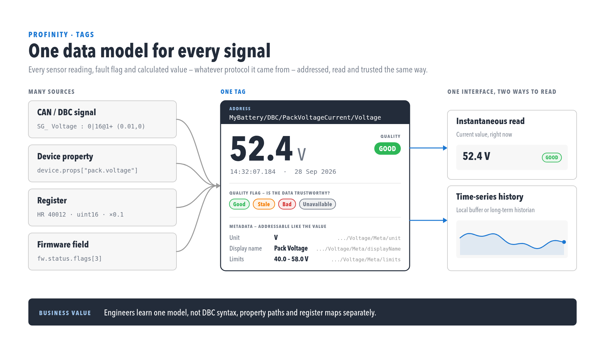

# Tag layer

The **tag layer** is Profinity's catalogue of live and configured tag values — the foundation for Tag Explorer, collections, rules, and alerts introduced in 2.3.

<figure markdown>

<figcaption>One data model for every signal</figcaption>
</figure>

## Tag Explorer

Open **TAG EXPLORER** from the side menu. Requires **`TagView`** permission.

<figure markdown>

<figcaption>Tag Explorer browse view</figcaption>
</figure>

Use Tag Explorer to:

- Browse the tag tree and switch to table views where available.
- Inspect **data quality** indicators (stale quality uses a Carbon icon — distinct from **rule alert** triangles).
- Open context-menu flows for [tag linking](Tag_Linking.md).

## Collections, rules, and alerts

| Feature | Where it opens | View permission |
|---------|----------------|-----------------|
| Collections | Side menu → **TAG UTILITIES** → **COLLECTIONS** (editor window) | `TagCollectionsView` |
| Rules | Side menu → **TAG UTILITIES** → **RULES** (editor window, when the Tag Rule Actions feature is enabled) | `TagRulesView` |
| Alerts Log | Side menu → **ALL ALERTS** | `AlertsView` |

The **TAG UTILITIES** group appears for users with `TagView`, and the collections and rules editors need a loaded profile and the view permission shown, whereas saving needs `TagCollectionsModify` or `TagRulesModify`.

## Key API areas (integrators)

Integrations can work with tags, tag collections, tag rules and alerts through the REST API under `/api/v2`. The Swagger page on your Profinity instance lists every endpoint and the parameters it accepts. The older data endpoint is not part of the v2 API, so use the tag endpoints for new integrations.

All endpoints require the appropriate permissions — see [Roles and permissions](../Administration/Users_and_Access/Roles_and_Permissions.md).

## Logging and replaying tags

The TAG File Logger records tag values to a file, and the **TAG LOG REPLAY** screen plays a recording back onto your live tags. See [Log / replay tags](Logging_Replaying_Tags.md).

## Tag relay

Profinity instances can share live tags with each other over the network — one
instance publishes a snapshot, another ingests it as remote, read-only tags under
that site's own prefix. See [Tag relay](./Tag_Relay.md) for how sender and receiver
roles work, transport options, and licensing.

<figure markdown>

<figcaption>Each site keeps running independently — relay only adds a shared view on top</figcaption>
</figure>

## Related documentation

- [Tag relay](./Tag_Relay.md)
- [Tag linking](Tag_Linking.md)
- [Tag tree path](Tag_Tree_Path.md)
- [Tag expressions](Tag_Expressions.md)
- [Alerts Log](Alerts.md)
- [Collections](Collections.md)
- [Rule actions and scripts](Actions.md)
- [Derived tags](Derived_Tags.md)
- [Log / replay tags](Logging_Replaying_Tags.md)
