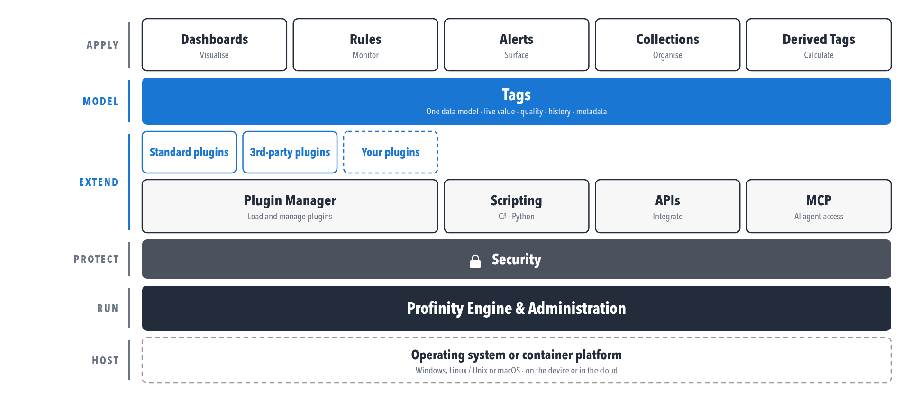
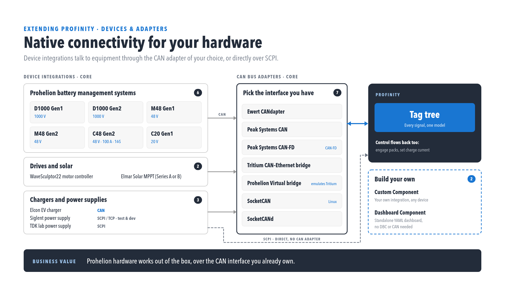

# Prohelion Profinity V2

Profinity is a modern CAN bus management platform designed to connect CAN bus based solutions to AI, cloud, API and big data technologies.

[Download Profinity V2 :material-download:](https://github.com/Prohelion/Profinity/releases/latest/download/Profinity.Install.msi){ .md-button }

Profinity V2 updates the capabilities of Prohelion's Profinity suite by adding:

- Native run-anywhere capability, so that Profinity runs on a PC, server, embedded device or in the cloud.
- A fully web-enabled user interface that runs on desktop, mobile or kiosk.
- Full REST-based API integration, which allows Profinity's features to be extended and custom applications to be built.
- Inbuilt scripting support.
- Integration with AI and large language model (LLM) tooling via the Model Context Protocol (MCP).

<figure markdown>

<figcaption>One platform, from device to dashboard</figcaption>
</figure>

<figure markdown>

<figcaption>Profinity V2 - Showing a Motor Controller Dashboard</figcaption>
</figure>

Profinity is built around the concept of [Profiles](Getting_Started/Profiles.md), which are sets of configured devices in your system.  By switching between Profiles you can support multiple configurations across different sites or different combinations of technologies. The configuration of the system is largely driven by the Profinity GUI, but once configured, the solution can run as a service, providing continuous data streams off servers or embedded devices, or run from the cloud.

Profinity can connect to [CAN bridges](Components/Adaptors/CAN_Bus_Adapters.md), which translate CAN bus traffic from your network to the Profinity solution. You can send, receive, and view CAN bus messages either raw or using DBC, log messages and replay them. You can also use Profinity to share CAN bus data from your system to your team via cloud data logging platforms.

Profinity provides specialised tools for managing [Prohelion batteries](Components/Battery_Management_Systems/index.md) and chargers, MPPT systems from [Elmar Solar](Components/MPPT/index.md), and [WaveSculptors](Components/Motor_Controller/index.md), as well as any device that can be defined by a CAN DBC file.  

<figure markdown>

<figcaption>Native connectivity for your hardware</figcaption>
</figure>

## Release notes

See the [Release Notes](./Release_Notes/index.md) for user-visible changes and upgrade notes for each Profinity V2 release.

## Profinity Server (REST APIs, Web, and Docker)

As of Profinity 2, Prohelion has fully migrated to a modern container and API centric architecture.  

The documentation covers the [RESTful APIs and Swagger support](./Extending_Profinity/APIs/index.md), as well as the out-of-the-box cloud connectivity for [InfluxDB and Prometheus](Components/Loggers/InfluxDB_Prometheus_Logger.md), which supports cloud based big data capture and analytics of CAN bus based solutions.

Profinity runs natively on Windows, Unix and macOS, and in the cloud via Docker, from V2 onward; see the [Windows](./Installation/Windows_Installation.md), [Zip (Linux and macOS)](./Installation/Zip_Installation.md) and [Docker](./Installation/Docker_Installation.md) installation guides for how to install Profinity.

## Quick Guides

The [How to Guides](./How_To_Guides/index.md) provide concise step-by-step instructions for common tasks such as creating custom dashboards, configuring components, and setting up data logging.

To request support or assistance, contact Prohelion through the [Prohelion website](https://www.prohelion.com/contact-us/). Bugs and requests for improvement can also be logged through the built-in [Feedback Form](./Administration/Feedback.md).

Support Requests should be submitted to the [Prohelion Support Portal](https://prohelion.atlassian.net/servicedesk/customer/portals).