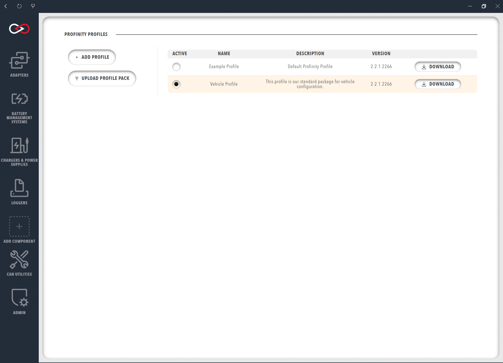

# Profiles

A Profile is the core mechanism by which Profinity maintains the configuration of your system. Any component that you add to your system becomes associated with the active Profile, and the configuration for each device is retained after Profinity is shut down. Profinity keeps track of your Profiles and loads the most recently used one each time you start the tool.

The `Profile` menu is located in the `ADMIN` tab.

<figure markdown>

<figcaption>Profinity Profiles menu</figcaption>
</figure>

## Changing the Active Profile

To change which profile is currently active in Profinity:

1. Navigate to the **ADMIN** tab
2. Open **Profiles**
3. In the profile list, locate the profile you want to activate
4. Click the **radio button** next to the profile name to select it as the active profile
5. The selected profile will immediately become active

!!! info "Active Profile Indicator"
    The active profile is indicated by the selected radio button. Only one profile can be active at a time. When you switch profiles, Profinity will load the configuration associated with the newly selected profile.

## Editing Profile Settings

You can edit a profile's name and description to better organize your profiles.

### Editing Profile Name and Description

1. Navigate to the **ADMIN** tab
2. Open **Profiles**
3. In the profile list, **click on the name** of the profile you want to edit
4. A dialog will open allowing you to modify:
   - **Profile Name**: Must be unique across all profiles
   - **Description**: Optional text to describe the profile's purpose or application
5. Make your changes
6. Click **Save** to apply the changes

!!! warning "Renaming the Active Profile"
    You cannot rename the active profile directly. To rename the active profile:
    
    1. First, change to a different profile (using the radio buttons)
    2. Then click on the name of the profile you want to rename
    3. Edit the name and save
    4. Change back to the renamed profile if needed
    
    You may find it helpful to create a temporary profile for this purpose, which can be deleted after you have renamed your desired profile.

### Creating a New Profile

To create a new Profile:

1. Navigate to the **ADMIN** tab
2. Open **Profiles**
3. Click the **+ ADD PROFILE** button
4. Enter a unique profile name and optional description
5. Build your system configuration from scratch

Alternatively, if you have a Profile Pack prepared from another instance of Profinity:

1. Click the **UPLOAD PROFILE PACK** button
2. Select the Profile Pack ZIP file from your computer
3. The profile will be imported with all associated configurations

## Setting Kiosk Mode in a Profile

Kiosk Mode enables automatic user authentication for a profile, bypassing the login page. This is useful for kiosk displays, monitoring stations, or automated systems.

### Enabling Kiosk Mode

To enable Kiosk Mode for a profile:

1. Navigate to the **ADMIN** tab
2. Open **Profiles**
3. Select the profile you want to configure (it does not need to be active)
4. Click on the profile name or settings icon to open profile settings
5. Enable the **Kiosk Mode Enabled** option
6. Select a **Kiosk Mode User** from the dropdown menu
   - Only non-administrator, enabled users with kiosk-safe roles are available
   - See [Kiosk Mode Requirements](#kiosk-mode-requirements) below
7. Click **Save** to apply the settings

!!! info "Profile Must Be Active"
    Kiosk Mode only applies when the profile is active. When a profile with Kiosk Mode enabled becomes active, users will be automatically authenticated. When a profile without Kiosk Mode becomes active, normal login is required.

### Kiosk Mode Requirements

Kiosk Mode has specific requirements for the selected user account:

- **Must be a non-administrator user**: Administrator users cannot be used for Kiosk Mode
- **Must be enabled**: The user account must be enabled in the system
- **Must have kiosk-safe security roles only**: The user must only have security roles that are marked as safe for kiosk mode

**Kiosk-safe security roles:**
- **SystemRead**: Allows reading system settings and viewing dashboards
- **CANReceive**: Allows viewing received CAN bus messages
- **DBCViewer**: Allows viewing DBC message and signal definitions

Users with non-kiosk-safe roles (including Administrator, SystemUpdate, Charging, CANSend) will not appear in the kiosk user dropdown.

For detailed information about Kiosk Mode, including security best practices and token management, see the [Kiosk Mode](./Kiosk_Mode.md) documentation.

## Downloading Profile Packs

To download a Profile Pack, including all associated DBC files, scripts, battery cell profiles, etc.:

1. Navigate to the **ADMIN** tab
2. Open **Profiles**
3. Click the **download button** (download icon) next to the profile in the profile list
4. The Profile Pack will be downloaded as a ZIP file containing all profile-related files

Profinity ships with an example Profile called the PET Profile (Prohelion / Elmar / Tritium), which contains the necessary configuration to support a vehicle based on Prohelion, Elmar, and Tritium technologies. If you want to use this Profile as a basis for your own work, we recommend copying it to a new file name because the file is overwritten each time you install a new version of Profinity.

## Profinity Profile Packs

Profinity Profile Packs are a new introduction to Profinity V2 and serve as an extension to the Profile-based structure of Profinity Classic. A Profile Pack packages everything related to your instance of Profinity, allowing you to easily configure multiple machines to run the same system.

Depending on the configuration of your system, a Profile Pack could contain:

- The [Profile](#profiles) and configured devices
- [DBC](../CAN_Utilities/CAN_Bus_DBC.md) files
- [Scripts](../Extending_Profinity/Scripting/index.md)
- [CAN Logs](../Components/Loggers/File_Loggers.md)

Profile packs can be downloaded from Profinity as a ZIP file, containing all the contents of the Profile. They can then be uploaded to a different version of Profinity if you want to share information between Profile instances.

## Profile Files

In Profinity, the Profiles and all the related files are stored by default in directories under the directory:

`/Documents/Prohelion/Profinity/Profiles`

While it is possible to edit the Profile files directly in a text editor we do not recommend you do so, if you do edit a file directly, Profinity will generally reload the file automatically once you save your changes. 

Profinity provides profile-specific directories for organizing dashboard assets:

### /Profile/Images

- **Location**: `{ProfileDirectory}/Images/`
- **Purpose**: Store images used in dashboards (icons, interactive images, etc.)
- **Usage**: Reference images by filename only (e.g., `image: "my-icon.svg"`)
- **Access**: Images are served from `/Profile/Images/{filename}` URL path
- **Examples**: Icon images, device diagrams, logos, status indicators

### /Profile/Styles

- **Location**: `{ProfileDirectory}/Styles/`
- **Purpose**: Store custom CSS stylesheets for dashboard styling
- **Usage**: Reference stylesheets by filename (e.g., `Profile.css`, `variables.css`)
- **Access**: Stylesheets are served from `/Profile/Styles/{filename}` URL path
- **Examples**: Custom color schemes, layout overrides, component-specific styles

### /Profile/Content

- **Location**: `{ProfileDirectory}/Content/`
- **Purpose**: Store general content files (HTML snippets, templates, etc.)
- **Usage**: Reference content files by filename
- **Access**: Content files are served from `/Profile/Content/{filename}` URL path
- **Examples**: HTML templates, markdown files, documentation snippets

## Profile Features

Profiles support several advanced features:

- **[Kiosk Mode](./Kiosk_Mode.md)**: Automatic user authentication that bypasses the login page
- **[Profile Dashboard](./Profile_Dashboard.md)**: Custom home pages using dashboard YAML files

For more information, see the individual feature documentation pages.