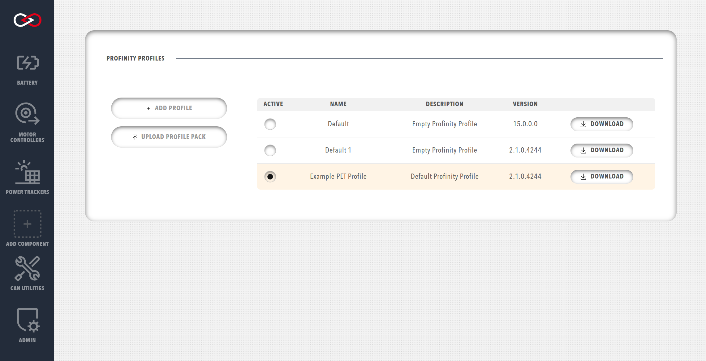

!!! tip "Profinity V2 IS NOW IN EARLY ADOPTER RELEASE"
    Profinity V2 is available now in Early Adopter Release.  To support this release we are making the product available to our Early Adopter Community.  If you have any issues or feedback please report it via our support portal or via the Feedback form in the Profinity Admin menu.

## Profiles

A Profile is the core mechanism by which Profinity maintains the configuration of your system. Any component that you add to your system becomes associated with the active Profile, and the configuration for each device is retained after Profinity is shut down. Profinity keeps track of your Profiles and loads the most recently used one each time you start the tool.<!-- Profiles typically consist of one or more CAN-Ethernet Bridges, which are used to connect to the CAN network as well as any devices that you might be managing. -->

The `Profile` menu is located in the `ADMIN` tab.

<figure markdown>

<figcaption>Profinity Profiles menu</figcaption>
</figure>

To create a new Profile you can either select the `+ ADD PROFILE` button and then build your system from scratch, or if you have already prepared a Profile Pack on another instance of Profinity, you can upload it from your computer using the `UPLOAD PROFILE PACK` button. 

To download a particular Profile Pack, including all associated DBC files, scripts, battery cell profiles, etc., click on the download button next to the Profile in the Profile list.

From this menu it is also possible to change the active Profile using the radio buttons. Each Profile must have a unique name and can optionally have a description to help inform users as to the purpose/application for that Profile. To modify the name or description of a particular Profile, click on the name of the Profile in the Profile list.

!!! info "Renaming the active Profile"
    You cannot rename the active Profile in Profinity. In order to rename the active Profile, you must change to a different Profile, rename the desired Profile, and then change back. It may help to create a temporary Profile for this purpose, which can be deleted after you have renamed your desired Profile.

Profinity ships with an example Profile called the PET Profile (Prohelion / Elmar / Tritium) which contains all the necessary configuration to support a vehicle based on Prohelion, Elmar, and Tritium technologies.  If you wish to use this Profile as a basis for your own work, we would suggest copying it to a new file name as the file is overwritten each time you install a new version of Profinity. <!-- Check this -->

# Profinity Profile Packs

Profinity Profile Packs are a new introduction to Profinity V2 and serve as an extension to the Profile-based structure of Profinity Classic. A Profile Pack packages everything related to your instance of Profinity, allowing you to easily configure multiple machines to run the same system.

Depending on the configuration of your system, a Profile Pack could contain:

- The [Profile](#profiles) and configured devices
- [DBC](../CAN_Utilities/CAN_Bus_DBC.md) files
- [Scripts](../Extending_Profinity/Scripting/index.md)
- [CAN Logs](../Components/Loggers/File_Loggers.md)

Profile packs can be downloaded from Profinity as as Zip file, containing all the contents of the Profile.  They can then be uploaded on to a different version of Profinity, if you want share information between Profile instances.

## Profile Files

In Profinity the Profiles and all the related files are stored by default in directories under the the directory

`/Documents/Prohelion/Profinity/Profiles`

While it is possible to edit the Profile files directly in a text editor we do not recommend you do so. 

Storing the file in this way makes it easy to share a Profiles between machines. If it makes sense in your environment, Profiles can be stored on network drives or other shares such as Google Drive or Dropbox.