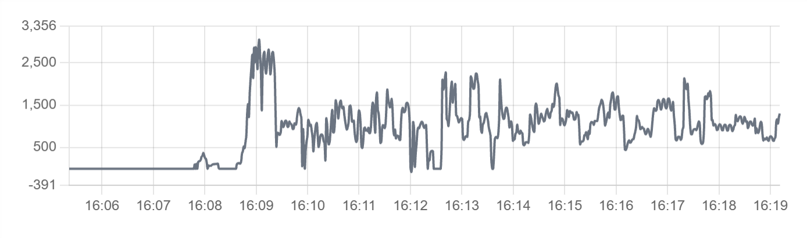
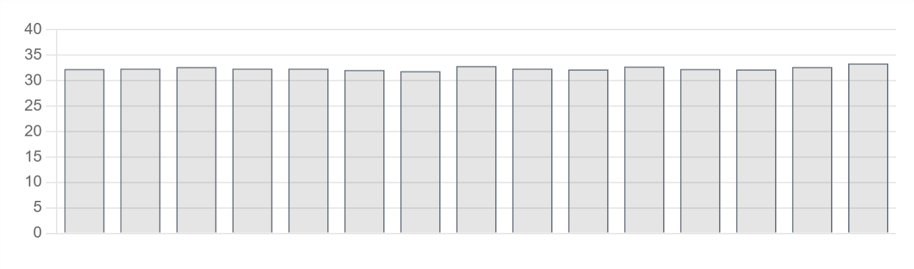

# Charts

Data visualization components. Charts provide graphical representation of data trends, making it easy to understand patterns and changes over time.

Profinity supports multiple chart types to visualize data in different ways:

**Line Chart** - Ideal for showing trends and changes over time:
<figure markdown>

<figcaption>Line chart component displaying data trends over time with connected data points</figcaption>
</figure>

**Bar Chart** - Perfect for comparing discrete values or categories:
<figure markdown>

<figcaption>Bar chart component displaying data comparison using rectangular bars</figcaption>
</figure>

**Best for:** Data trends, historical analysis, performance monitoring, visual data representation, time-series data

**Parameters:**

| Parameter | Type | Description |
|-----------|------|-------------|
| `id` | optional (string) | Unique identifier for the chart |
| `class` | optional (string) | CSS class for styling |
| `type` | required (string) | Chart type - "bar", "line", "radar", "doughnut", "pie", "polarArea", "bubble", or "scatter". See [Chart Types](#chart-types) below for details |
| `value` | required (object/array) | Chart data (structured object with labels/datasets, or time series array) |
| `legend` | optional (boolean) | Show legend (default: false) |
| `refreshInterval` | optional (number) | Auto refresh interval in milliseconds (minimum: 0) |
| `showControls` | optional (boolean) | Show time range and refresh controls |
| `min` | optional (number) | Minimum value for chart scale (auto-calculated if not specified) |
| `max` | optional (number) | Maximum value for chart scale (auto-calculated if not specified) |
| `label` | optional (string) | Chart label |
| `enabled` | optional (boolean) | Whether the chart is enabled |
| `visible` | optional (boolean) | Whether the chart is visible |
| `bind` | optional (array) | Data binding configuration |

## Chart Types

Profinity supports the following chart types:

- **`line`** - Line charts display data points connected by lines, ideal for showing trends over time
- **`bar`** - Bar charts display data as rectangular bars, perfect for comparing discrete values
- **`radar`** - Radar charts display multivariate data in a two-dimensional form
- **`doughnut`** - Doughnut charts display data as a circular chart with a hole in the center
- **`pie`** - Pie charts display data as proportional slices of a circle
- **`polarArea`** - Polar area charts display data as sectors of a circle
- **`bubble`** - Bubble charts display three dimensions of data (x, y, and size)
- **`scatter`** - Scatter charts display data points across two axes

**Example with Data Binding:**

``` yaml
dashboard:
  items:
    - row:
        items:
          - chart:
              type: bar
              legend: false
              bind:
                - target: value
                  source: Prohelion BMU.[Property].PackData.CellTempsSummaryGraph   
```

**Static Chart Example:**

``` yaml
dashboard:
  items:
    - row:
        items:
          - chart:
              type: line
              legend: true
              value:
                labels: ["Jan", "Feb", "Mar", "Apr"]
                datasets:
                  - label: "Sales"
                    data: [65, 59, 80, 81]
                  - label: "Revenue"
                    data: [28, 48, 40, 19]
```

**Time Series Chart Example:**

``` yaml
dashboard:
  items:
    - row:
        items:
          - chart:
              type: line
              legend: false
              showControls: true
              refreshInterval: 1000
              bind:
                - target: value
                  source: "[TimeSeries].{COMPONENT_NAME}.BusMeasurement.BusCurrent"
```
