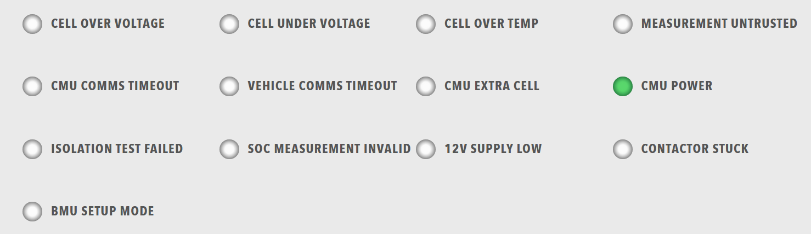

# Lamps

Grid of status indicators. Lamps provide visual status information using colours and states to quickly communicate system status.

<figure markdown>

<figcaption>Lamps component displaying a grid of status indicators with color-coded states</figcaption>
</figure>

**Best for:** Status indicators, error/warning displays, system state visualization, quick status overview

**Parameters:**

| Parameter | Type | Description |
|-----------|------|-------------|
| `id` | optional (string) | Unique identifier for the lamps component |
| `class` | optional (string) | CSS class for styling |
| `items` | required (array) | Array of lamp groups |

**Lamp Group Structure:**

Each item in `items` must contain a `lampgroup` object with:

| Parameter | Type | Description |
|-----------|------|-------------|
| `id` | optional (string) | Unique identifier for the lamp group |
| `class` | optional (string) | CSS class for styling |
| `items` | required (array) | Array of lamps |

Each lamp item must contain a `lamp` object with:

| Parameter | Type | Description |
|-----------|------|-------------|
| `id` | optional (string) | Unique identifier for the lamp |
| `class` | optional (string) | CSS class for styling |
| `color` | required (string) | Lamp color ("green", "red", "amber", "disabled", "grey", etc.) |
| `label` | optional (string) | Display label |
| `value` | optional (number) | Lamp value (typically 0 or 1) |
| `enabled` | optional (boolean) | Whether the lamp is enabled |
| `visible` | optional (boolean) | Whether the lamp is visible |
| `bind` | optional (array) | Data binding configuration |

**Example:**

``` yaml
dashboard:
  items:
    - row:
        items:
          - lamps:
              items:
                - lampgroup:
                    items:
                      - lamp:
                          color: "green"
                          label: "Online"
                          value: 1
                          enabled: true
                          bind:
                            - target: enabled
                              source: '{COMPONENT_NAME}.Status.Online'
                              toType: boolean
                      - lamp:
                          color: "red"
                          label: "Error"
                          value: 1
                          enabled: false
                          bind:
                            - target: enabled
                              source: '{COMPONENT_NAME}.Status.Error'
                              toType: boolean
                      - lamp:
                          color: "amber"
                          label: "Warning"
                          value: 1
                          enabled: false
                          bind:
                            - target: enabled
                              source: '{COMPONENT_NAME}.Status.Warning'
                              toType: boolean
```
