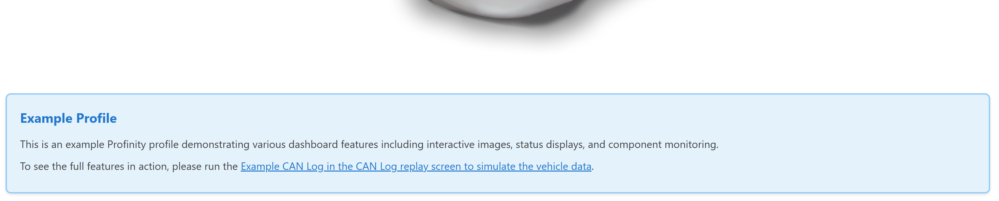

# HTML

HTML content component for displaying raw HTML content. This component allows you to embed custom HTML, including references to content from /Profile/Content, images from /Profile/Images, and styles from /Profile/Styles.

<figure markdown>

<figcaption>HTML component displaying custom HTML content with rich text formatting</figcaption>
</figure>

**Best for:** Custom content display, rich text formatting, embedded content, documentation snippets

**When not to use:** For structured data display (use Readouts, Tables, etc.), for interactive elements (use Actions, Toggles, etc.)

**Parameters:**

| Parameter | Type | Description |
|-----------|------|-------------|
| `id` | optional (string) | Unique identifier for the HTML component |
| `class` | optional (string) | CSS class for styling |
| `content` | required (string) | HTML content to display |

**Referencing Profile Assets in HTML:**

- **Images**: Use `/Profile/Images/{filename}` in img src attributes
- **Styles**: Link to stylesheets using `/Profile/Styles/{filename}`
- **Content**: Reference content files using `/Profile/Content/{filename}`

**Example:**

``` yaml
dashboard:
  items:
    - row:
        items:
          - html:
              class: "info-box"
              content: |
                <div class="info-box__header">System Information</div>
                <div class="info-box__content">
                  <p>This dashboard monitors system status.</p>
                  
                </div>
```

**Example with External Stylesheet:**

``` yaml
dashboard:
  items:
    - row:
        items:
          - html:
              content: |
                <link rel="stylesheet" href="/Profile/Styles/custom-dashboard.css" />
                <div class="custom-panel">
                  <h2>Custom Content</h2>
                  <p>Styled with custom CSS from /Profile/Styles</p>
                </div>
```
