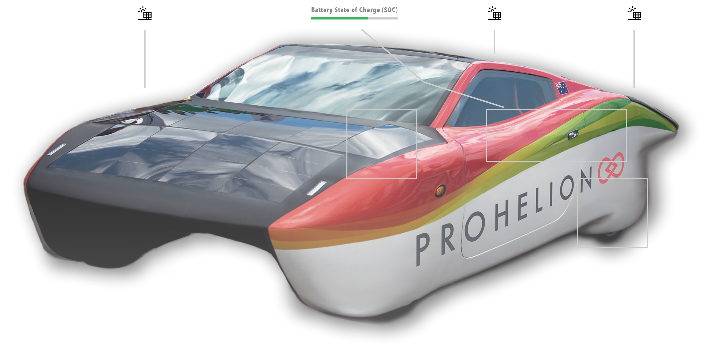

# Image

Interactive image component with clickable regions, icons, data values, points, and annotation lines. Images are loaded from the /Profile/Images directory.

<figure markdown>

<figcaption>Interactive image component showing clickable regions, icons, data values, and annotation lines</figcaption>
</figure>

**Best for:** Device diagrams, system layouts, interactive schematics, visual data overlays

**When not to use:** For simple static images (use HTML component with img tag), for charts (use Chart component)

## Overview

Interactive Images combine a base image with several overlay elements:

- **Regions**: Clickable areas on the image that can navigate to other pages or trigger actions
- **Icons**: Positioned icons (emoji, SVG paths, or image files) that can be interactive
- **Data Values**: Real-time data displays that bind to system data and update automatically
- **Points**: Anchor points for annotation lines
- **Annotation Lines**: Connecting lines between elements with optional waypoints (elbows)

All elements are positioned relative to the base image, allowing you to create complex, data-driven visualizations.

**Parameters:**

| Parameter | Type | Description |
|-----------|------|-------------|
| `id` | optional (string) | Unique identifier for the image component |
| `class` | optional (string) | CSS class for styling |
| `label` | optional (string) | Display label |
| `value` | required (object) | Interactive image data structure |
| `bind` | optional (array) | Data binding configuration |
| `enabled` | optional (boolean) | Whether the image is enabled |
| `unit` | optional (string) | Unit for data values |
| `min` | optional (number) | Minimum value |
| `max` | optional (number) | Maximum value |
| `precision` | optional (number) | Decimal precision |

## Base Image

The base image is the foundation of an Interactive Image component. The image file must be stored in the profile's `/Profile/Images` directory and referenced by filename only.

```yaml
image:
  value:
    image: "device-diagram.png"
```

The image serves as the coordinate system for all overlay elements. Regions, icons, data values, and points are positioned relative to this base image.

**Image Data Structure (`value` object):**

| Parameter | Type | Description |
|-----------|------|-------------|
| `image` | required (string) | Filename of the image in /Profile/Images directory |
| `regions` | optional (array) | Array of clickable regions |
| `icons` | optional (array) | Array of icons to display on the image |
| `dataValues` | optional (array) | Array of data values to display |
| `points` | optional (array) | Array of anchor points for annotation lines |
| `annotationLines` | optional (array) | Array of annotation lines connecting elements |

## Regions

Regions are clickable areas on the image defined by rectangular coordinates. Regions can navigate to other pages or trigger API actions.

### Region Parameters

| Parameter | Type | Description |
|-----------|------|-------------|
| `id` | required (string) | Unique identifier for the region |
| `coordinates` | required (string) | Rectangle coordinates in `xywh` format (x, y, width, height in pixels) |
| `action` | required (string) | Action type - `"navigate"` for URLs or `"action"` for API actions |
| `target` | optional (string) | URL for navigation (when `action` is `"navigate"`) |
| `actionId` | optional (string) | Action ID for API action (when `action` is `"action"`) |
| `label` | optional (string) | Tooltip text displayed on hover |
| `visibleBorder` | optional (boolean) | Whether to show the border (default: `true`) |

**Navigation Region Example:**

```yaml
regions:
  - id: "battery-region"
    coordinates: "xywh=50,100,300,200"
    action: "navigate"
    target: "/component?componentId=Battery%20Pack"
    label: "View Battery Pack"
    visibleBorder: true
```

**Action Region Example:**

```yaml
regions:
  - id: "reset-region"
    coordinates: "xywh=400,300,100,50"
    action: "action"
    actionId: "reset-system"
    label: "Reset System"
    visibleBorder: true
```

## Icons

Icons are positioned elements that can display emoji, SVG paths, or image files. Icons can be interactive and support tooltips.

### Icon Parameters

| Parameter | Type | Description |
|-----------|------|-------------|
| `id` | required (string) | Unique identifier for the icon |
| `x` | required (number) | X coordinate (percentage or pixels) |
| `y` | required (number) | Y coordinate (percentage or pixels) |
| `icon` | required (string) | Icon source - emoji (e.g., `"⚠️"`), SVG path, or image filename from `/Profile/Images` |
| `size` | optional (number) | Icon size in pixels |
| `color` | optional (string) | Icon color (for SVG paths only) |
| `label` | optional (string) | Tooltip text displayed on hover |
| `action` | optional (string) | Action type - `"navigate"` or `"action"` |
| `target` | optional (string) | URL for navigation |
| `actionId` | optional (string) | Action ID for API action |

### Icon Types

**Emoji Icons:**

```yaml
icons:
  - id: "status-emoji"
    x: 50
    y: 50
    icon: "🔋"
    size: 48
    label: "Battery Status"
```

**Image File Icons:**

```yaml
icons:
  - id: "solar-icon"
    x: 25
    y: 25
    icon: "solar-panel.svg"
    size: 64
    label: "Solar Panel"
    action: "navigate"
    target: "/component?componentId=Solar%20Panel"
```

**SVG Path Icons:**

```yaml
icons:
  - id: "custom-icon"
    x: 75
    y: 75
    icon: "M 10 10 L 90 90 M 90 10 L 10 90"
    size: 40
    color: "#FF0000"
    label: "Custom Icon"
```

## Data Values

Data Values display real-time data from the Profinity system. They support multiple display types (text, graph/bar chart, status/lamp) and can bind to any data source.

### Data Value Parameters

| Parameter | Type | Description |
|-----------|------|-------------|
| `id` | required (string) | Unique identifier for the data value |
| `x` | required (number) | X coordinate for data display position (percentage or pixels) |
| `y` | required (number) | Y coordinate for data display position (percentage or pixels) |
| `label` | optional (string) | Label to display (falls back to `id` if not provided) |
| `bind` | required (string/array) | Data binding configuration |
| `displayType` | optional (string) | How to display - `"text"` (default), `"graph"` (bar chart), or `"status"` (lamp) |
| `maxValue` | optional (number) | Maximum value for bar chart (required if `displayType` is `"graph"`) |
| `lampColor` | optional (string) | Lamp color when `displayType` is `"status"` (default: `"grey"`) |
| `unit` | optional (string) | Unit for the value |
| `precision` | optional (number) | Number of decimal places |
| `enabled` | optional (boolean) | Whether the data value is enabled |
| `min` | optional (number) | Minimum value |
| `max` | optional (number) | Maximum value |
| `value` | optional (string/number) | Mock value (ignored when using real bindings) |

### Display Types

**Text Display:**

```yaml
dataValues:
  - id: "temperature"
    x: 30
    y: 40
    label: "Temperature"
    bind:
      - target: value
        source: '{COMPONENT_NAME}.Temperature.Value'
    displayType: "text"
    unit: "°C"
    precision: 1
```

**Graph Display (Bar Chart):**

```yaml
dataValues:
  - id: "battery-soc"
    x: 70
    y: 40
    label: "SOC"
    bind:
      - target: value
        source: '{COMPONENT_NAME}.StateOfCharge.SOCPercent'
    displayType: "graph"
    maxValue: 100
    unit: "%"
    precision: 1
```

**Status Display (Lamp):**

```yaml
dataValues:
  - id: "system-status"
    x: 50
    y: 60
    label: "Status"
    bind:
      - target: value
        source: '{COMPONENT_NAME}.Status.Online'
        toType: boolean
    displayType: "status"
    lampColor: "green"
```

## Points

Points are anchor points for annotation lines. They can be displayed as visual markers or used as connection points for annotation lines.

### Point Parameters

| Parameter | Type | Description |
|-----------|------|-------------|
| `id` | required (string) | Unique identifier for the point |
| `x` | required (number) | X coordinate (percentage or pixels) |
| `y` | required (number) | Y coordinate (percentage or pixels) |
| `size` | optional (number) | Point size in pixels (if > 0, the point will be displayed) |
| `color` | optional (string) | Point color (defaults to grey) |

**Visible Point Example:**

```yaml
points:
  - id: "anchor-point"
    x: 50
    y: 50
    size: 8
    color: "#0000FF"
```

**Invisible Anchor Point Example:**

```yaml
points:
  - id: "connection-point"
    x: 30
    y: 40
    size: 0
```

## Annotation Lines

Annotation Lines connect elements (icons, data values, regions, or points) with optional waypoints (elbows) for routing. Lines are drawn automatically between connected elements.

### Annotation Line Parameters

| Parameter | Type | Description |
|-----------|------|-------------|
| `id` | required (string) | Unique identifier for the annotation line |
| `fromId` | required (string) | ID of element to connect from (icon, dataValue, region, or point) |
| `toId` | required (string) | ID of element to connect to (icon, dataValue, region, or point) |
| `elbows` | optional (array) | Array of elbow points for bent lines (relative to image, 0-100%) |

**Direct Line Example:**

```yaml
annotationLines:
  - id: "direct-connection"
    fromId: "status-icon"
    toId: "voltage-display"
```

**Line with Waypoints Example:**

```yaml
annotationLines:
  - id: "routed-connection"
    fromId: "sensor-icon"
    toId: "sensor-data"
    elbows:
      - x: 50
        y: 30
      - x: 70
        y: 50
```

## Coordinate Systems

Interactive Images support two coordinate systems:

- **Percentage**: Coordinates relative to image size (0-100%)
- **Pixels**: Absolute pixel coordinates

**Percentage Coordinates:**

```yaml
icons:
  - id: "centered-icon"
    x: 50  # 50% of image width
    y: 50  # 50% of image height
    icon: "⚡"
```

**Pixel Coordinates:**

```yaml
regions:
  - id: "pixel-region"
    coordinates: "xywh=100,50,200,150"  # x, y, width, height in pixels
    action: "navigate"
    target: "/component?componentId=Battery"
```

Regions always use pixel coordinates in the `xywh` format. Icons, data values, and points can use either percentage or pixel coordinates.

## Image Storage

Interactive Image files must be stored in the profile's `/Profile/Images` directory. Images are referenced by filename only (not full paths).

```text
/Profile/Images/
  ├── device-diagram.png
  ├── battery-system.png
  ├── solar-panel.svg
  └── custom-icon.png
```

Images are served from `/Profile/Images/{filename}` URL path, so you can reference them in your dashboard YAML:

```yaml
image:
  value:
    image: "device-diagram.png"  # File in /Profile/Images/
```

## Tooltips and Hover Behavior

- **Regions**: Display tooltips on hover (if `label` is provided)
- **Icons**: Display tooltips on hover (if `label` is provided)
- **Data Values**: No tooltips (they display data directly)

Tooltips are positioned above the element and follow the mouse cursor.

## Complete Example

Here's a complete example combining all Interactive Image features:

```yaml
dashboard:
  items:
    - row:
        items:
          - image:
              value:
                image: "battery-system.png"
                regions:
                  - id: "battery-region"
                    coordinates: "xywh=100,100,200,150"
                    action: "navigate"
                    target: "/component?componentId=Battery%20Pack"
                    label: "Battery Pack"
                    visibleBorder: true
                  - id: "charger-region"
                    coordinates: "xywh=350,100,150,100"
                    action: "navigate"
                    target: "/component?componentId=Charger"
                    label: "Charger"
                icons:
                  - id: "status-icon"
                    x: 50
                    y: 30
                    icon: "🔋"
                    size: 48
                    label: "Battery Status"
                    action: "navigate"
                    target: "/component?componentId=Battery%20Pack"
                  - id: "warning-icon"
                    x: 75
                    y: 25
                    icon: "⚠️"
                    size: 32
                    label: "Warning"
                dataValues:
                  - id: "voltage"
                    x: 50
                    y: 60
                    label: "Voltage"
                    bind:
                      - target: value
                        source: '{COMPONENT_NAME}.Voltage.Value'
                    displayType: "text"
                    unit: "V"
                    precision: 2
                  - id: "soc"
                    x: 70
                    y: 60
                    label: "SOC"
                    bind:
                      - target: value
                        source: '{COMPONENT_NAME}.StateOfCharge.SOCPercent'
                    displayType: "graph"
                    maxValue: 100
                    unit: "%"
                    precision: 1
                  - id: "status"
                    x: 50
                    y: 50
                    label: "Status"
                    bind:
                      - target: value
                        source: '{COMPONENT_NAME}.Status.Online'
                        toType: boolean
                    displayType: "status"
                    lampColor: "green"
                points:
                  - id: "anchor-1"
                    x: 25
                    y: 25
                    size: 5
                    color: "#FF0000"
                annotationLines:
                  - id: "status-line"
                    fromId: "status-icon"
                    toId: "status"
                    elbows:
                      - x: 50
                        y: 40
                  - id: "data-line"
                    fromId: "anchor-1"
                    toId: "voltage"
```

## Best Practices

1. **Use appropriate coordinate systems**: Use percentage coordinates for elements that should scale with the image, pixel coordinates for fixed-size elements
2. **Keep IDs unique**: All element IDs (regions, icons, data values, points) must be unique within an Interactive Image
3. **Use descriptive labels**: Provide labels for regions and icons to improve usability
4. **Optimize image size**: Use appropriately sized images to balance quality and performance
5. **Test interactivity**: Verify that regions and icons navigate correctly and actions work as expected
6. **Use data bindings**: Bind data values to live system data for real-time updates
