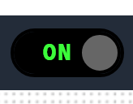

# Toggles

Switch components. Toggles provide on/off controls for system settings and features, allowing users to enable or disable functionality.

<figure markdown>

<figcaption>Toggles component displaying switch controls for enabling or disabling features</figcaption>
</figure>

**Best for:** Settings controls, feature toggles, enable/disable switches, user preferences, system configuration

**Parameters:**

| Parameter | Type | Description |
|-----------|------|-------------|
| `id` | optional (string) | Unique identifier for the toggle |
| `class` | optional (string) | CSS class |
| `label` | required (string) | Toggle label |
| `actionId` | required (string) | Action identifier |
| `value` | optional (object) | Toggle state |
| `enabled` | optional (boolean) | Whether the toggle is enabled |
| `visible` | optional (boolean) | Whether the toggle is visible |
| `bind` | optional (array) | Data binding configuration |

**Example:**

``` yaml
dashboard:
  items:
    - row:
        items:
          - toggle:
              label: "Auto Refresh"
              actionId: "auto-refresh"
              class: "toggle-switch"
              enabled: true
```
