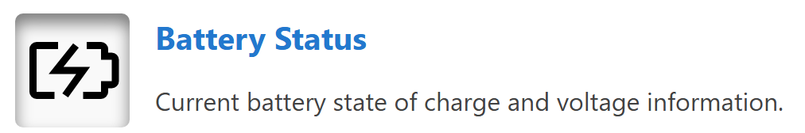
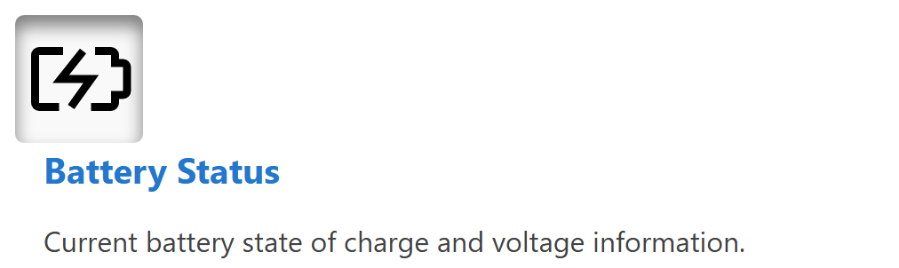

# Group

A group is a container that organizes related components. Groups help create visual and logical groupings within rows, making dashboards more organized and easier to understand.

Groups can be arranged in two directions:

**Horizontal Group** - Components arranged side by side:
<figure markdown>

<figcaption>Horizontal group component showing components arranged side by side</figcaption>
</figure>

**Vertical Group** - Components arranged top to bottom:
<figure markdown>

<figcaption>Vertical group component showing components arranged from top to bottom</figcaption>
</figure>

**Best for:** Grouping related data displays, creating visual sections, organizing components with similar functions

**Parameters:**

| Parameter | Type | Description |
|-----------|------|-------------|
| `id` | optional (string) | Unique identifier for the group |
| `class` | optional (string) | CSS class for styling |
| `direction` | optional (string) | Layout direction - "vertical" or "horizontal" (default: "vertical") |
| `items` | required (array) | Array of components within the group |

**Horizontal Group Example:**

This example shows a horizontal group containing an icon and HTML content:

``` yaml
dashboard:
  items:
    - row:
        items:
          - group:
              direction: horizontal
              items:
                - icon:
                    image: nav_battery_active.svg
                    recess: true
                - html:
                    content: |
                      <div style="padding-left: 1rem;">
                        <div class="info-box__header">Battery Status</div>
                        <div class="info-box__content">
                          <p>Current battery state of charge and voltage information.</p>
                        </div>
                      </div>
```

**Vertical Group Example:**

Groups can also be arranged vertically, stacking components from top to bottom:

``` yaml
dashboard:
  items:
    - row:
        items:
          - group:
              class: "sensor-panel"
              direction: "vertical"
              items:
                - readouts:
                    items:
                      - readout:
                          label: "Pressure"
                          value: 1013.25
                          unit: "hPa"
                          precision: 2
                - chart:
                    type: "line"
                    value:
                      labels: ["00:00", "06:00", "12:00", "18:00"]
                      datasets:
                        - label: "Pressure Trend"
                          data: [1010, 1012, 1015, 1013]
```
