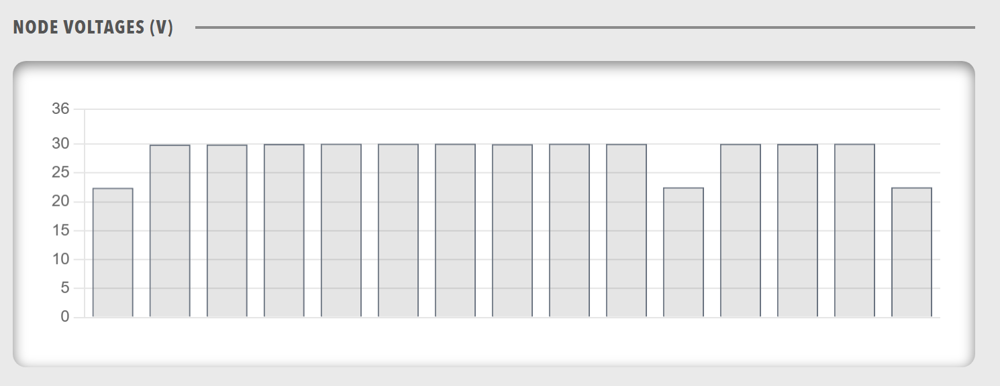

# Panel

Individual panel within a panels grid. Each panel can contain various components and provides a titled container for organizing related content.

<figure markdown>

<figcaption>Panel component displaying a titled container with organized content</figcaption>
</figure>

**Best for:** Individual data sections, titled content areas, organized information display

**Parameters:**

| Parameter | Type | Description |
|-----------|------|-------------|
| `id` | optional (string) | Unique identifier for the panel |
| `class` | optional (string) | CSS class for styling |
| `title` | required (string) | Panel title |
| `menu` | optional (object) | Menu configuration for the panel |
| `height` | optional (string) | Height value in CSS format (e.g., '100px', '50vh', 'auto') |
| `items` | required (array) | Components within the panel (chart, lamps, state, group, readouts, table, html) |

**Basic Example:**

``` yaml
dashboard:
  items:
    - row:
        items:
          - panels:
              items:
                - panel:
                    title: "Temperature Sensors"
                    height: "auto"
                    items:
                      - readouts:
                          items:
                            - readout:
                                label: "Sensor 1"
                                value: 22.5
                                unit: "°C"
                                precision: 1
                            - readout:
                                label: "Sensor 2"
                                value: 24.2
                                unit: "°C"
                                precision: 1
```

**Menu Configuration Example:**

Panels can include menu configurations for actions and navigation:

``` yaml
dashboard:
  items:
    - row:
        items:
          - panels:
              items:
                - panel:
                    title: "System Status"
                    menu:
                      items:
                        - menuitem:
                            label: "Refresh"
                            action: "refresh"
                        - menuitem:
                            label: "Settings"
                            navigate: "/settings"
                        - modal:
                            id: "panel-settings"
                            image: dash_config.svg
                            imageAlt: "Panel Settings"
                            settings:
                              create: false
                              update: true
                              delete: false
                              send: false
                              reload: true
                              showTabs: true
                              refreshOnClose: true
                              urlSettings: /api/v2/ActiveProfile/Component/{COMPONENT_NAME}/settings
                    items:
                      - lamps:
                          items:
                            - lampgroup:
                                items:
                                  - lamp:
                                      color: "green"
                                      label: "Online"
                                      value: 1
```

**Height Variations:**

Panels support different height configurations for flexible layouts:

``` yaml
dashboard:
  items:
    - row:
        items:
          - panels:
              items:
                - panel:
                    title: "Fixed Height Panel"
                    height: "200px"
                    items:
                      - chart:
                          type: "line"
                          value:
                            labels: ["Jan", "Feb", "Mar"]
                            datasets:
                              - label: "Data"
                                data: [10, 20, 30]
                - panel:
                    title: "Viewport Height Panel"
                    height: "50vh"
                    items:
                      - table:
                          tableHeaders:
                            - header:
                                accessorKey: name
                                value: Name
                          value: []
                - panel:
                    title: "Auto Height Panel"
                    height: "auto"
                    items:
                      - readouts:
                          items:
                            - readout:
                                label: "Value"
                                value: 42
```

**Complex Nested Structures:**

Panels can contain complex nested component structures:

``` yaml
dashboard:
  items:
    - row:
        items:
          - panels:
              items:
                - panel:
                    title: "Motor Controller Overview"
                    height: "auto"
                    menu:
                      items:
                        - menuitem:
                            label: "View Details"
                            navigate: "/component?componentId=Motor%20Controller"
                    items:
                      - group:
                          direction: "horizontal"
                          items:
                            - icon:
                                image: nav_motorcontrollers_active.svg
                                label: "Motor Controller"
                            - readouts:
                                items:
                                  - readout:
                                      label: "Bus Voltage"
                                      precision: 1
                                      bind:
                                        - target: value
                                          source: '{COMPONENT_NAME}.BusMeasurement.BusVoltage'
                                  - readout:
                                      label: "Bus Current"
                                      precision: 1
                                      bind:
                                        - target: value
                                          source: '{COMPONENT_NAME}.BusMeasurement.BusCurrent'
                      - chart:
                          type: "line"
                          legend: false
                          showControls: true
                          refreshInterval: 1000
                          bind:
                            - target: value
                              source: '[TimeSeries].{COMPONENT_NAME}.BusMeasurement.BusVoltage'
                      - lamps:
                          items:
                            - lampgroup:
                                items:
                                  - lamp:
                                      color: "green"
                                      label: "Online"
                                      bind:
                                        - target: enabled
                                          source: '{COMPONENT_NAME}.Status.Online'
                                          toType: boolean
                                  - lamp:
                                      color: "red"
                                      label: "Error"
                                      bind:
                                        - target: enabled
                                          source: '{COMPONENT_NAME}.Status.Error'
                                          toType: boolean
```

**Complete Example with All Features:**

``` yaml
dashboard:
  items:
    - row:
        items:
          - panels:
              items:
                - panel:
                    id: "main-panel"
                    class: "status-panel"
                    title: "System Status"
                    height: "60vh"
                    menu:
                      items:
                        - menuitem:
                            label: "Refresh Data"
                            action: "refresh"
                        - modal:
                            id: "panel-config"
                            image: dash_config.svg
                            imageAlt: "Configure Panel"
                            settings:
                              create: false
                              update: true
                              delete: false
                              send: false
                              reload: true
                              showTabs: true
                              refreshOnClose: true
                              urlSettings: /api/v2/ActiveProfile/Component/{COMPONENT_NAME}/settings
                    items:
                      - group:
                          direction: "vertical"
                          items:
                            - lamps:
                                items:
                                  - lampgroup:
                                      items:
                                        - lamp:
                                            color: "green"
                                            label: "Online"
                                            bind:
                                              - target: enabled
                                                source: '{COMPONENT_NAME}.Status.Online'
                                                toType: boolean
                            - readouts:
                                items:
                                  - readout:
                                      label: "Temperature"
                                      bind:
                                        - target: value
                                          source: '{COMPONENT_NAME}.Temperature.Value'
                            - chart:
                                type: "line"
                                bind:
                                  - target: value
                                    source: '[TimeSeries].{COMPONENT_NAME}.Temperature.Value'
```
