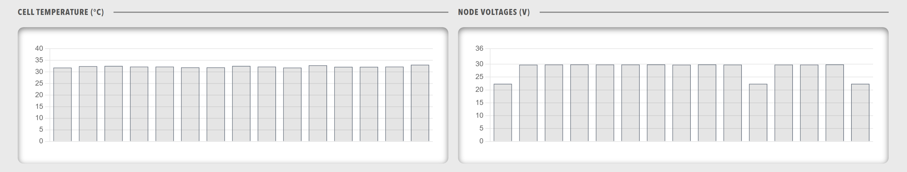

# Panels

Panels create a grid layout of individual panel components. This creates a flexible grid system where each panel can contain different types of content and data visualizations.

<figure markdown>

<figcaption>Panels component showing a grid layout of multiple panel containers</figcaption>
</figure>

**Best for:** Creating dashboard sections with multiple data views, organizing complex information into digestible panels

**Parameters:**

| Parameter | Type | Description |
|-----------|------|-------------|
| `items` | required (array) | Array of panel objects |

**Example:**

``` yaml
dashboard:
  items:
    - row:
        items:
          - panels:
              items:
                - panel:
                    title: "System Status"
                    items:
                      - lamps:
                          items:
                            - lampgroup:
                                items:
                                  - lamp:
                                      color: "green"
                                      label: "CPU"
                                      value: 1
                                      enabled: true
                - panel:
                    title: "Performance"
                    items:
                      - chart:
                          type: "bar"
                          value:
                            labels: ["CPU", "Memory", "Disk"]
                            datasets:
                              - label: "Usage %"
                                data: [45, 67, 23]
```
