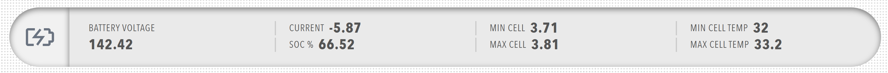

# Pill

Status pill component with grouped readouts and icon. Pills provide a compact way to display multiple related values with a central icon, perfect for showing component status and key metrics.

<figure markdown>

<figcaption>Pill component showing status display with icon and grouped readouts</figcaption>
</figure>

**Best for:** Component status displays, key metric summaries, compact data presentation

**When not to use:** When you need individual readouts without grouping, or when you don't need an icon

**Parameters:**

| Parameter | Type | Description |
|-----------|------|-------------|
| `id` | optional (string) | Unique identifier for the pill |
| `class` | optional (string) | CSS class for styling |
| `icon` | optional (object) | Icon configuration |
| `items` | required (array) | Array of pill groups |

**Icon Configuration:**

| Parameter | Type | Description |
|-----------|------|-------------|
| `image` | required (string) | Icon image filename from /Profile/Images directory |
| `recess` | optional (boolean) | Whether icon is recessed |
| `value` | optional (number) | Icon value |
| `bind` | optional (array) | Data binding for icon |

**Pill Group Structure:**

Each item in `items` must contain a `pillgroup` object with:

| Parameter | Type | Description |
|-----------|------|-------------|
| `id` | optional (string) | Unique identifier for the pill group |
| `class` | optional (string) | CSS class for styling |
| `items` | required (array) | Array of value items |

Each value item must contain a `value` object (pill_item) with:

| Parameter | Type | Description |
|-----------|------|-------------|
| `label` | required (string) | Display label |
| `value` | optional (number/string) | Static value |
| `unit` | optional (string) | Unit of measurement |
| `precision` | optional (number) | Decimal precision |
| `enabled` | optional (boolean) | Whether the readout is enabled |
| `visible` | optional (boolean) | Whether the readout is visible |
| `bind` | optional (array) | Data binding configuration |

**Example:**

``` yaml
dashboard:
  items:
    - row:
        items:
          - pill:
              icon:
                image: nav_motorcontrollers_active.svg
                recess: false
                value: 0
              items:
                - pillgroup:
                    items:
                      - value:
                          label: BUS VOLTAGE
                          openHyperLinkInNewWindow: false
                          enabled: true
                          precision: 1
                          bind:
                            - target: value
                              source: '{COMPONENT_NAME}.BusMeasurement.BusVoltage'
                      - value:
                          label: BUS CURRENT
                          openHyperLinkInNewWindow: false
                          enabled: true
                          precision: 1
                          bind:
                            - target: value
                              source: '{COMPONENT_NAME}.BusMeasurement.BusCurrent'
                - pillgroup:
                    items:
                      - value:
                          label: DSP TEMP
                          openHyperLinkInNewWindow: false
                          enabled: true
                          precision: 1
                          bind:
                            - target: value
                              source: '{COMPONENT_NAME}.DspBoardTempMeasurement.DspBoardTemp'
```
