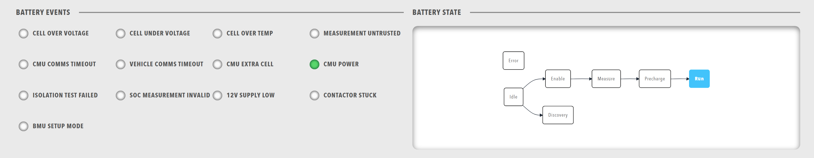

# Row

A row is a layout container that can hold multiple components. Rows are the fundamental building blocks of dashboard layout, allowing you to organize components horizontally or vertically.

<figure markdown>

<figcaption>Row layout container organizing multiple components in a dashboard</figcaption>
</figure>

**Best for:** Creating logical sections, organizing related components, controlling layout direction

**Parameters:**

| Parameter | Type | Description |
|-----------|------|-------------|
| `id` | optional (string) | Unique identifier for the row |
| `class` | optional (string) | CSS class for styling |
| `direction` | optional (string) | Layout direction - "vertical" or "horizontal" (default: "vertical") |
| `height` | optional (string) | Height value in CSS format (e.g., '100px', '50vh', 'auto') |
| `items` | required (array) | Array of components to display in the row |

**Example:**

``` yaml
dashboard:
  items:
    - row:
        id: "status-row"
        class: "status-container"
        direction: "horizontal"
        height: "auto"
        items:
          - lamps:
              items:
                - lampgroup:
                    items:
                      - lamp:
                          color: "green"
                          label: "Online"
                          value: 1
                          enabled: true
          - readouts:
              items:
                - readout:
                    label: "Temperature"
                    value: 25.5
                    unit: "°C"
```
