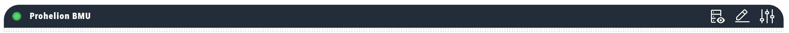

# Titlebar

Header section with status lamps and navigation. The titlebar provides dashboard identification, status information, and navigation controls.

<figure markdown>

<figcaption>Dashboard titlebar component showing status lamps and navigation menus</figcaption>
</figure>

**Best for:** Dashboard identification, status indicators, navigation menus, component-specific actions

**Parameters:**

| Parameter | Type | Description |
|-----------|------|-------------|
| `id` | optional (string) | Unique identifier for the titlebar |
| `class` | optional (string) | CSS class for styling |
| `lamp` | optional (object) | Status lamp configuration |
| `menu` | optional (object) | Navigation menu |
| `showTitlebar` | optional (boolean) | Show the titlebar background (default: true) |
| `showActions` | optional (boolean) | Show actions in the titlebar (default: true) |

**Example:**

``` yaml
dashboard:
  items:
    - titlebar:
        lamp:
          color: grey
          value: 1
          label: Prohelion BMU
          enabled: true
          bind:
            - target: color
              source: Prohelion BMU.[Property].StatusColourText
              toType: string
        menu:
          items:
            - menuitem:
                image: nav_custom_active.svg
                imageAlt: Messages and Signals
                navigate: dbc?view=messages&componentIdFilter=Prohelion+BMU
            - modal:
                id: default
                image: dash_config.svg
                imageAlt: Change Settings
                settings:
                  create: false
                  update: true
                  delete: true
                  send: false
                  reload: true
                  showTabs: true
                  refreshOnClose: false
                  navigateOnClose: /
                  urlSettings: /api/v2/ActiveProfile/Component/Prohelion%20BMU/settings
                  urlDelete: /api/v2/ActiveProfile/Component/Prohelion%20BMU
```
