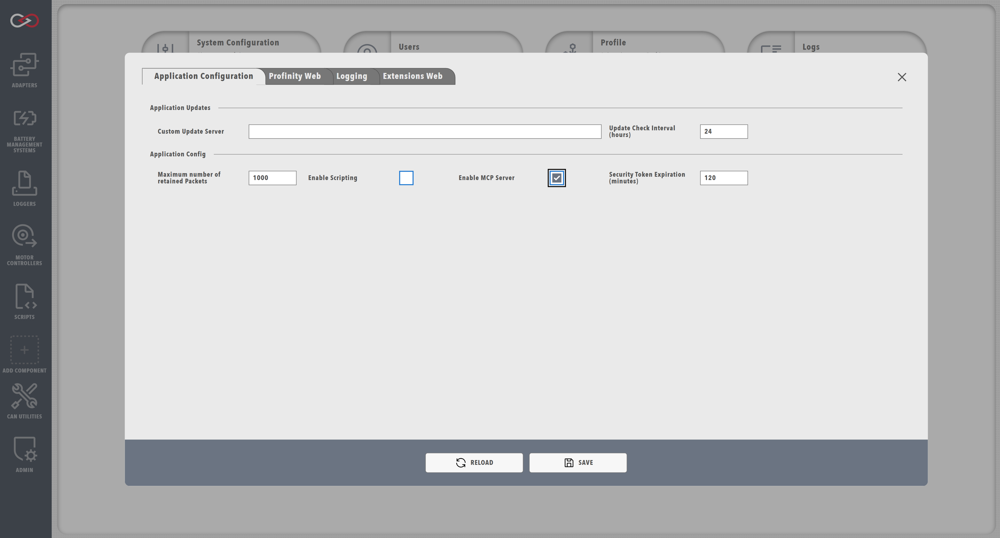

!!! tip "Profinity V2 IS NOW IN GENERAL RELEASE"
    Profinity V2 is available now in General Release.  If you are having any issues or feedback please report it via our support portal or via the Feedback form in the Profinity Admin menu.

# MCP Server

Profinity includes support for the Model Context Protocol (MCP), which allows AI assistants and other tools to interact with Profinity to query system data and metadata. The MCP server provides programmatic access to Profinity's component data, signal values, and metadata through a standardized protocol.

## What is MCP?

The Model Context Protocol (MCP) is a standardized protocol that enables AI assistants and other tools to securely access and interact with external data sources and services. In Profinity, the MCP server provides a way for AI tools to query CAN bus data, component information, and signal metadata without requiring direct API access.

## Enabling MCP Server

To enable the MCP server in Profinity, you must configure it in the System Configuration:

1. Navigate to the **ADMIN** tab
2. Open **System Configuration**
3. Find the **Enable MCP Server** option in the Application Configuration section
4. Enable the option
5. Save the configuration

<figure markdown>

<figcaption>System Configuration showing the “Enable MCP Server” setting</figcaption>
</figure>

!!! warning "System Restart Required"
    Enabling or disabling the MCP server requires a Profinity restart. After saving the configuration, wait approximately 15 seconds for the engine to restart before reloading the page.

Once enabled, the MCP server will be available at the `/sse` endpoint using HTTP/SSE (Server-Sent Events) transport.

## Transport

Profinity's MCP server uses HTTP/SSE (Server-Sent Events) transport for communication. The server endpoint is available at:

```text
http://localhost:18080/sse
```

The exact URL depends on your Profinity web server configuration (port and protocol).

## Available Tools

The MCP server provides the following tools for querying Profinity data:

### get_all_components

Retrieves a lightweight list of all active component names in the Profinity system. Use this tool first to discover available components before querying detailed metadata or data for specific components.

**Parameters:** None

**Returns:** Collection of component names as strings

### get_all_metadata

Retrieves the complete data dictionary for all components, messages, and signals in the Profinity system. This includes full signal metadata (units, ranges, data types, scaling factors, etc.).

**Parameters:**

| Parameter | Type | Description |
|-----------|------|-------------|
| `component` | optional | Filter by component name (case-sensitive) |
| `message` | optional | Filter by message name (case-sensitive, requires component parameter) |
| `signal` | optional | Filter by signal name (case-sensitive, requires both component and message parameters) |

**Returns:** Dictionary of components with their messages and signals, including full metadata

### get_component_data

Retrieves DBC messages and signals for a specific component. Use this to get current signal values for a single component.

**Parameters:**

| Parameter | Type | Description |
|-----------|------|-------------|
| `component` | required | Name of the component as defined in the active Profinity profile |
| `allInfo` | optional (default: false) | If true, includes full signal metadata (units, ranges, etc.) |

**Returns:** Dictionary of messages and signals for the specified component

### get_all_components_data

Retrieves DBC messages and signals for all active components in the Profinity system. Use this to get current signal values across all components at once.

**Parameters:**

| Parameter | Type | Description |
|-----------|------|-------------|
| `allInfo` | optional (default: false) | If true, includes full signal metadata (units, ranges, etc.) |

**Returns:** Dictionary of all components with their messages and signals

### get_signal_value

Retrieves the current or historical time-series data for a specific DBC signal. Use this to get real-time values or query historical data from InfluxDB. For current values only, use `get_component_data`. For signal metadata, use `get_all_metadata`.

**Parameters:**

| Parameter | Type | Description |
|-----------|------|-------------|
| `component` | required | Name of the component as defined in the active Profinity profile. Use `get_all_components` or `get_all_metadata` to discover available component names. |
| `message` | required | DBC message name containing the signal. Use `get_all_metadata` to discover available message names for a component. |
| `signal` | required | DBC signal name to retrieve. Use `get_all_metadata` to discover available signal names for a message. |
| `store` | optional (default: "local") | Data source - `"local"` for real-time CAN bus data (default), or `"logged"` for historical data from InfluxDB. |
| `start` | optional | Start time for historical queries in InfluxDB format (e.g., `"-10m"` for 10 minutes ago, `"2024-01-01T00:00:00Z"` for absolute time). Required when `store="logged"`. |
| `stop` | optional | Stop time for historical queries in InfluxDB format (default: now). Use `"0m"` or omit for current time. |
| `aggregationWindow` | optional | Time window for data aggregation (e.g., `"1m"`, `"5m"`, `"1h"`). Only used with `store="logged"`. |
| `aggregationFunction` | optional (default: "max") | Aggregation function - `"max"`, `"min"`, `"mean"`, `"sum"`, or `"count"`. Only used with `store="logged"`. |

**Returns:** DataPointOrSeries with current value (if `store="local"`) or historical time-series data (if `store="logged"`)

## Authentication

The MCP server requires authentication using JWT tokens. Users must have the `SystemRead` security role to access the MCP server endpoints.

To authenticate with the MCP server:

1. Create a user account with the `SystemRead` role (or use an existing account with this role)
2. Generate a JWT token for the user (via the Profinity API or user management interface)
3. Include the token in the `Authorization` header when making MCP requests:

```text
Authorization: Bearer YOUR_JWT_TOKEN_HERE
```

!!! info "Service Accounts"
    For long-lived integrations like MCP servers, consider creating a service account with the `SystemRead` role and enabling "Token Never Expires" on the account. This ensures the token remains valid for the lifetime of the integration.

## Configuration Examples

### Python Example

```python
import requests

PROFINITY_MCP_URL = "http://localhost:18080/sse"
SERVICE_ACCOUNT_TOKEN = "YOUR_JWT_TOKEN_HERE"

headers = {
    "Authorization": f"Bearer {SERVICE_ACCOUNT_TOKEN}",
    "Content-Type": "application/json"
}

# Get all components (discover available components)
payload = {
    "method": "tools/call",
    "params": {
        "name": "get_all_components",
        "arguments": {}
    }
}

response = requests.post(PROFINITY_MCP_URL, headers=headers, json=payload)
components = response.json()

# Get all metadata
payload = {
    "method": "tools/call",
    "params": {
        "name": "get_all_metadata",
        "arguments": {}
    }
}

response = requests.post(PROFINITY_MCP_URL, headers=headers, json=payload)
metadata = response.json()

# Get component data
payload = {
    "method": "tools/call",
    "params": {
        "name": "get_component_data",
        "arguments": {
            "component": "ComponentName",
            "allInfo": False
        }
    }
}

response = requests.post(PROFINITY_MCP_URL, headers=headers, json=payload)
component_data = response.json()

# Get signal value (real-time)
payload = {
    "method": "tools/call",
    "params": {
        "name": "get_signal_value",
        "arguments": {
            "component": "ComponentName",
            "message": "MessageName",
            "signal": "SignalName",
            "store": "local"
        }
    }
}

response = requests.post(PROFINITY_MCP_URL, headers=headers, json=payload)
signal_value = response.json()

# Get signal value (historical time-series)
payload = {
    "method": "tools/call",
    "params": {
        "name": "get_signal_value",
        "arguments": {
            "component": "ComponentName",
            "message": "MessageName",
            "signal": "SignalName",
            "store": "logged",
            "start": "-10m",
            "stop": "0m",
            "aggregationWindow": "1m",
            "aggregationFunction": "max"
        }
    }
}

response = requests.post(PROFINITY_MCP_URL, headers=headers, json=payload)
historical_data = response.json()
```

## Use Cases

The MCP server is particularly useful for:

- **AI Assistants**: Enabling AI tools to query Profinity data and provide insights
- **Data Integration**: Integrating Profinity data with external analysis tools
- **Monitoring Systems**: Querying system state and signal values programmatically
- **Automated Reporting**: Generating reports based on current or historical data

## Security Considerations

- The MCP server requires authentication with a valid JWT token
- Users must have the `SystemRead` role to access MCP endpoints
- The MCP server provides read-only access to data (no write operations)
- All requests are authenticated and authorized before processing

## Related Documentation

- [System Configuration](../Administration/System_Config.md) - Enable MCP Server configuration
- [APIs](./APIs/index.md) - RESTful API documentation
- [Scripting](./Scripting/index.md) - Profinity scripting capabilities
