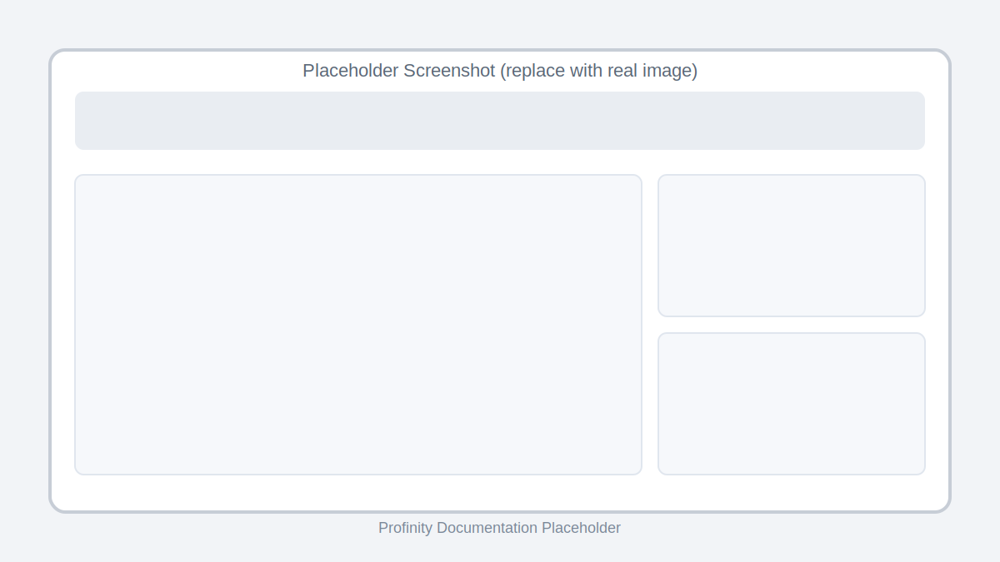

!!! tip "Profinity V2 IS NOW IN GENERAL RELEASE"
    Profinity V2 is available now in General Release.  If you have any issues or feedback please report it via our support portal or via the Feedback form in the Profinity Admin menu.

# Receive Scripts

Receive scripts are specialized scripts designed to handle incoming CAN (Controller Area Network) messages in real-time. They automatically execute when a matching CAN packet is received, making them essential for CAN bus monitoring, protocol implementation, and real-time data processing. 

These scripts are particularly useful in applications where immediate response to CAN messages is required.

## Characteristics
- Automatic execution when matching CAN packets are received
- Implement the `Receive` method (C#) or `receive` function (Python)
- Can be configured to match specific CAN IDs or a range of IDs
- Full access to the received CAN packet data

<figure markdown>

<figcaption>Receive script editor and CAN packet trigger configuration (placeholder screenshot — replace with an actual image)</figcaption>
</figure>

## Examples

The following example demonstrates how to implement Receive scripts in each supported language. Each example shows how to handle incoming CAN packets, with a focus on accessing the CAN ID in hexadecimal format. These examples represent the minimum implementation needed for a functional Receive script.

This example demonstrates a Receive script that:

- Implements the required Receive method
- Shows how to access the CAN ID in hexadecimal format
- Uses the Profinity console for output
- Handles incoming CAN packets

=== "C#"

    ```csharp
    using System;
    using Profinity.Scripting;
    using Profinity.Comms.CANBus;

    public class CSharpRunTest : ProfinityScript, IProfinityReceiverScript
    {
        public void Receive(CanPacket canPacket)
        {
            Profinity.Console.WriteLine("CSharp CanId Received : " + canPacket.CanIdAsHex);
        }
    }
    ```

=== "Python"

    ```python
    def receive(canPacket):
        print("Python CanPacket Id Received : " + canPacket.CanIdAsHex)
    ```