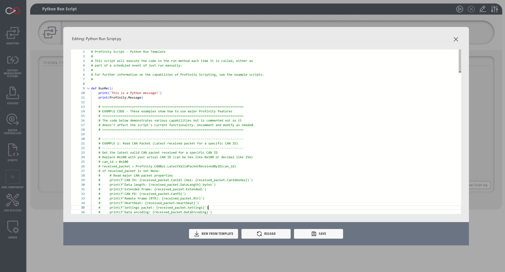

!!! tip "Profinity V2 IS NOW IN GENERAL RELEASE"
    Profinity V2 is available now in General Release.  If you have any issues or feedback please report it via our support portal or via the Feedback form in the Profinity Admin menu.

# Run Scripts

Run scripts are the most flexible and commonly used script type in Profinity. They can be executed either manually by users or automatically on a schedule, making them ideal for a wide range of automation tasks. These scripts are perfect for operations that need to be performed either on-demand or if scheduled at specific intervals, such as data collection, testing, or system configuration tasks.

Run scripts support three execution modes:

- **Run On Demand**: Scripts executed manually by users
- **Time Interval**: Scripts that run automatically at regular intervals (e.g., every 5 minutes, every hour)
- **Cron Schedule**: Scripts that run on a cron schedule using Quartz cron expressions

## Characteristics
- Can be executed manually or on a schedule
- Can interact with CAN bus, DBC files, and state management
- Support for console output
- Can be used for testing, data collection, and automation
- Support for cancellation handling
- Support for time-based scheduling (TimeInterval and CronSchedule modes)

<figure markdown>

<figcaption>Run script editor and scheduling options</figcaption>
</figure>

## Examples

The following examples demonstrate how to implement each script type in the supported programming languages. Each example shows the basic structure and key features of the script type, including proper initialization, execution flow, and cleanup. Note that while the examples are simple, they illustrate the essential patterns needed for each script type.

This example demonstrates a basic Run script that:

- Prints messages to the console
- Accesses the Profinity message property
- Returns a boolean result

=== "C#"

    ```csharp
    using System;
    using Profinity.Scripting;

    public class CSharpRunTest : ProfinityScript, IProfinityRunnableScript
    {
        public bool Run()
        {
            Profinity.Console.WriteLine("This is a CSharp Message!");
            Profinity.Console.WriteLine(Profinity.Message);
            return true;
        }
    }
    ```

=== "Python"

    ```python
    def PrintMessage():
        print('This is a Python message!')
        print(Profinity.Message)

    PrintMessage()
    ```

!!! info "Python 3 Syntax"
    Profinity uses IronPython with Python 3 compatibility enabled. All Python scripts use Python 3 syntax, including `print()` as a function (not a statement) and support for f-strings and other Python 3 features.