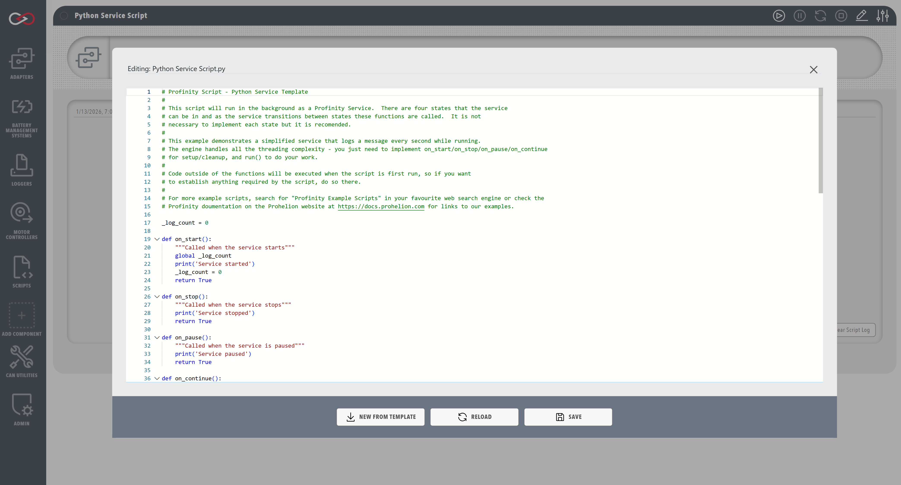

!!! tip "Profinity V2 IS NOW IN GENERAL RELEASE"
    Profinity V2 is available now in General Release.  If you have any issues or feedback please report it via our support portal or via the Feedback form in the Profinity Admin menu.

# Service Scripts

Service scripts are designed for continuous, long-running operations that need to maintain state and respond to system events. They operate similarly to Windows services, with full lifecycle management and multiple startup modes. These scripts are ideal for critical monitoring tasks, continuous data logging, and system-level operations that need to run reliably over extended periods.

## Characteristics
- Continuous execution with service-like behavior
- Service state management methods
- Support for service lifecycle management

<figure markdown>

<figcaption>Service script editor and lifecycle configuration</figcaption>
</figure>

## Examples

The following examples demonstrate how to implement Service scripts in each supported language. Each example shows the complete lifecycle management of a service, including start, stop, pause, continue, and shutdown operations. These examples represent the minimum implementation needed for a functional Service script.

This example demonstrates a Service script that:

- Implements all required lifecycle methods
- Shows proper service state management
- Uses the Profinity console for logging
- Handles service state transitions

=== "C#"

    ```csharp
    using System;
    using Profinity.Scripting;

    public class CSharpServiceTest : ProfinityBaseService
    {
        public override bool OnStart()
        {
            Profinity.Console.WriteLine("Started CSharp Service");
            return true;
        }

        public override bool OnStop()
        {
            Profinity.Console.WriteLine("Stopped CSharp Service");
            return true;
        }

        public override bool OnPause()
        {
            Profinity.Console.WriteLine("Paused CSharp Service");
            return true;
        }

        public override bool OnContinue()
        {
            Profinity.Console.WriteLine("Continue CSharp Service");
            return true;
        }

        public override bool Run()
        {
            // Optional: Run() method for interface compliance
            // Can be left empty or do minimal work
            // Return true to continue, false to stop
            return true;
        }
    }
    ```

=== "Python"

    ```python
    def on_start():
        print('Python Service Started!')
        return True

    def on_stop():
        print('Python Service Stopped!')
        return True

    def on_pause():
        print('Python Service Paused!')
        return True

    def on_continue():
        print('Python Service Continued!')
        return True

    def on_shutdown():
        print('Python Service Shutdown!')
        return True

    def run():
        """Optional: run() function for consistency with examples"""
        # Can be left empty or do minimal work
        # Return True to continue, False to stop
        return True
    ```