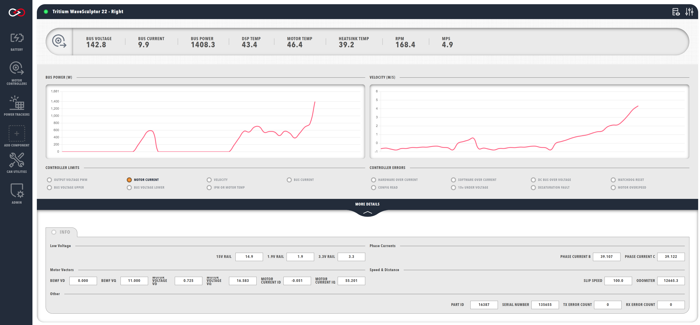

!!! tip "Profinity V2 IS NOW IN EARLY ADOPTER RELEASE"
    Profinity V2 is available now in Early Adopter Release.  To support this release we are making the product available to our Early Adopter Community.  If you have any issues or feedback please report it via our support portal or via the Feedback form in the Profinity Admin menu.

# Visualising Data

Once all of your components have been configured, you are ready to start receiving and visualising data.

Each component in your system will have an associated dashboard which can be accessed by selecting the component from the sidebar. The component dashboards are tailored to the specific component and display all of the relevant information and data for that component in a convenient fashion.

<figure markdown>

<figcaption>Example of Dashboard Visualising Data</figcaption>
</figure>