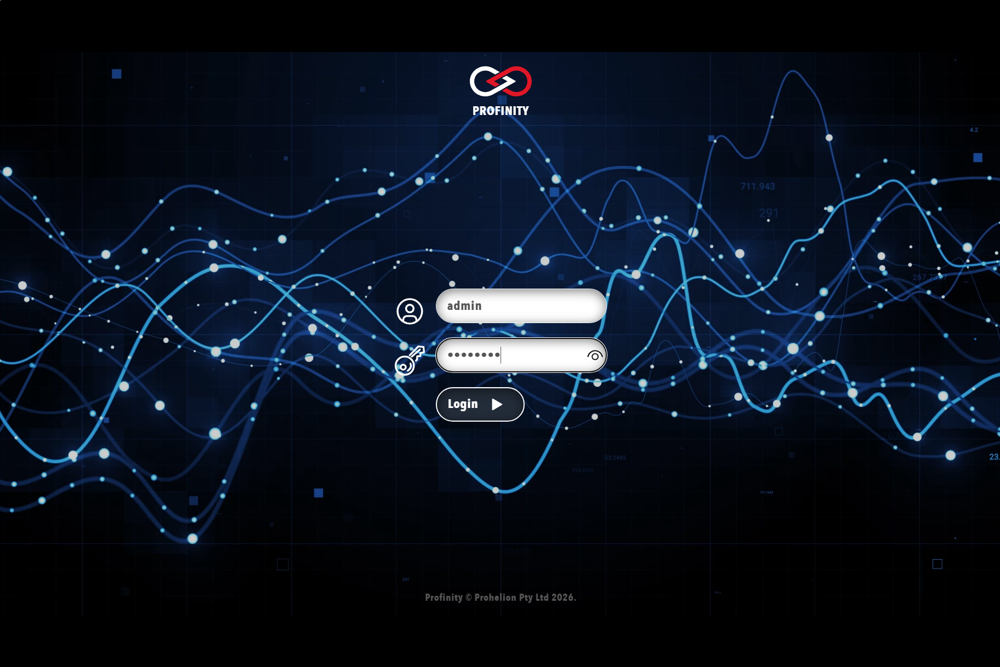
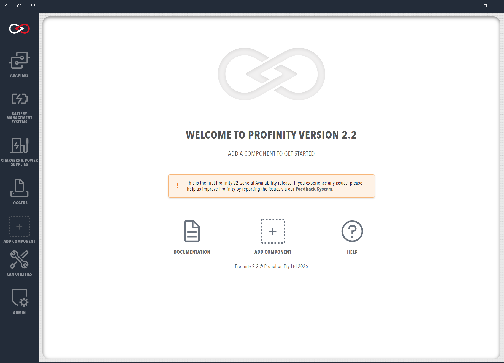

# Installing Profinity On Docker

!!! info "Available Profinity Releases"
    Profinity is currently available on [Windows machines](./Windows_Installation.md) as a standard desktop application, for selected [Unix Platforms (including macOS and Linux)](./Zip_Installation.md) and as a [Docker container](./Docker_Installation.md) for Docker enabled environments and Cloud setups.

## Table of Contents

- [Installation using Docker](#installation-using-docker)
    - [Prerequisites](#prerequisites)
    - [Simple Setup](#simple-setup)
    - [Starting and Stopping Profinity](#starting-and-stopping-profinity)
    - [Accessing Profinity](#accessing-profinity)
- [Complex Setup for Production Deployments](#complex-setup-for-production-deployments)
    - [Using Environment Variables for Configuration](#using-environment-variables-for-configuration)
    - [Docker Compose with Environment Variables](#docker-compose-with-environment-variables)
    - [Environment File (.env)](#environment-file-env)
    - [Using Environment Files with Docker Compose](#using-environment-files-with-docker-compose)
    - [Deployment Strategies](#deployment-strategies)

## Installation using Docker

Profinity can be deployed onto most devices capable of running Docker, including macOS and Linux machines as well as several single-board computers such as Raspberry Pi, BeagleBone Black, etc.

### Prerequisites

The following items are required to be able to install Profinity:

- Docker installed on the target device
- A device capable of running ASP .Net 9, with Docker support from Microsoft
- Docker Compose installed on the target device (included with Docker Desktop, available as plugin on Linux machines)
- A suitable CAN adaptor for the target device

### Simple Setup

On the target device, create a new empty directory and a file titled `docker-compose.yml` in the new directory. The contents of the `docker-compose.yml` file should be

```yaml
services:
  profinity:
      image: prohelion/profinity:latest
      restart: always
      #On linux hosts you can run in host mode to enable autodiscovery
      #network_mode: host
      ports:
        - 18080:18080
        - 18443:18443
        - 5000:5000
        - 4876:4876
```

For more information about Docker Compose, see the [official Docker documentation](https://docs.docker.com/compose/).

### Starting and Stopping Profinity

The Profinity Docker container is started and stopped using commands from the [Docker Compose toolset](https://docs.docker.com/compose/reference/). First, navigate to the directory containing the `docker-compose.yml` file.

#### Basic Commands

**Start Profinity:**
```bash
docker compose up
```

**Start in background (detached mode):**
```bash
docker compose up -d
```

**Stop Profinity (keeps containers):**
```bash
docker compose stop
```
This stops the running containers but keeps them. You can restart them later with `docker compose start`.

**Stop and remove Profinity (removes containers):**
```bash
docker compose down
```
This stops the containers and removes them. You'll need to run `docker compose up` again to recreate and start them.

**View logs:**
```bash
docker compose logs -f
```

For more information about Docker Compose commands, see the [official Docker Compose reference](https://docs.docker.com/compose/reference/).

### Accessing Profinity

Once started, open the URL defined in your configuration to access the Profinity web client. The default URL is `http://localhost:18080` on the local machine or `http://[Your IP Address]:18080` if accessed remotely.

Connecting to the Profinity web client will direct you to the Profinity login page. 

<figure markdown>

<figcaption>Profinity login page</figcaption>
</figure>

A fresh install of Profinity will only have the administrator user active. To log in, use the following login details.

Username: `admin`

Password: `password`

After logging in, you will arrive at the Profinity homepage.

<figure markdown>

<figcaption>Profinity homepage</figcaption>
</figure>

To stop Profinity temporarily (keeping containers), use `docker compose stop`. To stop and remove containers, use `docker compose down`.

## Complex Setup for Production Deployments

It is not necessary to use environment variables to configure Profinity.  However, for full production environments and deployments that involve many Profinity instances you will likely find that Environment Variables are the most simple way to configure the product.

### Using Environment Variables for Configuration

Profinity supports environment variable substitution in configuration and profile files, making it easy to create flexible Docker deployments. For detailed information about environment variables, including default values and syntax, see the [Environment Variables](./Environment_Variables.md) documentation.

#### Docker Compose with Environment Variables

You can configure Profinity using environment variables in your `docker-compose.yml` file. Docker Compose supports [environment variable substitution](https://docs.docker.com/compose/environment-variables/) in compose files, allowing you to use variables for port mapping and service configuration.

```yaml
services:
  profinity:
    image: prohelion/profinity:latest
    restart: always
    ports:
      - "${HTTP_PORT:-18080}:18080"
      - "${HTTPS_PORT:-18443}:18443"
      - "${API_PORT:-5000}:5000"
      - "${UDP_PORT:-4876}:4876"
    environment:
      # Profinity Configuration
      - CONFIG_NAME=${CONFIG_NAME:-Production Configuration}
      - HTTP_ADDRESS=${HTTP_ADDRESS:-0.0.0.0}
      - HTTP_PORT=${HTTP_PORT:-18080}
      - LOG_LEVEL=${LOG_LEVEL:-Info}
      - ENABLE_SCRIPTING=${ENABLE_SCRIPTING:-true}
      
      # Profile Configuration
      - PROFILE_NAME=${PROFILE_NAME:-Docker Profile}
      - ADAPTER_IP=${ADAPTER_IP:-192.168.1.100}
      - ADAPTER_PORT=${ADAPTER_PORT:-8080}
    volumes:
      - ./profiles:/root/Prohelion/Profinity/Profiles
      - ./config:/root/Prohelion/Profinity/Config
```

For more information about Docker Compose environment variables, see the [official Docker documentation](https://docs.docker.com/compose/environment-variables/).

!!! info "Docker Volumes"
    The `volumes` section mounts local directories into the container, allowing Profinity to persist configuration and profile data. Profinity stores data in `/root/Prohelion/Profinity/` by default (when running as root user). For more information about Docker volumes, see the [official Docker documentation](https://docs.docker.com/storage/volumes/).

!!! tip "Validating Profile Paths"
    To verify where Profinity is storing profiles and config files, you can exec into the running container:
    ```bash
    docker compose exec profinity bash
    ls -la /root/Prohelion/Profinity/
    ```
    This will show the actual directory structure used by Profinity inside the container.

#### Environment File (.env)

Docker Compose automatically loads environment variables from a `.env` file in the same directory as your `docker-compose.yml`. This is the recommended way to manage environment-specific configuration.

Create a `.env` file in the same directory as your `docker-compose.yml`:

```env
# Profinity Configuration
CONFIG_NAME=Production Configuration
HTTP_ADDRESS=0.0.0.0
HTTP_PORT=18080
LOG_LEVEL=Info
ENABLE_SCRIPTING=true

# Profile Configuration
PROFILE_NAME=Docker Profile
ADAPTER_IP=192.168.1.100
ADAPTER_PORT=8080

# Network Configuration
HTTP_PORT=18080
HTTPS_PORT=18443
API_PORT=5000
UDP_PORT=4876
```

For more information about `.env` files in Docker Compose, see the [official Docker documentation](https://docs.docker.com/compose/environment-variables/#the-env-file).

!!! tip "Using Environment Variables in Config and Profile Files"
    When using environment variables with Docker, you can reference them directly in your Profinity `Config.yaml` and `Profile.yaml` files. These files should be placed in the mounted volume directories that map to `/root/Prohelion/Profinity/Config` and `/root/Prohelion/Profinity/Profiles` inside the container. When Profinity starts in Docker, it will automatically substitute the environment variables in these files with the values from your `.env` file or Docker Compose environment section.
    
    For complete examples and detailed information about using environment variables in `Config.yaml` and `Profile.yaml` files, including syntax, default values, and variable naming rules, see the [Environment Variables](./Environment_Variables.md) documentation.

#### Using Environment Files with Docker Compose

If you're using multiple `.env` files for different environments:

```bash
# Start with specific environment file
docker compose --env-file .env.production up

# Start with development environment
docker compose --env-file .env.development up

# Use specific compose file with environment file
docker compose -f docker-compose.prod.yml --env-file .env.production up
```

For more information about Docker Compose environment files, see the [official Docker documentation](https://docs.docker.com/compose/environment-variables/#the-env-file).

#### Deployment Strategies

You can create different Docker Compose files for different environments. This approach allows you to use the same base configuration while customizing settings for development, staging, and production.

**Development Environment**
```yaml
# docker-compose.dev.yml
services:
  profinity:
    image: prohelion/profinity:latest
    environment:
      - CONFIG_NAME=Development Configuration
      - LOG_LEVEL=Debug
      - ENABLE_SCRIPTING=true
      - PROFILE_NAME=Development Profile
      - ADAPTER_IP=127.0.0.1
    volumes:
      - ./dev-profiles:/root/Prohelion/Profinity/Profiles
      - ./dev-config:/root/Prohelion/Profinity/Config
```

**Production Environment**
```yaml
# docker-compose.prod.yml
services:
  profinity:
    image: prohelion/profinity:latest
    restart: always
    environment:
      - CONFIG_NAME=Production Configuration
      - LOG_LEVEL=Info
      - ENABLE_SCRIPTING=false
      - PROFILE_NAME=Production Profile
      - ADAPTER_IP=${PRODUCTION_ADAPTER_IP}
    volumes:
      - ./prod-profiles:/root/Prohelion/Profinity/Profiles
      - ./prod-config:/root/Prohelion/Profinity/Config
      - ./logs:/root/Prohelion/Profinity/Logs
```

For more information about Docker Compose file overrides, see the [official Docker documentation](https://docs.docker.com/compose/extends/).

!!! info "Directly Accessing Devices"
    Docker deliberately does not expose all devices through to the containers that run the applications.  In some cases you may wish to expose additional devices to Docker so that you can access things like SocketCAN Natively or discover components that use UDP for broadcasting.  See the [official Docker documentation](https://docs.docker.com/compose/) for how to expose these devices to your Docker container.
