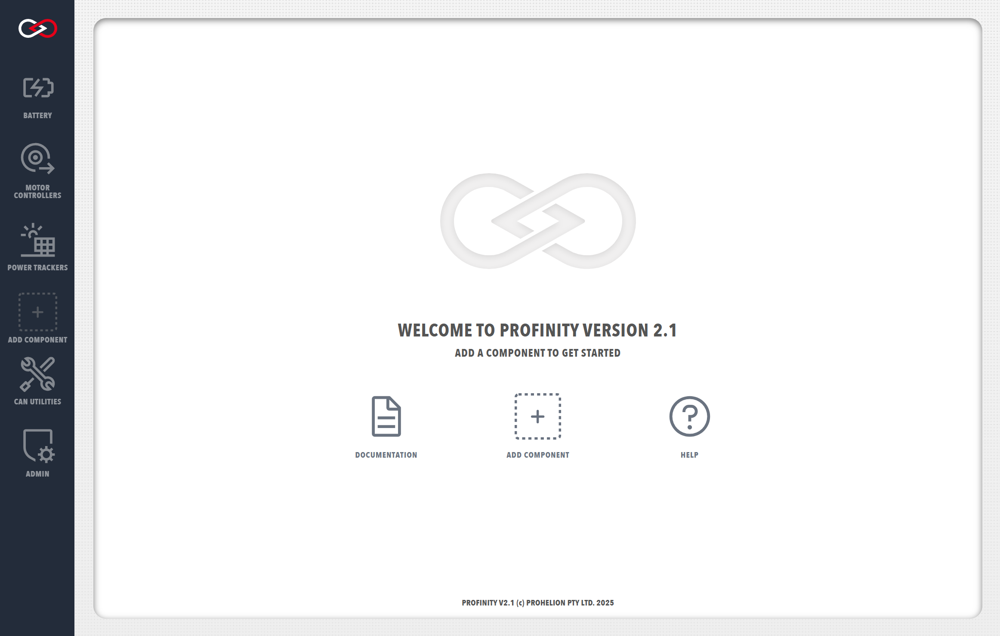
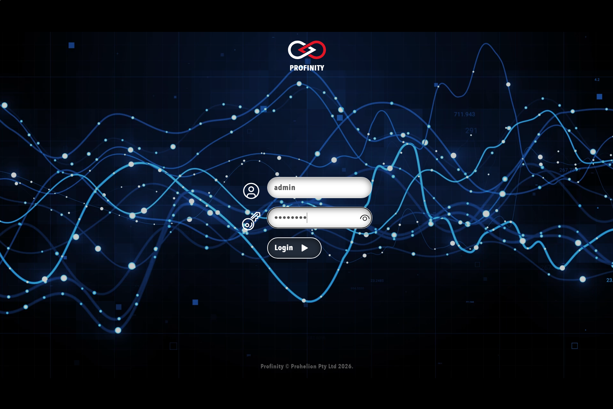

!!! tip "Profinity V2 IS NOW IN EARLY ADOPTER RELEASE"
    Profinity V2 is available now in Early Adopter Release.  To support this release we are making the product available to our Early Adopter Community.  If you have any issues or feedback please report it via our support portal or via the Feedback form in the Profinity Admin menu.

# Installing Profinity On Windows

!!! info "Available Profinity Releases"
    Profinity is currently available on [Windows machines](./Windows_Installation.md) as a standard desktop application, for selected [Unix Platforms (including macOS and Linux)](./Zip_Installation.md) and as a [Docker container](./Docker_Installation.md) for Docker enabled environments and Cloud setups.

## Installation on Windows

Installing Profinity on your Windows machine is relatively simple due to the Profinity Setup Wizard.

[Download Profinity V2 Early Adopter Release :material-download:](https://github.com/Prohelion/Profinity_V2_Early_Adopter_Release/releases/latest/download/Profinity.Install.msi){ .md-button }

1. Contact support to get a copy of the Profinity V2 Early Adopter Installer
2. Open the downloaded file `Profinity.Install.msi`
3. Follow the prompts in the Profinity Setup Wizard

Launching the Profinity desktop client will take you directly to the Profinity homepage.

<figure markdown>

<figcaption>Profinity homepage</figcaption>
</figure>

!!! warning "Available Ports for Windows"
    Even when Profinity is just being run as a Desktop application, it still connects to all available TCP interfaces on the running machine on port 18080 by default.  If you do not want your Profinity instance to be accessed remotely, change the default IP address that Profinity runs on to localhost (127.0.0.1) in the [System Configuration](../Administration/System_Config.md).

### Starting and Stopping Profinity

A a Windows Desktop application, Profinity is started by running the application from the Start Menu.  

To stop Profinity, shutdown the Application.

### Accessing a Desktop Application Instance via a Web Browser

With Profinity Desktop running, you can also access the user interface as a web application if the Profinity instance is running on an address other than 127.0.0.1.  

To do so open the URL defined in the [Admin / System Configuration / Web panel](../Administration/System_Config.md) (i.e., `http://profinity:18080`) to access the Profinity web client. For users that followed the default setup procedure, the default URL is `http://localhost:18080` on the local machine or the IP address of the machine and `http://[Your IP Address]:18080` if accessed remotely.

Connecting to the Profinity web client will direct you to the Profinity login page. 

<figure markdown>

<figcaption>Profinity login page</figcaption>
</figure>

A fresh install of Profinity will only have the administrator user active. To log in, use the following login details.

Username: `admin`

Password: `password`