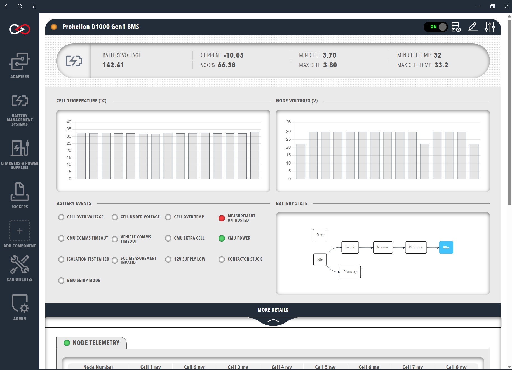
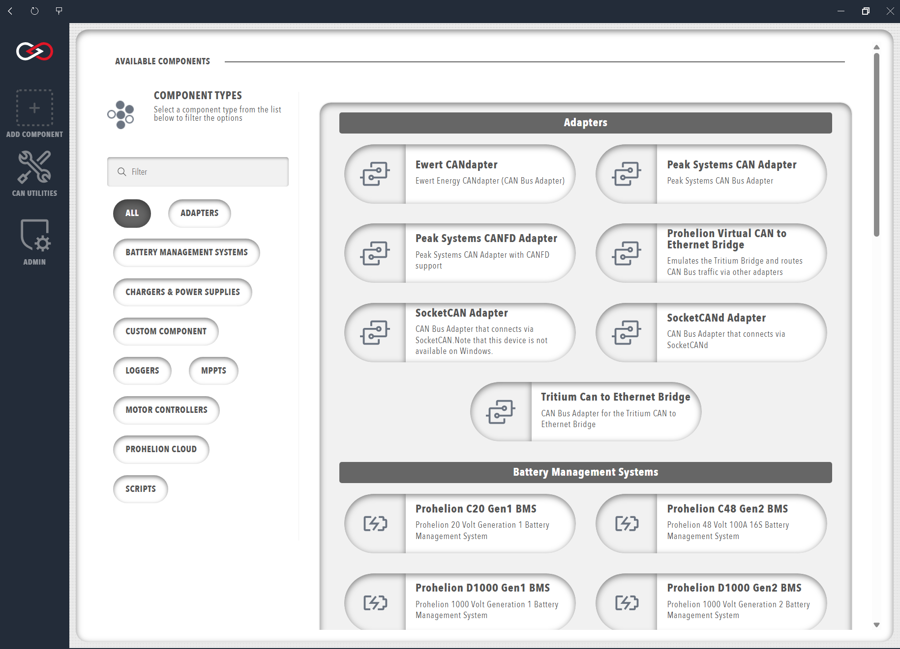
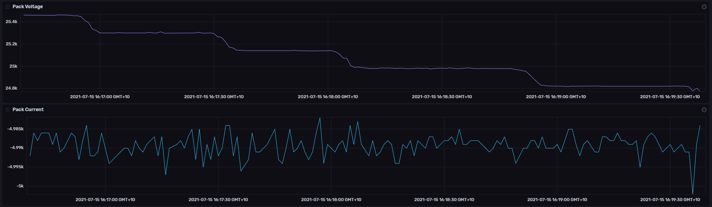
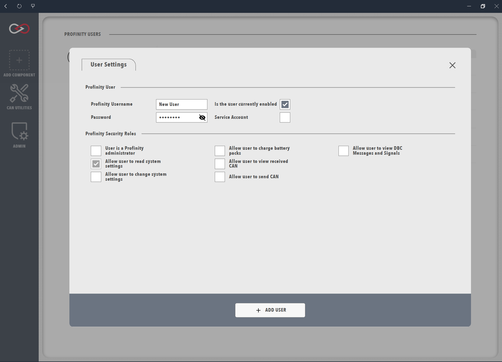
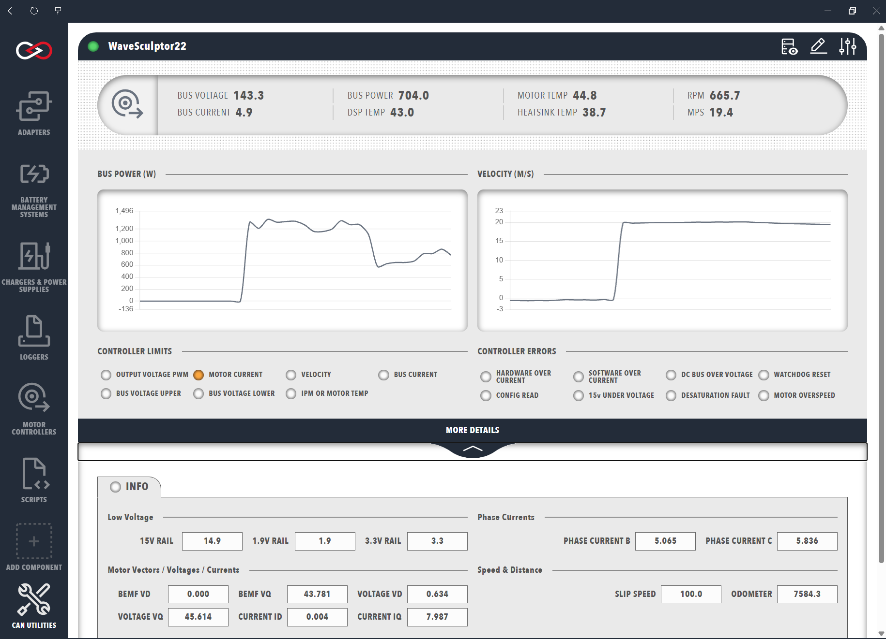
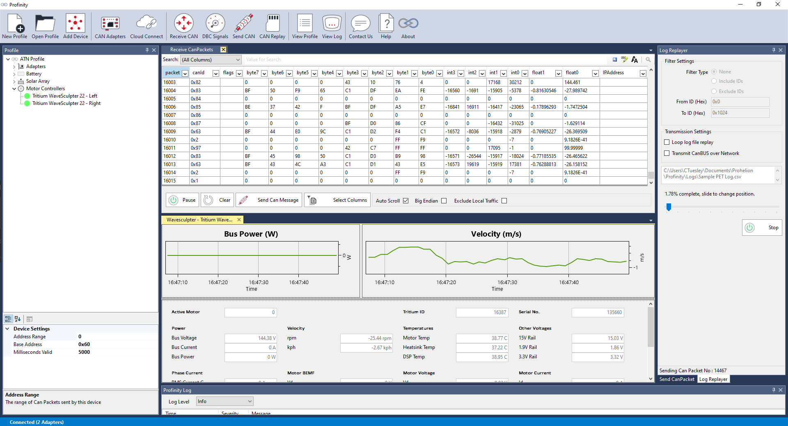

# Prohelion Profinity

Profinity is our comprehensive CAN bus management platform, designed to connect your CAN-based solutions to modern cloud, AI, API, and big data technologies. 

[Download Profinity V2 :material-download:](https://github.com/Prohelion/Profinity/releases/latest/download/Profinity.Install.msi){ .md-button }
   
<figure markdown>

<figcaption>Managing a Prohelion BMU in the modern web-based interface of Profinity V2</figcaption>
</figure>

## Key Features of Profinity

The worlds most modern CAN bus management solution, featuring

- Single solution multi platform deployment, run Profinity anywhere from edge, to desktop to cloud.
- Modern container and API-centric architecture
- Enhanced cloud connectivity and data logging
- Fully web user interface, available from any platform
- Advanced device management
- Extensive customisation capabilities including, custom dashboards, custom component support, styling and scripting
- Support for AI technologies

### Device Management
- Connect and configure CAN bus devices
- Support for multiple device types
- Real-time monitoring and control

<figure markdown>

<figcaption>Adding and configuring devices in Profinity</figcaption>
</figure>

### Data Integration
- Cloud connectivity options
- API access for custom integrations
- Advanced data logging capabilities

<figure markdown>

<figcaption>Advanced data logging and analysis features</figcaption>
</figure>

### Security (V2 Only)
- Role-based access control
- Secure credential management
- Audit logging

<figure markdown>

<figcaption>Secure user management and access control</figcaption>
</figure>

## Available Versions

-   :material-tools:{ .lg .middle } __Profinity V2__

    ---

    The latest version of Profinity, featuring:

    - Modern container and API-centric architecture
    - Enhanced cloud connectivity
    - Improved user interface
    - Advanced device management

    <figure markdown>
    
    <figcaption>Modern web-based interface of Profinity V2</figcaption>
    </figure>

    [:octicons-arrow-right-24: Profinity V2 Documentation](Profinity_Version_2/index.md)

-   :material-tools:{ .lg .middle } __Profinity Version 1 (Retired)__

    ---

    The original version of Profinity, supporting:
    
    - Basic CAN bus management
    - Device configuration
    - Data logging
    - Simple cloud integration

    <figure markdown>
    
    <figcaption>Classic interface of Profinity Version 1</figcaption>
    </figure>

    [:octicons-arrow-right-24: Profinity Version 1 Documentation](Profinity_Version_1/index.md)

## Support

Need help? We're here to assist:

- Visit our [Support Portal](https://prohelion.atlassian.net/servicedesk/customer/portals)
- [Contact Us](https://www.prohelion.com/contact-us/) directly
