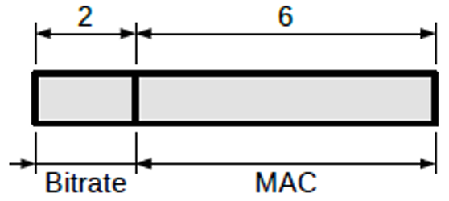

# Bridge Heartbeat

In order to identify the presence of a CAN-Ethernet bridge on a network, the bridge sends periodic heartbeat datagrams over UDP.  These packets are identified by an active H bit in the flags bitfield, and an identifier of __0x000__.  The contents of the data field of a heartbeat datagram is shown in figure 5.

<figure markdown>

<figcaption>Figure 5: Heartbeat Data</figcaption>
</figure>

The bitrate field is an unsigned 16-bit integer showing the current CAN bitrate of the bridge in kbps.

The MAC field is a 48-byte value representing the MAC address of the bridge's Ethernet interface.

Note that the heartbeat packets are always multicast via UDP, regardless of the identifier forwarding settings used in any existing TCP connection.
