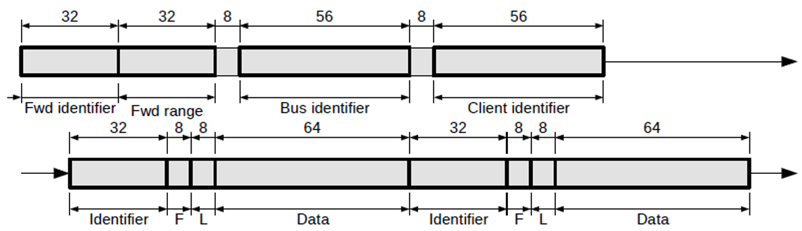

# CAN-TCP Bridging

When a higher level of reliability is required in the connection between a device and the CAN-Ethernet bridge, CAN packets can be communicated over a TCP/IP connection.  This connection should be made to the bridge on the same remote port as UDP communication occurs: __4876__.  Data should then be sent to the bridge according to the structure shown in figure 4.  

By setting the fwd identifier and fwd range fields (see below), it is possible to have the bridge use this TCP connection to forward on certain packets, rather than having them multicast via UDP.

<figure markdown>

<figcaption>Figure 4: TCP Stream Structure</figcaption>
</figure>

The fwd identifier represents the lowest CAN identifier that should be bridged from the physical CAN network and forwarded on via the TCP connection.

The fwd range represents the size of the range of CAN identifiers that should be forwarded via TCP.  That is, the bridge will forward via TCP any packet with

__fwd identifier <= packet CAN identifier < ( fwd identifier + fwd range )__

The remaining fields in figure 4 are identical to those in figure 1, see [CAN-UDP Bridging](CAN_UDP_Bridging.md).  

In effect, the TCP data stream consists of an initial TCP datagram with the forwarding information, followed by bus and client identifiers that are only sent once for the entire TCP stream. This initial information is followed by any number of CAN packets consisting of identifiers, flags, lengths and data which can be a part of the initial TCP datagram or any number of independent TCP datagrams afterwards.

Just like with UDP bridging, multiple CAN packets are able to be bundled into a single TCP datagram, the only difference is that after the initial TCP datagram successive transmissions need only contain CAN packets.
