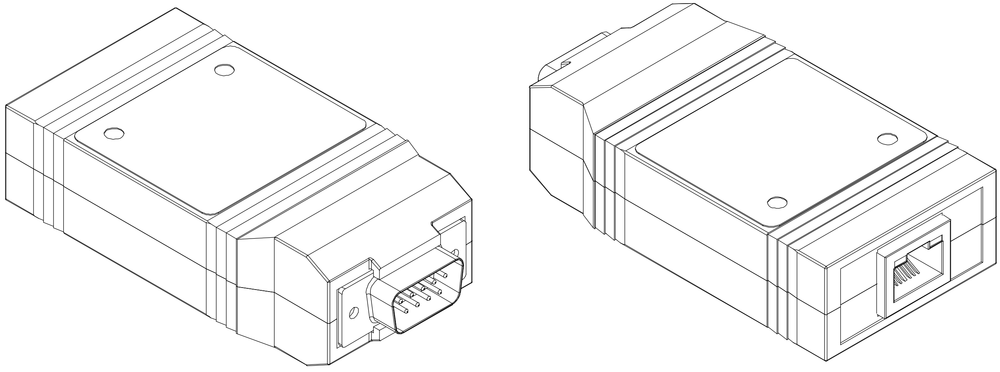

# CAN-Ethernet Bridge User Manual

This document describes the usage of the Prohelion CAN–Ethernet bridge, including the accompanying configuration software.

<figure markdown>

<figcaption>CAN-Ethernet Bridge</figcaption>
</figure>

The Prohelion CAN–Ethernet bridge allows easy access to a CAN bus from a PC. No installation is required, so the device can be used with any PC with an Ethernet interface. Furthermore, an already present Ethernet network can be used to route CAN messages: with a bridge connected to a router on the network, all PCs attached to that router will become part of the virtual CAN bus. It is also possible to combine multiple physically separate CAN buses into one virtual bus, or use them as separate virtual buses on the same network.

## CAN Bridge Usage

The CAN–Ethernet bridge is fully plug and play. When the bridge is connected to an Ethernet network it will acquire an IP address, either via DHCP or Auto IP, or by using a previously configured static IP. 

Once an address has been assigned the bridge will begin operating.

### User Interface

The CAN–Ethernet bridge user interface consists of a single push-button and green LED in the front decal.  

Holding down the button for more than 5 seconds when the bridge is running will reset the bridge configuration back to factory default settings, and this event is shown by illuminating the front-panel LED briefly.

Holding down the button for at least 5 seconds while powering up the bridge will run the bootloader, allowing the bridge firmware to be updated.

## CAN Bridge Hardware

The CAN-Ethernet bridge uses the standard CAN bus pinout on the male DB9 connector. Refer to the [datasheet](../Datasheet/index.md) for the specifications on this connector.  

# Protocols and Security Considerations: 

By default, the bridge transmits CAN message over Ethernet via multicast UDP/IP packets. This protocol provides the best match with the broadcast architecture of physical CAN networks, whereby a packet sent by one node can be received by all other nodes connected to the network.  

However, UDP is an unreliable protocol, which means that messages can get lost and the order of messages can change.  In general, given the relatively high bandwidth of most modern network connections, such transmission errors are rare; however, in certain applications when lossless communications are required (e.g. when transmitting data streams over CAN) the unreliable nature of UDP may not be acceptable.  In these situations, it is possible for a bi-directional TCP/IP connection to be made to a particular CAN–Ethernet bridge, thereby ensuring the reliability of the virtual section of the CAN–Ethernet network.  The downside of using this TCP/IP link is that by definition it is a point-to-point connection, and any data sent or received will not be visible to other nodes on the virtual network.  Also, each bridge supports only a single simultaneous TCP/IP connection.

Both multicast UDP and TCP are insecure protocols.  If the appropriate steps are not taken in the configuration of the network that a bridge is attached to, this could result in a malicious party gaining access to devices connected to the physical CAN network. Therefore, it is important that you configure your network properly before connecting any device to your CAN bus. The most secure configuration procedures are:

__1.__	Disconnect from the Internet. Ensure that there is no connection between any PC in your network and the Internet.

__2.__	Configure your router. In most offices only one router has a connection to the Internet and all other traffic goes through this router. If this router is configured to block all traffic on the port used by the bridge  (default 4876), your CAN network will be separated from the Internet.

