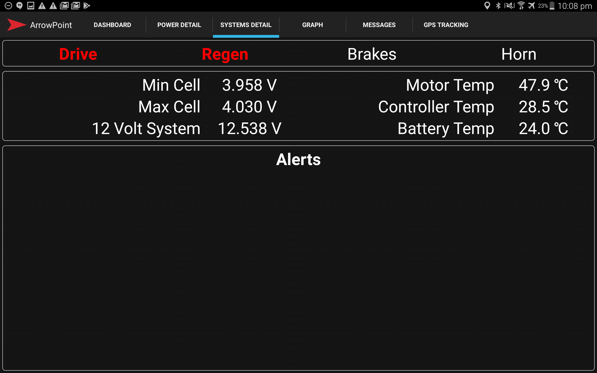

This screen shows information on key systems that may go out of range as well as the current state of the vehicle (Neutral / Drive / Reverse) is regen being used (it currently is in the picture below as it's red), is the driver braking (no) and are they using the Horn (no).

The ArrowPoint App also features a stand alone alerting system that will display alerts on the screen when various Can packets pass set thresholds. The alerts are then shown in the bottom panel.

<figure markdown>

<figcaption>ArrowPoint Android Alerts</figcaption>
</figure>

Alerts are configured by modifying the alerts.csv file located in /app/src/main/res/raw/alerts.csv below is an example file

| Data              | Min Threshold | Max Threshold |
| ----------------- | ------------- | ------------- |
| `MinimumCellV`    | 2.9           | -             |
| `MotorTemp`       | -             | 100           |
| `MaxCellTemp`     | -             | 60            |
| `ControllerTemp`  | -             | 50            |

If any of these thresholds are passed then the tablet will display an alert on the screen. This is very useful in race environment as if you have any communication failure between the chase car and solar car (which has happened to TeamArrow a lot) the driver can operate the car with confidence that they will be alerted to a major issue.
